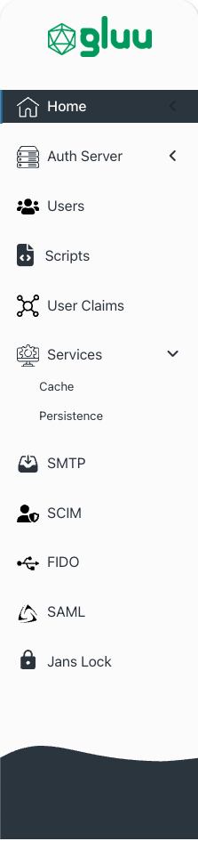

## Welcome to the Gluu Flex Project

Gluu Flex is a commercial distribution of the Linux Foundation
[Janssen Project](https://jans.io).
It was created for businesses who want the protections of a commercial license,
plus some additional tools convenient for enterprise scale.
Flex is built from Janssen Project components, so migrating to or from the
open source distribution is easy, just update your configuration.

## Quick Start

Prefer to try first, and ask questions later? Go to the [Gluu Flex](https://gluu.org/flex/)
website right now!

## User Interface for Administration: Admin-UI

Gluu Flex provides a user interface to perform complex administration tasks
and to manage configuration. This administration UI provides enterprise IAM
administrators with features like MAU monitoring, session monitoring,
managing user attributes, and much more. While the section below provides a
quick glimpse of what administration UI can do for administrators, for a
complete deep-dive of all the features, head over to the
[documentation](https://docs.gluu.org/v5.0.0-20/admin/admin-ui/introduction/).

### Dashboard For All Things Important

Use the dashboard to understand the current state of usage, authorization activity, and
system health. The dashboard uses graphs and charts to convey the usage trend
in user and access token activity. The dashboard also highlights any
system/operational issue faced by any server component.

### Take Control

Manage every aspect of your authorization server configuration.
Be it OAuth configurations, FIDO, or SCIM.

### Monitor Monthly Active Users (MAU)

Administrators can keep track of monthly active users and use this insight for
capacity planning and licensing.

## Trial and Commercial Licensing

### Trial License

:rocket: Trial license is free for 30 days -- no need to even contact Gluu. :rocket:

To get a free 30-day trial license, just sign up for
[SCAN on Agama Lab](https://cloud.gluu.org/agama-lab/dashboard/market/scan) and
obtain an SSA for Flex install.

### Commercial License
A commercial license can be obtained from [SCAN on Agama Lab](https://cloud.gluu.org/agama-lab/dashboard/market/scan).
Gluu Flex offers licenses for under 1600 MAU on Agama Lab. For larger orders,
please contact [sales@gluu.org](mailto:sales@gluu.org)

### Air-Gapped Deployments
We need to call Gluu License APIs to perform license checks. So, if you need an
"air-gapped" deployment which will not be allowed to call the Gluu License API,
please reach out to  [sales@gluu.org](mailto:sales@gluu.org)

When in doubt, [book a meeting](https://gluu.org/contact-us/) with the Gluu
business team to discuss your license and support options.

## License and SSA

Each Gluu Flex instance needs an SSA(Software Statement Assertion) as an input
during the installation process. SSA, which is an encrypted JWT string,
represents an installed instance of the Gluu Flex. Customers can get one or
more SSAs issued for a particular license using [Agama Lab](https://cloud.gluu.org/agama-lab).

## Flex Release Timeline

The Flex release schedule is closely tied to the upstream [Janssen Project](https://jans.io) release schedule. The structure of Flex releases mirrors that of the upstream project, following these guidelines:

- Flex Release = Janssen Project Release + 4 in the major version. For example, Flex 5.6.0 corresponds to Janssen Project release 1.6.0.
- Flex releases typically occur 1-2 days after the corresponding Janssen Project release. 

To stay informed about upcoming Flex releases, it's recommended to monitor the Janssen project [milestones](https://github.com/JanssenProject/jans/milestones) regularly. Please note that the QA team may update these milestones as testing progresses, so checking frequently is advised.

