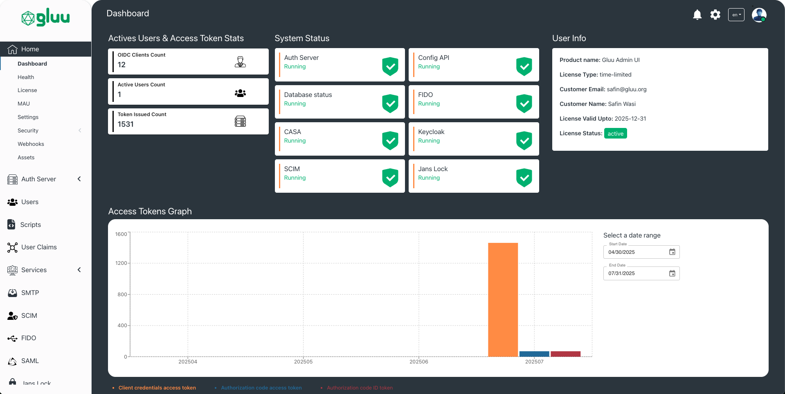

## Welcome to the Gluu Flex Project

Gluu Flex is a commercial distribution of the Linux Foundation Janssen Project. 
It was created for businesses who want the protections of a commercial license, 
plus some additional tools convenient for enterprise scale. 
Flex is built from Janssen Project components,  so migrating to or from the 
open source distribution is easy–just update your configuration.

## Quick Start

Try first, ask questions later? Go to the [Gluu](https://gluu.org) website right now!

## User Interface for Administration

Gluu Flex provides user interface to perform complex administration tasks 
and to manage configuration. This administration UI provides enterprise IAM 
administrators with features like MAU monitoring, session monitoring, 
managing user attributes and much more. While the section below provides a
quick glimpse of what administration UI can do for administrators, for a 
complete deep-dive of all the features, head over to the 
[documentation](https://docs.gluu.org/v5.0.0-20/admin/admin-ui/introduction/).

### Dashboard For All Things Important

Use dashboard to understand current state of usage, authorization activity and
system health. The dashboard uses graphs and charts convey the usage trend
in user and access token activity. Dashboard also highlights any 
system/operational issue faced by any server component. 

### Take Control

Manage every aspect of your authorization server configuration.
Be it OAuth configurations, FIDO or SCIM.

### Monitor Monthly Active Users (MAU)

Administrators can keep track of monthly active users and use this insight for
capacity planning and licensing.

