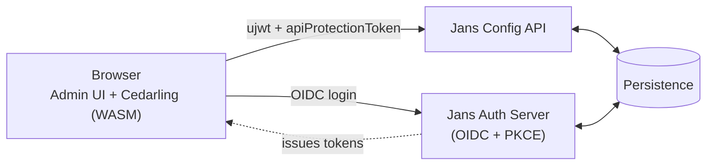
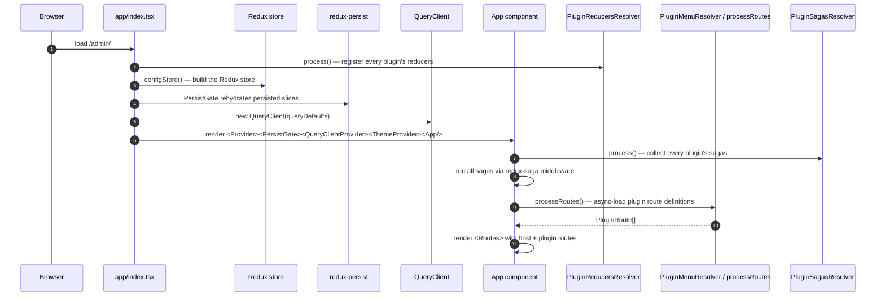

# Architecture

## Introduction

The Admin UI is a single-page React application that lets administrators configure a Janssen Auth Server. Internally it is organized as **two layers with a one-way dependency**:

- An **app host** under `app/` — the platform every feature builds on. The host owns routing, state management, theming, internationalization, authentication, authorization, and a library of reusable UI primitives.
- **Plugins** under `plugins/` — self-contained product features (OIDC clients, scopes, users, SCIM, FIDO, scripts, etc.). Each plugin lives in its own folder and registers itself with the host at startup.

A plugin can reach into the host (because the host provides shared services), but the host never imports from any plugin (because that would defeat the modular split), and plugins never import from each other (because that would re-create the tight coupling the split is meant to prevent). This is the single most important rule in the codebase, and the rest of the architecture exists to support it.

A few terms appear throughout this document:

- **Plugin metadata** — a `plugin-metadata.ts` file at the root of each plugin. It exports the menu items, routes, Redux reducers, and sagas that plugin contributes to the host.
- **Resolver** — one of three files at the top of `plugins/` (`PluginMenuResolver.ts`, `PluginReducersResolver.ts`, `PluginSagasResolver.ts`) that the host runs at startup to gather metadata from every plugin and wire it into the runtime.
- **Server state** — anything fetched from the Jans Config API. Handled by TanStack React Query.
- **Client state** — anything that lives only in the browser (auth tokens, session flags, theme, license status, Cedarling decisions, UI workflow flags). Handled by Redux Toolkit.

The remainder of this document walks through the system context (where the Admin UI sits in the wider Jans stack), the boot sequence (what happens between page load and the first rendered route), and the rules around adding new code.

## System context

Before diving into the internals, it helps to see where the Admin UI sits in the Jans stack. The browser talks to two server-side components — the Auth Server (for sign-in) and the Config API (for everything else) — and runs Cedarling inside itself for authorization decisions.



The browser holds three things the rest of the system trusts: the OIDC tokens (from sign-in), the admin-UI session cookie (from `createAdminUiSession`), and the Cedarling WASM engine plus its policy store (loaded after sign-in). Together these let the UI prove who the user is, prove the session is real, and decide locally what the user can see. See [auth.md](./auth.md) for the sign-in and session flow, [config-api.md](./config-api.md) for the API surface, and [cedarling.md](./cedarling.md) for the authorization engine.

## Boot sequence

When the Admin UI loads, several things have to happen in order before the first route renders. Understanding this order is important because it explains why the resolver pattern exists and why plugins are loaded the way they are.



The numbered explanation:

1. **Entry point — `app/index.tsx`** runs as the browser parses the JS bundle. Before rendering, it wires up the Redux store and the React Query client.
2. **`PluginReducersResolver.process()`** runs eagerly, _before_ the store is built. It iterates over [`admin-ui/plugins.config.json`](../plugins.config.json), calls `loadPluginMetadata(metadataFile)` for each plugin (synchronously — these are `import.meta.glob` references), and registers every reducer the plugin exports into the reducer registry. Doing this _before_ `configStore()` means the store is constructed with the full set of slices already known — no late-registration is needed.
3. **`configStore()`** builds the Redux store using the reducer registry. Sagas are wired into the middleware here.
4. **`PersistGate`** waits for `redux-persist` to rehydrate the slices marked persistent (theme, language, userinfo) before rendering anything below it. This is what keeps the user logged in across reloads.
5. **`QueryClient`** is constructed with the project's default query options (defined in `app/utils/queryUtils.ts`). It is provided via `QueryClientProvider` so every `useGet*` / `usePut*` hook in the app uses the same cache.
6. **`<App />`** renders. This is where `PluginSagasResolver` is called to gather every saga from every plugin's metadata, and the saga middleware runs them all.
7. **`processRoutes()`** (asynchronously this time) collects the route definitions from each plugin's `plugin-metadata.ts` and stitches them into the React Router tree alongside the host's own routes. From here, the user sees the sidebar, the navigation works, and the rest of the app lifecycle (OIDC, license check, Cedarling bootstrap) takes over — see [auth.md](./auth.md) and [cedarling.md](./cedarling.md) for what happens next.

If any plugin's metadata fails to load, the resolvers log via `devLogger.warn` and skip that plugin — the rest of the app continues to function. This is the reason the resolvers use `Promise.allSettled` instead of `Promise.all`.

## The host / plugin split

The two folders that matter:

```text
app/          host / platform — the shell every plugin builds on
plugins/      feature modules — one per product area
```

Three import rules — strict, enforced by team convention rather than tooling:

| From → To               | Allowed?                              |
| ----------------------- | ------------------------------------- |
| `plugin` → `app/`       | ✅ — plugins build on the host        |
| `app/` → `plugin`       | ❌ — host must not depend on a plugin |
| `plugin A` → `plugin B` | ❌ — siblings stay independent        |

If a piece of code is used in exactly one plugin, it stays in that plugin. If two or more plugins need it, it moves up to `app/`. There is no shared-plugin location and no plugin-to-plugin import path — adding either would let one feature's churn break another, which is exactly what the split is preventing.

### Inside `app/` — what each folder owns

The host is itself organized by concern. Routing, state, authorization, audit, and shared UI primitives each live in their own folder so a new contributor can find any piece without grepping the entire codebase. The table below is a map — open the folder for the concern you care about.

| Folder                  | Purpose                                                                          |
| ----------------------- | -------------------------------------------------------------------------------- |
| `app/routes/`           | Top-level routes, layout shells, auth gates                                      |
| `app/redux/`            | Store, slices, sagas, query setup                                                |
| `app/cedarling/`        | Authorization client (policy store + hooks) — see [cedarling.md](./cedarling.md) |
| `app/audit/`            | Central audit action types and helpers                                           |
| `app/components/`       | Reusable UI primitives (`GluuTable`, `GluuButton`, `GluuBadge`, icons, etc.)     |
| `app/routes/Apps/Gluu/` | Broader Gluu UI building blocks (`GluuLoader`, `GluuDialog`, dialogs, etc.)      |
| `app/constants/`        | Shared cross-cutting constants ([conventions.md](./conventions.md#constants))    |
| `app/helpers/`          | Navigation helpers                                                               |
| `app/utils/`            | Regex, devLogger, URL safety, query utils, dayjs utils, env detection            |
| `app/layout/`           | Layout shells                                                                    |
| `app/styles/`           | Global CSS                                                                       |
| `app/images/`           | Static image assets                                                              |
| `app/locales/`          | i18n JSON for `en`, `es`, `fr`, `pt`                                             |
| `app/i18n.ts`           | i18next bootstrap                                                                |
| `app/customColors.ts`   | Theme color tokens                                                               |

### Inside `plugins/` — the features

Each plugin is a self-contained feature with its own `components/`, `redux/` (if it needs Redux state), `helper/`, `hooks/`, `types/`, and a top-level `plugin-metadata.ts` that registers the plugin's routes, reducers, and sagas with the host.

Current plugins:

| Plugin            | What it covers                                                                             |
| ----------------- | ------------------------------------------------------------------------------------------ |
| `admin`           | Assets, settings, MAU/Health, webhook system, Cedarling config                             |
| `auth-server`     | OIDC clients, scopes, sessions, ACRs / auth methods, SSA, properties, logging, JSON viewer |
| `fido`            | FIDO2 configuration                                                                        |
| `jans-lock`       | Jans Lock configuration                                                                    |
| `saml`            | SAML SSO config and identity-broker / provider / service-provider management               |
| `scim`            | SCIM configuration                                                                         |
| `scripts`         | Custom scripts (person auth, post-authn, introspection, …)                                 |
| `services`        | Cache and Persistence pages                                                                |
| `smtp`            | SMTP configuration                                                                         |
| `user-claims`     | Attribute / claim definitions                                                              |
| `user-management` | Users, 2FA devices, user form/edit/list                                                    |
| `internal`        | Type contracts shared with the plugin loader (not a feature plugin)                        |

The order plugins load in is controlled by `admin-ui/plugins.config.json` — each entry is `{ order, key, metadataFile }`. The `order` field is used by `PluginMenuResolver` to sort the parent menu groups; it does not affect reducer or saga registration.

## The plugin loader

Three files at the top of `plugins/` make the plugin system work. They are deliberately small and a little awkward — refactoring any of them tends to break Hot Module Replacement (HMR) because they use Vite's `import.meta.glob` mechanism, which is sensitive to how the references are structured.

- [`admin-ui/plugins/PluginMenuResolver.ts`](../plugins/PluginMenuResolver.ts) — exports `processMenus()` and `processRoutes()`. `processMenus` reads each plugin's metadata, collects every menu entry, and sorts the parent menu groups by `order`. `processRoutes` does the same for route definitions, returning a `PluginRoute[]` that the host's routing layer renders.
- [`admin-ui/plugins/PluginReducersResolver.ts`](../plugins/PluginReducersResolver.ts) — exports `process()`. Iterates over every plugin's metadata synchronously, collects all reducers, deduplicates by `name`, and registers them into the host's reducer registry. Synchronous on purpose: the Redux store must be built with these reducers already known.
- [`admin-ui/plugins/PluginSagasResolver.ts`](../plugins/PluginSagasResolver.ts) — exports `process()`. Returns a flat list of `CalledSaga[]` collected from every plugin's metadata. The host's saga middleware runs them all after `<App />` mounts.

Each plugin's `plugin-metadata.ts` exports a `default` object shaped roughly as:

```ts
export default {
  menus: PluginMenu[],
  routes: PluginRoute[],
  reducers: PluginReducer[],   // { name, reducer }
  sagas: CalledSaga[],
}
```

Any subset of those keys is allowed — a plugin that only contributes routes does not need a `reducers` array, for example. The resolvers tolerate missing keys via `?? []`.

If a plugin metadata file throws during load, the resolvers catch the error, log it through `devLogger.warn`, and continue with the remaining plugins. The app still boots when one plugin is broken — it loads everything else, and the broken plugin's pages return 404.

## State management

The Admin UI uses **two coexisting state libraries**, and the split between them is intentional. They are not redundant; they own different things.

### Server state lives in React Query

Everything that comes from the Jans Config API — OIDC clients, scopes, sessions, ACRs, custom scripts, attributes, users, FIDO / SCIM / SMTP / SAML / Cache / Persistence configuration, properties, JSON-configuration, SSA, assets, stats / MAU / health, audit logs, agama projects, webhook execution, and so on — goes through TanStack React Query. The hooks are not hand-written; they are generated by Orval from the OpenAPI spec and consumed as `useGet<Op>()` / `usePut<Op>()` / `useDelete<Op>()` — see [config-api.md](./config-api.md) for how the generation works.

Why React Query: server data is shared across components and changes outside the browser's control. React Query gives us request dedup (the same hook called from three components fires one request), caching with stale-while-revalidate, automatic retries, and invalidation on mutation. None of that needs to be coded — it comes from the library.

**Rule:** if it's in the Config API, it goes through a generated hook. Never hand-roll a `fetch` or a direct axios call for server data.

### Client / auth state lives in Redux

Everything that exists only in the browser — tokens, session flags, license status, theme, language, toast notifications, Cedarling decisions, and plugin-local UI workflow state — lives in Redux Toolkit slices. Async flows (OIDC sign-in, license check, session creation) are driven by sagas.

The Redux store is composed from these slices:

| Slice                                                          | What it holds                                               |
| -------------------------------------------------------------- | ----------------------------------------------------------- |
| `authSlice`                                                    | OIDC config, tokens, `userinfo`, backend reachability flag  |
| `sessionSlice`                                                 | Admin UI session creation state (`createAdminUiSession`)    |
| `licenseSlice`                                                 | License validity, trial state, SSA upload, threshold checks |
| `cedarPermissionsSlice`                                        | Cached Cedarling authorize decisions + policy-store bytes   |
| `logoutSlice`                                                  | Logout / audit-on-logout state                              |
| `initSlice`                                                    | Boot-time init flags                                        |
| `toastSlice`                                                   | Toast notifications shown across the app                    |
| `ProfileDetailsSlice`                                          | Current user's profile-page state                           |
| _plugin-local_ (`AssetSlice`, `WebhookSlice`, `scopeSlice`, …) | UI / workflow state for that plugin                         |

Why Redux for these: most of them must be readable _outside_ React Query's lifecycle. Tokens need to be available to the axios mutator before any hook can fire. License status gates whether the app renders at all. Theme and language must apply before the first paint. None of these are server data, and trying to model them as queries adds friction without benefit.

**Redux is retained on purpose.** A common ask in code review is whether the Redux side could be collapsed into React Query; the answer is no. The two libraries solve different problems, and the cost of maintaining both is lower than the cost of forcing one to do the other's job.

## Adding a new plugin

A walkthrough for adding a brand-new plugin from scratch:

1. **Create the folder.** Copy the structure of an existing plugin — `admin-ui/plugins/scim/` is a small, self-contained reference. The standard layout is:

   ```text
   plugins/<name>/
   ├── components/         # the plugin's React components
   ├── redux/              # slices + sagas if the plugin has client state
   ├── helper/             # plugin-local helpers
   ├── hooks/              # plugin-local hooks
   ├── types/              # TS types for the plugin
   └── plugin-metadata.ts  # registration entry point
   ```

   Not every folder is required. Many plugins have no `redux/` because they only call Config API hooks.

2. **Write the `plugin-metadata.ts`.** Export menus, routes, reducers, and sagas as the resolver expects. Look at a sibling plugin for the shape.

3. **Register in `plugins.config.json`.** Add an entry like:

   ```json
   { "order": 99, "key": "my-feature", "metadataFile": "./my-feature/plugin-metadata" }
   ```

   `order` controls where the plugin's parent menu group appears in the sidebar; `key` is a stable identifier; `metadataFile` is the relative path the resolvers use to import the metadata.

4. **Keep imports clean.** No `import` from another plugin folder. Anything shared with multiple plugins belongs in `app/` instead — see [conventions.md](./conventions.md#imports) for the import rules.

5. **Verify.** Run `npm start`, sign in, and confirm the sidebar entry appears and the route resolves. If the sidebar entry is missing but the URL still works, the plugin's `menus` array is empty or its metadata file failed to load — check the dev console for the resolver's `devLogger.warn`.

## Adding a new constant

The placement rule for constants is short:

- Used in **exactly one plugin** → keep it in that plugin (e.g. `plugins/<name>/helper/constants.ts`).
- Used in **two or more plugins**, or used by `app/` → move it to `app/constants/`.

See [conventions.md](./conventions.md#constants) for the full naming and structure rules.

## Where to read next

- [auth.md](./auth.md) — OAuth/PKCE sign-in, admin-UI session creation, license verification
- [config-api.md](./config-api.md) — how Orval-generated hooks talk to the Config API
- [cedarling.md](./cedarling.md) — how UI authorization decisions are made in the browser
- [build-deploy.md](./build-deploy.md) — Vite build pipeline, environment handling, packaging
- [recipes.md](./recipes.md) — step-by-step procedures (add a page, add a slice, regenerate the API client)
- [conventions.md](./conventions.md) — naming, imports, types, styling, i18n, audit logging
- [tech-stack.md](./tech-stack.md) — one-page reference of every tool in use and why
- [testing.md](./testing.md) — Jest + jsdom setup, mocks, conventions
