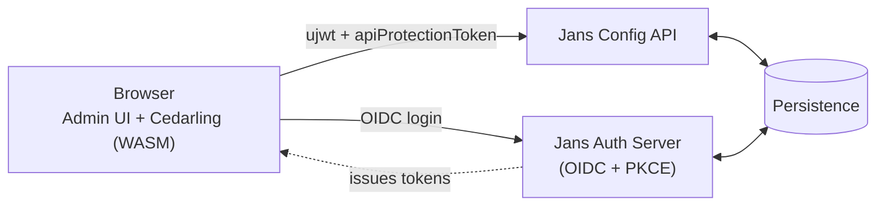
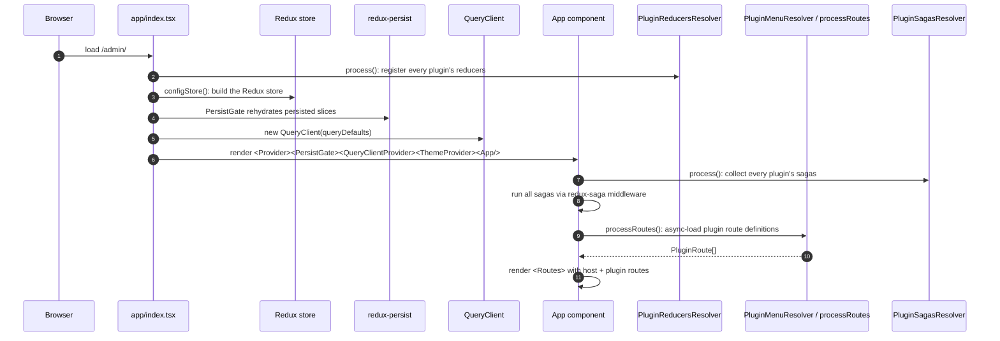

# Architecture

## Introduction

The Admin UI is a single-page React application that lets administrators configure a Janssen Auth Server. Internally it is organized as **two layers with a one-way dependency**:

- An **app host** under [`app/`](../app/): the platform every feature builds on. The host owns routing, state management, theming, internationalization, authentication, authorization, and a library of reusable UI primitives.
- **Plugins** under [`plugins/`](../plugins/): self-contained product features (OIDC clients, scopes, users, SCIM, FIDO, scripts, etc.). Each plugin lives in its own folder and registers itself with the host at startup.

A plugin can reach into the host (because the host provides shared services), but the host never imports from any plugin (because that would defeat the modular split), and plugins never import from each other (because that would re-create the tight coupling the split is meant to prevent). This is the single most important rule in the codebase, and the rest of the architecture exists to support it.

## System context

### Flow diagram



### Explanation of the flow

The Admin UI is a pure client. The bundle that ships to the browser carries no secrets and no business data of its own. Everything the user sees comes from one of two server-side Janssen components, and everything the user changes is written back through them.

- The **Jans Auth Server** is the OIDC + PKCE identity provider. The browser redirects there to sign in (no client secret is shared with the browser. See [auth.md](./auth.md)), and the Auth Server returns OIDC tokens (`id_token`, `access_token`, `refresh_token`).
- The **Jans Config API** is the REST surface that owns every piece of configuration the Admin UI manages - OIDC clients, scopes, users, custom scripts, FIDO/SAML/SCIM/SMTP configuration, attributes, sessions, audit logs, and license metadata. The Admin UI talks to it through generated hooks. The full pipeline is in [config-api.md](./config-api.md).
- **Persistence** is whatever store the Janssen install is wired to (an LDAP/RDBMS backend depending on deployment). Both the Auth Server and the Config API talk to it directly.

The browser holds three pieces of state the rest of the system trusts:

1. **OIDC tokens**: issued by the Auth Server after sign-in.
2. **The Admin UI session cookie**: created by calling `createAdminUiSession` on the Config API with the user's JWT (`ujwt`) and a short-lived `apiProtectionToken`. The cookie is what the Config API checks on every subsequent request.
3. **The Cedarling WASM engine and its policy store**: fetched right after sign-in, initialized in-browser, and used to gate every UI element. See [cedarling.md](./cedarling.md).

Together these let the UI prove who the user is, prove the session is real, and decide locally what the user is allowed to see.

## Boot sequence

When the Admin UI loads, several things have to happen in order before the first route renders. Understanding this order is important because it explains why the resolver pattern exists and why plugins are loaded the way they are.

### Flow diagram



### Explanation of the flow

1. **Entry point** ([`app/index.tsx`](../app/index.tsx)) runs as the browser parses the JS bundle. Before rendering anything, it wires up the Redux store and the React Query client.
2. **`PluginReducersResolver.process()`** runs eagerly, _before_ the store is built. It iterates over [`admin-ui/plugins.config.json`](../plugins.config.json), calls `loadPluginMetadata(metadataFile)` for each plugin (synchronously, via `import.meta.glob` references), and registers every reducer the plugin exports into the reducer registry. Doing this _before_ `configStore()` means the store is constructed with the full set of slices already known, so no late-registration is needed.
3. **`configStore()`** builds the Redux store using the reducer registry. Sagas are wired into the middleware here.
4. **`PersistGate`** waits for `redux-persist` to rehydrate the slices marked persistent (theme, language, userinfo) before rendering anything below it. This is what keeps the user signed in across reloads and applies the right theme before the first paint.
5. **`QueryClient`** is constructed with the project's default query options (defined in [`app/utils/queryUtils.ts`](../app/utils/queryUtils.ts)). It is provided via `QueryClientProvider` so every `useGet*` / `usePut*` hook in the app uses the same cache.
6. **`<App />`** renders. This is where `PluginSagasResolver` is called to gather every saga from every plugin's metadata, and the saga middleware runs them all.
7. **`processRoutes()`** (asynchronously this time) collects the route definitions from each plugin's `plugin-metadata.ts` and stitches them into the React Router tree alongside the host's own routes. From here, the user sees the sidebar, the navigation works, and the rest of the app lifecycle (OIDC, license check, Cedarling bootstrap) takes over. See [auth.md](./auth.md) and [cedarling.md](./cedarling.md).

If any plugin's metadata fails to load, the resolvers log via `devLogger.warn` and skip that plugin. The rest of the app continues to function. This is the reason the resolvers use `Promise.allSettled` instead of `Promise.all`.

## Import rules

The host / plugin split is held together by three strict import rules:

| From → To               | Allowed?                            |
| ----------------------- | ----------------------------------- |
| `plugin` → `app/`       | ✅ plugins build on the host        |
| `app/` → `plugin`       | ❌ host must not depend on a plugin |
| `plugin A` → `plugin B` | ❌ siblings stay independent        |

If a piece of code is used in exactly one plugin, it stays in that plugin. If two or more plugins need it, it moves up to `app/`. There is no shared-plugin location and no plugin-to-plugin import path. Adding either would let one feature's churn break another, which is exactly what the split is preventing. See [conventions.md](./conventions.md#imports) for the path aliases.

## Inside `app/`: what each folder owns

| Folder                  | Purpose                                                                       |
| ----------------------- | ----------------------------------------------------------------------------- |
| `app/routes/`           | Top-level routes, layout shells, auth gates                                   |
| `app/redux/`            | Store, slices, sagas, query setup                                             |
| `app/cedarling/`        | Authorization client (see [cedarling.md](./cedarling.md))                     |
| `app/audit/`            | Audit action types and helpers                                                |
| `app/components/`       | Reusable UI primitives (`GluuTable`, `GluuButton`, `GluuBadge`, …)            |
| `app/routes/Apps/Gluu/` | Broader Gluu building blocks (`GluuLoader`, `GluuDialog`, …)                  |
| `app/constants/`        | Shared cross-cutting constants ([conventions.md](./conventions.md#constants)) |
| `app/helpers/`          | Navigation helpers                                                            |
| `app/utils/`            | Regex, devLogger, URL safety, query utils, dayjs utils, env detection         |
| `app/layout/`           | Layout shells                                                                 |
| `app/styles/`           | Global CSS                                                                    |
| `app/locales/`          | i18n JSON for `en`, `es`, `fr`, `pt`                                          |
| `app/i18n.ts`           | i18next bootstrap                                                             |

## Inside `plugins/`: the features

Each plugin is a self-contained feature with its own `components/`, `redux/` (if it needs Redux state), `helper/`, `hooks/`, `types/`, and a top-level `plugin-metadata.ts` that registers the plugin's routes, reducers, and sagas with the host.

| Plugin            | What it covers                                                                             |
| ----------------- | ------------------------------------------------------------------------------------------ |
| `admin`           | Assets, settings, MAU/Health, webhook system, Cedarling config                             |
| `auth-server`     | OIDC clients, scopes, sessions, ACRs / auth methods, SSA, properties, logging, JSON viewer |
| `fido`            | FIDO2 configuration                                                                        |
| `jans-lock`       | Jans Lock configuration                                                                    |
| `scim`            | SCIM configuration                                                                         |
| `scripts`         | Custom scripts (person auth, post-authn, introspection, …)                                 |
| `services`        | Cache and Persistence pages                                                                |
| `smtp`            | SMTP configuration                                                                         |
| `user-claims`     | Attribute / claim definitions                                                              |
| `user-management` | Users, 2FA devices, user form/edit/list                                                    |
| `internal`        | Type contracts shared with the plugin loader                                               |

Load order comes from [`admin-ui/plugins.config.json`](../plugins.config.json) (`order` sorts menu groups; doesn't affect reducer / saga registration).

## The plugin loader

Three resolvers at the top of `plugins/` make the plugin system work. They are deliberately small and a little awkward. **Don't refactor them**. They use Vite's `import.meta.glob` mechanism, which is sensitive to how the references are structured, and refactoring any of them tends to break Hot Module Replacement (HMR).

- [`plugins/PluginMenuResolver.ts`](../plugins/PluginMenuResolver.ts): `processMenus()` collects every menu entry and sorts the parent groups by `order`. `processRoutes()` does the same for route definitions, returning a `PluginRoute[]` that the host's routing layer renders.
- [`plugins/PluginReducersResolver.ts`](../plugins/PluginReducersResolver.ts): `process()` iterates over every plugin's metadata synchronously, collects all reducers, deduplicates by `name`, and registers them into the host's reducer registry. Synchronous on purpose: the Redux store must be built with these reducers already known.
- [`plugins/PluginSagasResolver.ts`](../plugins/PluginSagasResolver.ts): `process()` returns a flat list of `CalledSaga[]` collected from every plugin's metadata. The host's saga middleware runs them all after `<App />` mounts.

Each plugin's `plugin-metadata.ts` exports a `default` object shaped roughly as:

```ts
export default {
  menus: PluginMenu[],
  routes: PluginRoute[],
  reducers: PluginReducer[],   // { name, reducer }
  sagas: CalledSaga[],
}
```

Any subset of those keys is allowed. The resolvers tolerate missing keys via `?? []`.

## State management

The Admin UI uses **two coexisting state libraries**, and the split between them is intentional. They are not redundant. They own different things.

### Server state → React Query

Everything that comes from the Jans Config API (OIDC clients, scopes, sessions, ACRs, custom scripts, attributes, users, FIDO / SCIM / SMTP / SAML / Cache / Persistence configuration, properties, JSON-configuration, SSA, assets, stats / MAU / health, audit logs, agama projects, webhook execution, and so on) goes through TanStack React Query. The hooks are not hand-written. They are generated by Orval from the OpenAPI spec and consumed as `useGet<Op>()` / `usePut<Op>()` / `useDelete<Op>()`. See [config-api.md](./config-api.md) for how the generation works.

**Why React Query:** server data is shared across components and changes outside the browser's control. React Query gives us request dedup (the same hook called from three components fires one request), caching with stale-while-revalidate, automatic retries, and invalidation on mutation. None of that needs to be coded. It comes from the library.

**Rule:** if it's in the Config API, it goes through a generated hook. Never hand-roll a `fetch` or a direct axios call for server data.

### Client / auth state → Redux

Everything that exists only in the browser. Tokens, session flags, license status, theme, language, toast notifications, Cedarling decisions, and plugin-local UI workflow state. Lives in Redux Toolkit slices. Async flows (OIDC sign-in, license check, session creation) are driven by sagas.

| Key in `state.*`                                     | What it holds                                               |
| ---------------------------------------------------- | ----------------------------------------------------------- |
| `authReducer`                                        | OIDC config, tokens, `userinfo`, backend reachability flag  |
| `logoutAuditReducer` &nbsp;¹                         | Logout-audit state (`logoutAuditSucceeded`)                 |
| `licenseReducer`                                     | License validity, trial state, SSA upload, threshold checks |
| `cedarPermissions`                                   | Cached Cedarling authorize decisions + policy-store bytes   |
| `logoutReducer`                                      | Logout flow state                                           |
| `initReducer`                                        | Boot-time init flags                                        |
| `toastReducer`                                       | Toast notifications shown across the app                    |
| `profileDetailsReducer`                              | Current user's profile-page state                           |
| _plugin-local_ (`AssetReducer`, `WebhookReducer`, …) | UI / workflow state for that plugin                         |

¹ Defined in [`app/redux/features/sessionSlice.ts`](../app/redux/features/sessionSlice.ts). The file is named `sessionSlice` but the slice is registered under `logoutAuditReducer`. Grep the registry key, not the filename.

**Why Redux for these:** most of them must be readable _outside_ React Query's lifecycle. Tokens need to be available to the axios mutator before any hook can fire. License status gates whether the app renders at all. Theme and language must apply before the first paint. None of these are server data, and trying to model them as queries adds friction without benefit.

**Redux is retained on purpose.** A common ask is whether the Redux side could be collapsed into React Query. The answer is no. The two libraries solve different problems, and the cost of maintaining both is lower than the cost of forcing one to do the other's job.

## Adding a new plugin

The full walkthrough is in [recipes.md](./recipes.md#add-a-new-plugin). Short version: copy `plugins/scim/` as a template and add a `{ order, key, metadataFile }` entry to `plugins.config.json`.

## Adding a constant

- Used in **exactly one plugin** → keep it in that plugin.
- Used in **two or more plugins**, or used by `app/` → move it to `app/constants/`.

Full rules in [conventions.md](./conventions.md#constants).
