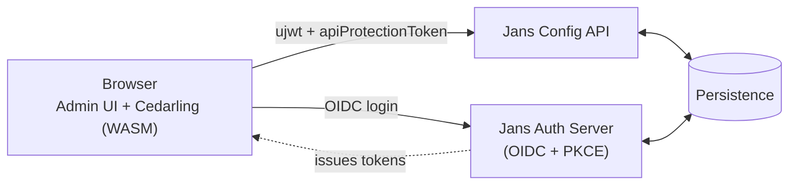

# Architecture

A two-layer model: an **app host** (`app/`) and **plugins** (`plugins/`) that plug into it.

## System context

Where admin-ui sits in the wider Janssen stack:



Details by piece: [auth.md](./auth.md) (login + session), [config-api.md](./config-api.md) (Config API + Orval), [cedarling.md](./cedarling.md) (in-browser access control).

## Layers

```text
app/          host / platform — the shell every plugin builds on
plugins/      feature modules — one per product area
```

**Dependency direction (strict):**

| From → To               | Allowed?                              |
| ----------------------- | ------------------------------------- |
| `plugin` → `app/`       | ✅ — plugins build on the host        |
| `app/` → `plugin`       | ❌ — host must not depend on a plugin |
| `plugin A` → `plugin B` | ❌ — siblings stay independent        |

Shared things that _several plugins_ need belong in `app/` (e.g. `@/constants`). A plugin-internal thing stays in its own plugin.

## `app/` — the host

| Folder                                                                    | Purpose                                                                          |
| ------------------------------------------------------------------------- | -------------------------------------------------------------------------------- |
| `routes/`                                                                 | top-level routes, layout shells, auth gates                                      |
| `redux/`                                                                  | store, slices, sagas, query setup                                                |
| `cedarling/`                                                              | authorization client (policy store + hooks) — see [cedarling.md](./cedarling.md) |
| `audit/`                                                                  | central audit action types and helpers                                           |
| `components/`                                                             | reusable UI primitives (`GluuTable`, `GluuButton`, `GluuBadge`, icons, etc.)     |
| `routes/Apps/Gluu/`                                                       | broader Gluu UI building blocks (`GluuLoader`, `GluuDialog`, dialogs, etc.)      |
| `constants/`                                                              | shared cross-cutting constants ([conventions.md](./conventions.md#constants))    |
| `helpers/`                                                                | navigation helpers                                                               |
| `utils/`                                                                  | regex, devLogger, URL safety, query utils, dayjs utils, env detection            |
| `layout/`, `styles/`, `images/`, `locales/`, `i18n.ts`, `customColors.ts` | shell concerns                                                                   |

## `plugins/` — the features

Each plugin is a self-contained feature with its own `components/`, `redux/` (if needed), `helper/`, `hooks/`, `types/`, and a `plugin-metadata.ts` that registers its routes/reducers/sagas with the host.

Current plugins:

- `admin` — assets, settings, MAU/Health, webhook system, Cedarling config
- `auth-server` — OIDC clients, scopes, sessions, ACRs/auth methods, SSA, properties, logging, JSON viewer
- `fido` — FIDO2 configuration
- `jans-lock` — Jans Lock configuration
- `saml` — SAML SSO config & identity-broker/provider/service-provider management
- `scim` — SCIM configuration
- `scripts` — custom scripts (person auth, post-authn, introspection, …)
- `services` — Cache and Persistence pages
- `smtp` — SMTP configuration
- `user-claims` — attribute / claim definitions
- `user-management` — users, 2FA devices, user form/edit/list
- `internal` — types/contract shared with the plugin loader

## Plugin loader

The host discovers plugins through three resolver files at the top of `plugins/` (do **not** refactor — runtime-sensitive, breaks HMR):

- `plugins/PluginMenuResolver.ts` — assembles the sidebar from each plugin's menu metadata
- `plugins/PluginReducersResolver.ts` — registers plugin reducers into the Redux store
- `plugins/PluginSagasResolver.ts` — runs plugin sagas

Each plugin's `plugin-metadata.ts` exports the menu items, routes, reducers, and sagas it contributes.

## State management

A deliberate split:

- **Server state → React Query** (`@tanstack/react-query`, via Orval-generated hooks). Anything fetched from the Jans Config API: OIDC clients, scopes, sessions, ACRs / auth methods, custom scripts, attributes, users, FIDO/SCIM/SMTP/SAML/Cache/Persistence config, properties, JSON-configuration, SSA, assets, stats / MAU / health, audit logs, agama projects, webhook execution, etc. If it's in the Config API, it goes through a `useGet<Op>` / `usePut<Op>` hook — never a hand-rolled fetch.
- **Client / auth state → Redux** (`@reduxjs/toolkit` + sagas + `redux-persist`). Pure client-side state that multiple components observe:

  | Slice                                                          | What it holds                                               |
  | -------------------------------------------------------------- | ----------------------------------------------------------- |
  | `authSlice`                                                    | OIDC config, tokens, `userinfo`, backend reachability flag  |
  | `sessionSlice`                                                 | Admin UI session creation state (`createAdminUiSession`)    |
  | `licenseSlice`                                                 | License validity, trial state, SSA upload, threshold checks |
  | `cedarPermissionsSlice`                                        | Cached Cedarling authorize decisions + policy-store bytes   |
  | `logoutSlice`                                                  | Logout / audit-on-logout state                              |
  | `initSlice`                                                    | Boot-time init flags                                        |
  | `toastSlice`                                                   | Toast notifications shown across the app                    |
  | `ProfileDetailsSlice`                                          | Current user's profile-page state                           |
  | _plugin-local_ (`AssetSlice`, `WebhookSlice`, `scopeSlice`, …) | UI/workflow state for that plugin                           |

  Redux is retained on purpose; do not propose collapsing it into React Query.

## Adding a new plugin

Create `plugins/<name>/` following an existing plugin as a template (e.g. `plugins/scim/`) and add a `{ order, key, metadataFile }` entry to `plugins.config.json` so the resolvers pick it up. Keep cross-plugin imports out — hoist shared things to `app/` instead (see [conventions.md](./conventions.md#imports)).

## Adding a new constant

See [conventions.md](./conventions.md#constants). The short rule:
_used in one plugin → keep it in that plugin; used by multiple plugins or by `app/` → move it to `app/constants/`._
