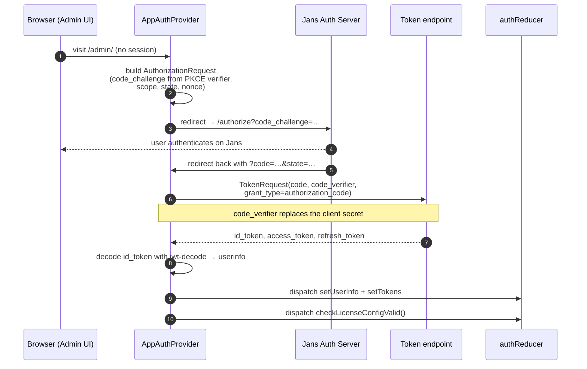
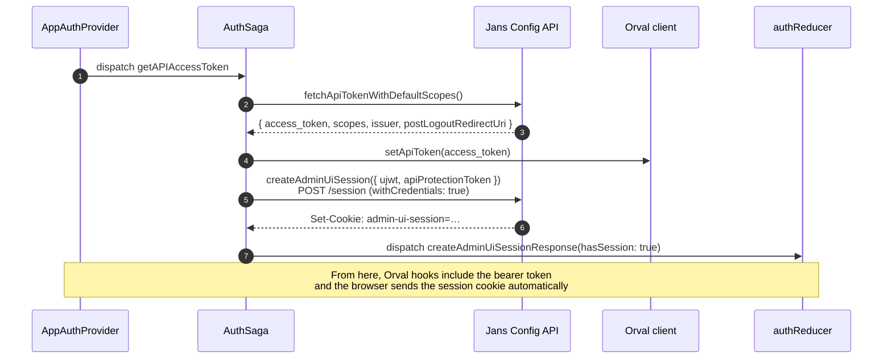
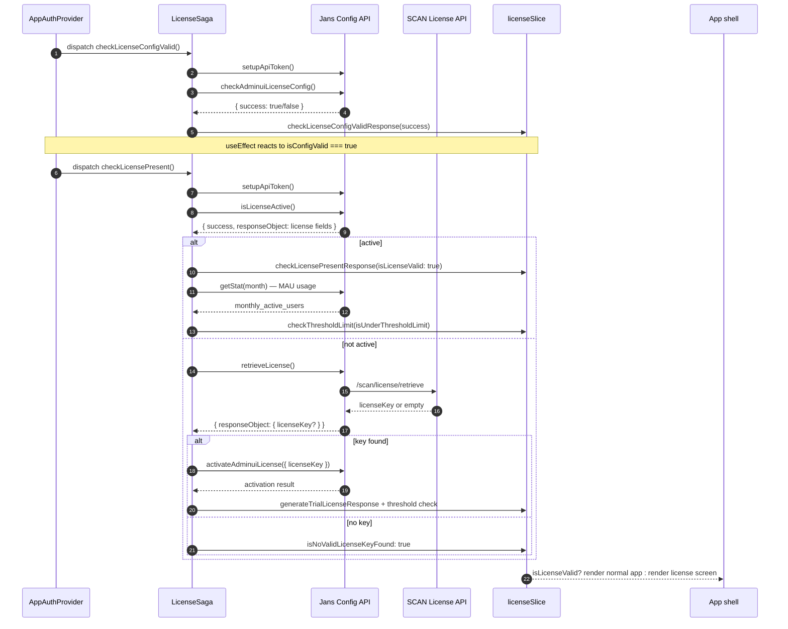

# Authentication

## Introduction

Authentication in the Admin UI answers one question: **who is the user sitting in front of the browser?** The answer is produced by signing the user into the Janssen Auth Server using OAuth 2.0 / OpenID Connect with PKCE — a flow where the browser proves it knows a randomly generated secret instead of holding a long-lived client secret. The Admin UI is a public single-page app; it cannot keep secrets safely, so PKCE is mandatory.

A few terms appear over and over in this document, so it helps to fix them up front:

- **OIDC sign-in** — the OAuth Authorization Code flow with PKCE that returns three things: an `id_token` (who the user is), an `access_token` (what the user can ask for), and the user's `userinfo`.
- **Admin-UI session** — a separate server-side session, identified by a cookie, that the Config API needs in addition to the OAuth token. OIDC sign-in alone is not enough to call the Config API; a session must also be created.
- **License verification** — a check that runs after sign-in to confirm this installation is licensed to run the Admin UI (Flex is a paid product). A missing or invalid license puts the app on a license-error screen instead of the normal sidebar.
- **Authorization** — the _decision_ about what a signed-in user is allowed to do (which buttons render, which pages open). That decision is **not** made here. It lives entirely in Cedarling — see [cedarling.md](./cedarling.md). This document covers authentication only.

The remainder of this doc walks through each phase in order: the OAuth/PKCE sign-in, the admin-UI session creation, license verification, and what happens on logout and idle timeout.

## How the code is organized

Before walking through the flows, it helps to know where the relevant code lives. Each concern owns a single file; the sections below cover each one in detail.

The **OIDC sign-in dance** is driven by `app/utils/AppAuthProvider.tsx` — this is the component that builds the authorization request, exchanges the authorization code for tokens, and dispatches the result into Redux. Two small helpers sit next to it: `app/utils/TokenController.ts` reads and writes the OIDC client configuration and issuer from session storage, and `app/utils/urlSecurity.ts` builds the end-session URL used at logout.

The **authentication state** — provider config, tokens, decoded userinfo — lives in `app/redux/features/authSlice.ts`. The asynchronous parts of the flow (waiting for tokens, refreshing them, recovering from errors) run in `app/redux/sagas/AuthSaga.ts`.

The **license check** that runs immediately after sign-in is split the same way: state in `app/redux/features/licenseSlice.ts`, async flow in `app/redux/sagas/LicenseSaga.ts`. The license flow is covered in its own section below because it has its own moving parts.

Two small pieces complete the picture: `app/routes/Apps/Gluu/GluuSessionTimeout.tsx` renders the idle-timeout warning dialog, and the `redirectToLogout` helper in `app/redux/sagas/SagaUtils.ts` handles forced logouts (e.g. after a 401). Both eventually land the user on `app/routes/Pages/ByeBye.tsx`. All storage keys — every `localStorage` and `sessionStorage` slot the auth flow touches — are defined once in `app/constants/storageKeys.ts`; never hard-code a storage key elsewhere.

## OAuth / PKCE sign-in

### Flow diagram

### Explanation of the flow

The browser opens the Admin UI at `/admin/`. [`app/utils/AppAuthProvider.tsx`](../app/utils/AppAuthProvider.tsx) mounts and checks whether a valid session already exists in `state.authReducer`. If not, it begins an **OAuth Authorization Code flow with PKCE** (steps 1-3).

PKCE means the browser generates a random secret called a **code verifier**, hashes it into a **code challenge**, and sends only the challenge with the redirect to the auth server. The auth server stores the challenge against this login attempt. When the browser later exchanges its authorization code for tokens, it sends the original verifier — the server hashes it and compares to the stored challenge. This proves the same browser that started the login is finishing it, without the Admin UI ever needing to hold a client secret.

The browser is redirected to the Jans Auth Server's `/authorize` endpoint (step 3). The user signs in there (step 4). Jans redirects back to `http://<admin-ui-host>/?code=…&state=…` (step 5) — note this lands at the _origin_, not under `/admin/`, because the redirect URI is registered without a path.

`AppAuthProvider` sees the `code` in the URL and exchanges it for tokens by POSTing to the auth server's `/token` endpoint with `grant_type=authorization_code`, the code, and the original code verifier (steps 6-7). No client secret is involved.

The response carries three tokens: an `id_token` (proof of identity, signed JWT), an `access_token` (for the UI's own scopes), and a `refresh_token` (for renewing the access token later). `AppAuthProvider` decodes the `id_token` using `jwt-decode` to extract the user profile (`userinfo` — email, name, `jansAdminUIRole`, etc.) (step 8), then dispatches these into [`app/redux/features/authSlice.ts`](../app/redux/features/authSlice.ts) (step 9).

Once the tokens are in Redux, the provider triggers the next phase by dispatching `checkLicenseConfigValid()` (step 10). The user is signed in to the auth server, but the Admin UI is not yet usable — the license must be verified and the server-side session must be created.

## Admin-UI session

### Flow diagram

### Explanation of the flow

OIDC sign-in alone does **not** let the UI talk to the Config API. The Config API needs two things on every request: a bearer access token that proves the caller has the right scopes, and a session cookie that proves the caller went through the Admin UI sign-in flow (not a script bypassing it). The bearer token + cookie pair is what `createAdminUiSession` exists to set up.

The flow is driven by [`app/redux/sagas/AuthSaga.ts`](../app/redux/sagas/AuthSaga.ts). After the OAuth/PKCE step writes the user info into Redux, `AppAuthProvider` dispatches `getAPIAccessToken` (step 1). The saga calls `fetchApiTokenWithDefaultScopes` (step 2) which talks to the Config API and gets back a short-lived `access_token` scoped for the Config API, plus a few side values (`issuer`, `postLogoutRedirectUri`, the requested scopes) (step 3).

The saga immediately hands the token to the Orval client by calling `setApiToken(access_token)` (step 4). Orval is the generated API client wrapper — see [config-api.md](./config-api.md). After this call, every Orval-generated hook (`useGet*`, `usePut*`, etc.) automatically attaches `Authorization: Bearer <access_token>` to its requests. The saga also persists `POST_LOGOUT_REDIRECT_URI` to `localStorage` so that `ByeBye.tsx` can use it as a fallback at logout time.

Then comes the session creation (step 5). The saga dispatches `createAdminUiSession({ ujwt, apiProtectionToken })`. `ujwt` is the user JWT (proof of identity); `apiProtectionToken` is a separate short-lived token that protects the session-creation endpoint itself. The helper in `app/redux/api/backend-api.ts` posts to `ENDPOINTS.SESSION` with `withCredentials: true`, which tells the browser to accept any `Set-Cookie` header in the response and to send it back on subsequent requests to the same origin.

The Config API creates a server-side session record, sets a cookie, and returns success (step 6). The saga dispatches `createAdminUiSessionResponse({ hasSession: true })` (step 7); `state.authReducer.hasSession` flips to `true`, which unblocks the rest of the app.

If `createAdminUiSession` returns 403, that means the user signed in successfully but does not have the `jansAdminUIRole` claim — the saga calls `redirectToLogout()` (from [`app/redux/sagas/SagaUtils.ts`](../app/redux/sagas/SagaUtils.ts)) which surfaces a toast and forces sign-out.

### How subsequent Config API calls flow

Every Orval-generated hook goes through the shared axios instance at `app/redux/api/axios.ts`. That instance carries two pieces:

- `Authorization: Bearer <access_token>` — set by `setApiToken`, refreshed by `AuthSaga` when the token rolls.
- `withCredentials: true` — so the admin-UI session cookie travels with every request.

The Config API validates both. The bearer authenticates the request; the cookie identifies the admin-UI session; Cedarling (running in the browser — see [cedarling.md](./cedarling.md)) gates which UI affordances the user sees.

## License verification

### Introduction

The Admin UI is part of **Gluu Flex**, a paid product. A working installation must have an active license — without one, the app shows a license-error screen instead of the normal sidebar, with options to upload a Software Statement Assertion (SSA) or start a 30-day trial. License verification is the step that decides which screen the user sees.

The check has two halves, run in order:

1. **Config check** — is the license-related OIDC configuration in persistence valid? (i.e. is the Admin UI even able to _ask_ the License APIs anything?)
2. **Presence check** — given the config is valid, does this installation have an active license, and is the user under the licensed MAU (monthly active user) cap?

If either half fails, the user lands on the license-error screen. If both pass, the rest of the app renders.

### Flow diagram

### Explanation of the flow

The flow is driven by [`app/redux/sagas/LicenseSaga.ts`](../app/redux/sagas/LicenseSaga.ts), and the state it manipulates lives in [`app/redux/features/licenseSlice.ts`](../app/redux/features/licenseSlice.ts). It is kicked off by [`app/utils/AppAuthProvider.tsx`](../app/utils/AppAuthProvider.tsx) — two `useEffect`s, run sequentially, not in parallel.

**Step 1 — Config check** (diagram steps 1-4). `AppAuthProvider` dispatches `checkLicenseConfigValid()` once, guarded by a `hasDispatchedConfigCheck` ref. The saga's `checkAdminuiLicenseConfigWorker` runs `setupApiToken()` first (this calls `fetchApiTokenWithDefaultScopes`, stores the token in `licenseSlice` via `setApiDefaultToken`, and hands it to the Orval client with `setApiToken(...)` so the rest of the saga's Orval calls authenticate). It then calls the `checkAdminuiLicenseConfig` Orval hook, which asks the Config API whether the OIDC client used to talk to the License APIs is valid. The response is a `{ success: boolean }`. The saga dispatches `checkLicenseConfigValidResponse(success)`, which sets `state.licenseReducer.isConfigValid`.

If `isConfigValid` is `false`, the UI shows the SSA-upload screen and the flow stops. The user uploads a fresh SSA, which routes back through `uploadNewSsaToken` in the same saga, which on success re-runs the config check. If `isConfigValid` is `true`, a second `useEffect` in `AppAuthProvider` reacts and dispatches `checkLicensePresent()`.

**Step 2 — Presence check** (diagram steps 5-8). `checkLicensePresentWorker` again runs `setupApiToken()` and then calls the `isLicenseActive` Orval hook. The Config API asks the SCAN license server `/scan/license/isActive` (at most once per 30 days, otherwise it returns the cached result from persistence). If `success: true`, the response carries license fields (expiry, MAU cap, etc.) which the saga maps into the slice via `checkLicensePresentResponse({ isLicenseValid: true })`.

**Step 3 — MAU threshold** (diagram steps 9-11). With an active license, the saga also calls the `getStat` Orval hook for the current month and compares the licensed MAU cap against the current usage. If usage is under the cap, `checkThresholdLimit({ isUnderThresholdLimit: true })` is dispatched. If usage is over, it dispatches `false` and the UI shows a warning banner.

**Step 4 — Not active → retrieve** (diagram steps 12-19). If `isLicenseActive` returned `{ success: false }`, the saga falls into `retrieveLicenseKey`. This calls `retrieveLicense` (Orval), which asks the Config API to fetch the license from SCAN (`/scan/license/retrieve`). If SCAN returns a license key (meaning the user has subscribed in Agama Lab), the saga calls `activateAdminuiLicense({ licenseKey })`, dispatches `generateTrialLicenseResponse(...)`, and re-runs the MAU threshold check.

If SCAN returns no key (the user has not subscribed), the saga dispatches `isNoValidLicenseKeyFound: true` and the UI offers a 30-day trial. The trial can only be generated once per Agama Lab user — the `generateTrialLicense` action follows the same retrieve/activate pattern but calls `getTrialLicense` instead.

**Error / network handling.** Every Orval call in `LicenseSaga` is wrapped to capture the failure shape via `getBackendStatusFromError`. The status code and error message are mirrored into `state.authReducer.backendStatus` so the global `GluuServiceDownModal` can render if the Config API is unreachable. A 403 on a license endpoint routes through `redirectToLogout()` from [`app/redux/sagas/SagaUtils.ts`](../app/redux/sagas/SagaUtils.ts) — that path means the OIDC token is valid but the user lacks the role to call the license endpoints, which is treated as a hard sign-out.

### Which slice fields the UI reads

The `licenseSlice` exposes several booleans that the app shell uses to decide which screen to render:

- `isLicenseValid` — the master gate for normal app rendering.
- `islicenseCheckResultLoaded` — distinguishes "still loading the check" from "loaded and invalid".
- `isNoValidLicenseKeyFound`, `error`, `errorSSA` — drive the license-error screen sub-states (trial offer, SSA upload prompt, plain error).
- `isConfigValid` — the result of the config-check half. Tracked separately from `isLicenseValid` because the config check can fail on its own and produces the SSA-upload screen.
- `isUnderThresholdLimit` — drives the MAU warning banner.
- `isValidatingFlow`, `generatingTrialKey`, `isLoading` — UI spinner state on the license screens.

If a license check fails because of a network error, the user lands on the license-error screen with retry, SSA-paste, or generate-trial options. None of these flows touch tokens; they only mutate `licenseSlice` and the License API endpoints.

## Tokens

Three different access tokens float around the app. They look similar but are not interchangeable; using the wrong one against the wrong endpoint always fails.

- **OIDC `id_token`** — proof of who the user is. JWT, decoded by `jwt-decode` to populate `userinfo`. Stored in `state.authReducer.userinfo` and persisted via `redux-persist` (so a page reload doesn't kick the user out).
- **`access_token` (UI scopes)** — for the UI's own calls back to the issuer (e.g. fetching the userinfo endpoint). Held by AppAuth's `LocalStorageBackend` per the OAuth spec.
- **Config API access token** — separate from the OIDC access token. Fetched by `fetchApiTokenWithDefaultScopes` in `app/redux/sagas/AuthSaga.ts` and handed to the Orval client via `setApiToken(...)`. Every Orval hook uses this token, **not** the OIDC one.

Never reach into `localStorage` directly for tokens — go through `app/utils/TokenController.ts` or `AuthSaga`.

## Storage keys

The app stores several pieces of state in `localStorage` rather than Redux. This is intentional: most of them (theme, language) need to be readable **before** React and Redux even boot, so that the first paint is in the correct theme and language. Putting them in Redux alone would cause a "flash of wrong theme" on every refresh.

[`app/constants/storageKeys.ts`](../app/constants/storageKeys.ts) is the single source of truth for every key. Add to that file before writing anything new to `localStorage` — inline string keys are a lint regression.

| Key                        | Feature                                                          | Set by                                           | Read by                                            |
| -------------------------- | ---------------------------------------------------------------- | ------------------------------------------------ | -------------------------------------------------- |
| `USER_CONFIG`              | User prefs blob (theme + language saved together)                | `LanguageMenu`, `ThemeDropdown`                  | `app/i18n.ts`, `LanguageMenu`, `themeContext`      |
| `INIT_THEME`               | UI theme (light/dark)                                            | `themeContext`, `logoutSlice` (reset on logout)  | `themeContext`, `app/layout/default.tsx`           |
| `INIT_LANG`                | UI language                                                      | `LanguageMenu`, `logoutSlice` (reset on logout)  | `app/i18n.ts`, `LanguageMenu`                      |
| `USER_INFO`                | Decoded OIDC `userinfo` cache (for theme/lang restore on reload) | `app/utils/AppAuthProvider.tsx` on sign-in       | `themeContext` (to pick the user's saved theme)    |
| `ISSUER`                   | OIDC issuer URL                                                  | `app/utils/TokenController.ts` after discovery   | `app/utils/TokenController.ts` on subsequent boots |
| `POST_LOGOUT_REDIRECT_URI` | Where to send the user after end-session                         | `app/redux/sagas/AuthSaga.ts` from OAuth2 config | `app/routes/Pages/ByeBye.tsx` as a fallback        |

## 401 vs 403

The Config API rejects with two distinct status codes, and they mean different things:

- **401 (unauthorized)** — the token is missing, expired, or invalid. AppAuth handles this as a normal token lifecycle event: it refreshes or re-authenticates the user.
- **403 (forbidden)** — the token is fine, but the action is denied. This generally means Cedarling rejected the action, or the user does not have the right role. The UI surfaces a permission error toast rather than signing the user out. `isFourZeroThreeError(err)` in [`app/utils/TokenController.ts`](../app/utils/TokenController.ts) is the helper that distinguishes the two.

When you write a new mutation, surface 403 separately. Do not collapse it into "session expired" — the user is still signed in; they simply do not have permission for this specific action.

## Idle timeout

Users who leave the Admin UI open without interaction are signed out automatically. This protects browser tabs left unattended on shared machines.

[`app/routes/Apps/Gluu/GluuSessionTimeout.tsx`](../app/routes/Apps/Gluu/GluuSessionTimeout.tsx) wraps the app using `react-idle-timer`. The defaults are five minutes idle, then a ten-second countdown modal warning the user, then a forced logout. The idle window is configurable per environment via `sessionTimeoutInMins` from the auth slice.

When the modal countdown expires, the component dispatches `auditLogoutLogs` (so the involuntary logout is captured in the audit trail) and then navigates the browser to `/logout`. From there, the logout flow below takes over.

## Logout

Logout is one cleanup path with three different triggers. All of them end up routing the browser to `/logout`, which is served by [`app/routes/Pages/ByeBye.tsx`](../app/routes/Pages/ByeBye.tsx).

### Trigger paths

- **User-initiated** — the sidebar/menu logout link routes to `/logout` → `ByeBye.tsx`.
- **Forced** — `redirectToLogout(message)` in [`app/redux/sagas/SagaUtils.ts`](../app/redux/sagas/SagaUtils.ts) is called when a saga hits a fatal auth error (e.g. 403 from `createAdminUiSession`). It does best-effort cleanup and then sets `window.location.href = '/admin/logout'`.
- **Idle timeout** — `GluuSessionTimeout` dispatches `auditLogoutLogs` first (so the involuntary exit is audited) and then navigates to `/logout`.

### What `ByeBye.tsx` does, in order

1. `dispatch(setAuthState({ state: false }))` — flips the auth flag immediately so any guarded UI hides while the rest of the cleanup runs.
2. If `state.authReducer.hasSession` is `true`, calls `deleteAdminUiSession()` against `ENDPOINTS.SESSION` (DELETE) so the Config API invalidates the admin-UI session cookie. Failures are logged but do not block the rest of logout.
3. `dispatch(logoutUser())` — the `logoutSlice` reducer wipes `localStorage` of tokens and userinfo, **preserves** `USER_CONFIG`, and resets `INIT_THEME` + `INIT_LANG` to defaults so the next visitor lands on a clean theme.
4. If the OAuth config has an `endSessionEndpoint`, builds the end-session URL with `buildSafeLogoutUrl(endSessionEndpoint, postLogoutRedirectUri, state)` (from [`app/utils/urlSecurity.ts`](../app/utils/urlSecurity.ts)) and redirects there. Jans clears its own session and returns the browser to the redirect URI.
5. **Fallback** — if no `endSessionEndpoint` is available, redirects to the URL in `STORAGE_KEYS.POST_LOGOUT_REDIRECT_URI` (validated via `buildSafeNavigationUrl`), or `/` as a last resort.

`buildSafeLogoutUrl` and `buildSafeNavigationUrl` exist because constructing these URLs by hand is error-prone — a crafted `post_logout_redirect_uri` can be a URL injection vector. Always go through them.

## OAuth scopes vs Cedarling resource scopes

It is easy to confuse two unrelated things both called "scopes":

- **OIDC scopes** are declared in the auth config the Jans server hands back; AppAuth lists them in the `AuthorizationRequest`. They control what the OIDC token can be used for.
- **Cedarling resource scopes** are declared in `app/cedarling/constants/resourceScopes.ts` and evaluated at the page boundary by `useCedarling()`. They control which UI elements render for which role.

A user can be signed in (OIDC scopes valid) but unauthorized (Cedarling denies). That is the normal case for role-restricted pages — see [cedarling.md](./cedarling.md) for the authorization flow.

## Debugging tips

A few things that catch out people new to the auth flow:

- AppAuth has a verbose log flag. At the top of `app/utils/AppAuthProvider.tsx`, calling `setFlag('IS_LOG', true)` traces the OAuth flow locally. Useful for tracking down redirect mismatches. Never ship with this flag enabled.
- `redux-devtools` shows the full `authReducer` slice, including tokens — useful for diagnosing "wrong token sent" issues. If the Config API rejects with `invalid_token`, the most common cause is that `setApiToken` was not yet called (visible in the AuthSaga trace) or that the OIDC `access_token` was sent in place of the Config API token. They look similar but are not the same JWT.
- If the user is bounced back to the login screen immediately after sign-in, the cause is almost always the `createAdminUiSession` 403 path — the user signed in but does not have the `jansAdminUIRole` claim. Check the Jans Auth Server's user record.
