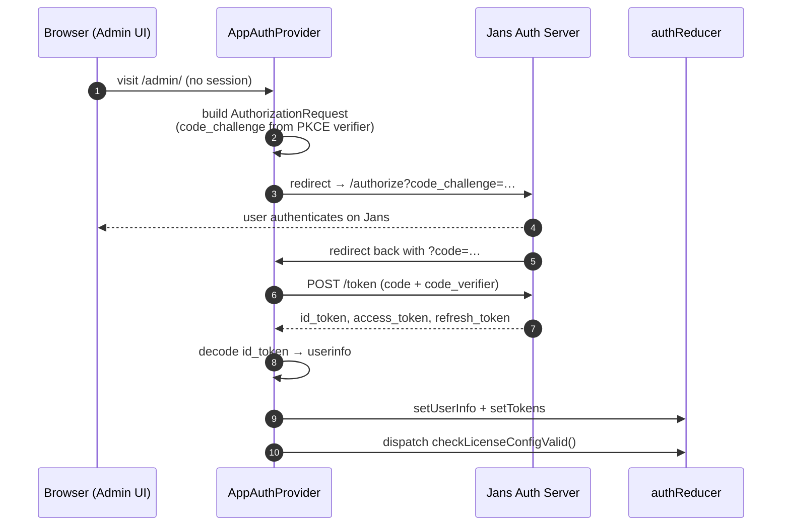
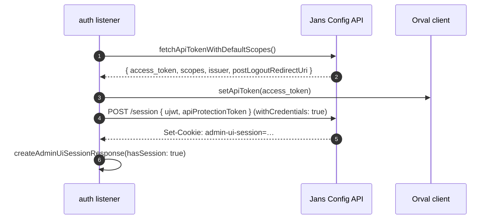
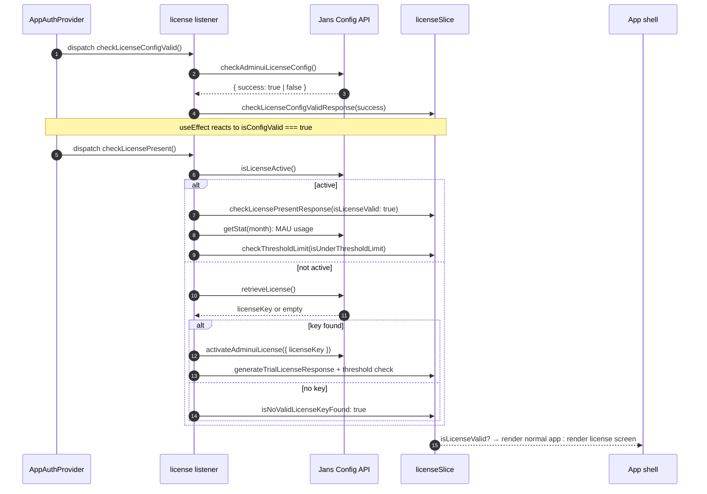

# Authentication

## Introduction

Authentication answers one question: **who is the user sitting in front of the browser?** The Admin UI gets the answer by signing the user in to the **Jans Auth Server** using **OAuth 2.0 / OpenID Connect with PKCE**. The flow is driven by [`@openid/appauth`](https://www.npmjs.com/package/@openid/appauth) (AppAuth-JS): the UI never sees a client secret.

Out of scope here:

- **What the user is allowed to do**: decided by Cedarling at the page boundary, see [cedarling.md](./cedarling.md).
- **The Config API call itself**: how the session cookie reaches outgoing requests is covered in [config-api.md](./config-api.md). This doc covers how the session is _established_.

## Where the code lives

- **OIDC sign-in**: [`app/utils/AppAuthProvider.tsx`](../app/utils/AppAuthProvider.tsx), [`app/utils/TokenController.ts`](../app/utils/TokenController.ts), [`app/utils/urlSecurity.ts`](../app/utils/urlSecurity.ts)
- **Auth state**: [`app/redux/features/authSlice.ts`](../app/redux/features/authSlice.ts), [`app/redux/listeners/authListener.ts`](../app/redux/listeners/authListener.ts)
- **License flow**: [`app/redux/features/licenseSlice.ts`](../app/redux/features/licenseSlice.ts), [`app/redux/listeners/licenseListener.ts`](../app/redux/listeners/licenseListener.ts)
- **Idle timeout**: [`app/routes/Apps/Gluu/GluuSessionTimeout.tsx`](../app/routes/Apps/Gluu/GluuSessionTimeout.tsx)
- **Logout**: [`app/routes/Pages/ByeBye.tsx`](../app/routes/Pages/ByeBye.tsx), [`app/redux/listeners/authListener.ts`](../app/redux/listeners/authListener.ts)
- **Storage keys (all)**: [`app/constants/storageKeys.ts`](../app/constants/storageKeys.ts) (single source of truth)

## OAuth / PKCE sign-in

### Flow diagram

### Explanation of the flow

The browser opens the Admin UI at `/admin/`. [`app/utils/AppAuthProvider.tsx`](../app/utils/AppAuthProvider.tsx) mounts and checks whether a valid session already exists in [`authReducer`](../app/redux/features/authSlice.ts). If not, it begins an **OAuth Authorization Code flow with PKCE**.

**PKCE** replaces the client secret. The browser generates a random secret called a **code verifier**, hashes it into a **code challenge**, and sends only the challenge with the redirect to the auth server. The auth server stores the challenge against this login attempt. When the browser later exchanges its authorization code for tokens, it sends the original verifier. The server hashes it and compares to the stored challenge. This proves the same browser that started the login is finishing it, without the Admin UI ever needing to hold a client secret.

The browser is redirected to the Jans Auth Server's `/authorize` endpoint. The user signs in there. Jans redirects back to `http://<admin-ui-host>/?code=…&state=…`: note this lands at the **origin**, not under `/admin/`, because the redirect URI is registered without a path.

`AppAuthProvider` sees the `code` in the URL and exchanges it for tokens by POSTing to the auth server's `/token` endpoint with `grant_type=authorization_code`, the code, and the original code verifier. No client secret is involved.

The response carries three tokens: an `id_token` (proof of identity, signed JWT), an `access_token` (for the UI's own scopes), and a `refresh_token` (for renewing the access token later). `AppAuthProvider` decodes the `id_token` using `jwt-decode` to extract the user profile (`userinfo`: email, name, `jansAdminUIRole`, etc.), then dispatches the tokens and decoded userinfo into [`authSlice`](../app/redux/features/authSlice.ts).

Once the tokens are in Redux, the provider triggers the next phase by dispatching `checkLicenseConfigValid()`. The user is signed in to the auth server, but the Admin UI is not yet usable. The license must be verified, and a server-side Admin UI session must be created.

## Admin-UI session

### Why it exists

OIDC sign-in alone does **not** let the UI talk to the Config API. The Config API authenticates every regular request through a **session cookie** that proves the caller went through the Admin UI sign-in flow (rather than a script bypassing it). `createAdminUiSession` is what mints that cookie on the server side.

### Flow diagram

### Explanation of the flow

The flow is driven by [`app/redux/listeners/authListener.ts`](../app/redux/listeners/authListener.ts). After the OAuth/PKCE step writes the user info into Redux, `AppAuthProvider` dispatches `getAPIAccessToken`. The listener calls `fetchApiTokenWithDefaultScopes()` and receives back an `access_token` along with side values (`issuer`, `postLogoutRedirectUri`, the requested scopes).

The listener hands the token to the Orval client by calling `setApiToken(access_token)` so the upcoming `POST /session` call carries the right header. Once the session cookie is set, regular Config API traffic authenticates off the cookie (see [config-api.md](./config-api.md)). The listener also persists `POST_LOGOUT_REDIRECT_URI` to `localStorage` so that [`ByeBye.tsx`](../app/routes/Pages/ByeBye.tsx) can use it as a fallback at logout time.

Then comes the session creation. The listener dispatches `createAdminUiSession({ ujwt, apiProtectionToken })`:

- **`ujwt`** is the user JWT. Proof of identity.
- **`apiProtectionToken`** is a separate short-lived token that protects the session-creation endpoint itself.

The helper in [`app/redux/api/backend-api.ts`](../app/redux/api/backend-api.ts) POSTs to `ENDPOINTS.SESSION` with `withCredentials: true`, which tells the browser to accept any `Set-Cookie` header in the response and to send it back on subsequent requests to the same origin.

The Config API creates a server-side session record, sets a cookie, and returns success. The listener dispatches `createAdminUiSessionResponse({ hasSession: true })`, and `state.authReducer.hasSession` flips to `true`: unblocking the rest of the app.

If `createAdminUiSession` returns 403, that means the user signed in successfully but does not have the `jansAdminUIRole` claim. The listener calls `redirectToLogout()` from [`app/redux/listeners/authListener.ts`](../app/redux/listeners/authListener.ts), which surfaces a toast and forces sign-out.

After this, every Config API call goes through the shared axios instance in [`orval/axiosInstance.ts`](../orval/axiosInstance.ts). The browser sends the `admin-ui-session` cookie alongside each request, and the Config API authenticates the caller off that cookie.

## License verification

### Why it exists

The Admin UI is part of **Gluu Flex**. A working installation must have an active license. Without one, the app shows a **license-error screen** instead of the normal sidebar, with options to upload a Software Statement Assertion (SSA) or start a 30-day trial. License verification runs immediately after OIDC sign-in and decides which screen the user sees: the normal app, or the license-error screen.

The check has two halves, run sequentially:

1. **Config check** ([`checkLicenseConfigValid`](../app/redux/listeners/licenseListener.ts)): is the license-related OIDC configuration in persistence valid? In other words: is the Admin UI even able to _ask_ the License APIs anything?
2. **Presence check** ([`checkLicensePresent`](../app/redux/listeners/licenseListener.ts)): given the config is valid, does this installation have an active license, and is the user under the licensed MAU (Monthly Active User) cap?

If either half fails, the user lands on the license-error screen. If both pass, the rest of the app renders.

### Flow diagram

### Explanation of the flow

The flow is driven by [`app/redux/listeners/licenseListener.ts`](../app/redux/listeners/licenseListener.ts), and the state it manipulates lives in [`app/redux/features/licenseSlice.ts`](../app/redux/features/licenseSlice.ts). It is kicked off by [`app/utils/AppAuthProvider.tsx`](../app/utils/AppAuthProvider.tsx): two `useEffect`s, run sequentially, not in parallel.

**Step 1: Config check.** `AppAuthProvider` dispatches `checkLicenseConfigValid()` once, guarded by a `hasDispatchedConfigCheck` ref. The listener's `checkAdminuiLicenseConfigWorker` calls the `checkAdminuiLicenseConfig` Orval hook, which asks the Config API whether the OIDC client used to talk to the License APIs is valid. The response is a `{ success: boolean }`. The listener dispatches `checkLicenseConfigValidResponse(success)`, which sets `state.licenseReducer.isConfigValid`.

If `isConfigValid` is `false`, the UI shows the SSA-upload screen and the flow stops. The user uploads a fresh SSA, which routes back through `uploadNewSsaToken` in the same listener. On success it re-runs the config check. If `isConfigValid` is `true`, a second `useEffect` in `AppAuthProvider` reacts and dispatches `checkLicensePresent()`.

**Step 2: Presence check.** `checkLicensePresentWorker` calls the `isLicenseActive` Orval hook. The Config API resolves this against its license backend (at most once per 30 days, otherwise it returns the cached result from persistence). If `success: true`, the response carries license fields (expiry, MAU cap, etc.) which the listener maps into the slice via `checkLicensePresentResponse({ isLicenseValid: true })`.

**Step 3: MAU threshold.** With an active license, the listener also calls the `getStat` Orval hook for the current month and compares the licensed MAU cap against the current usage. If usage is under the cap, `checkThresholdLimit({ isUnderThresholdLimit: true })` is dispatched. If usage is over, it dispatches `false` and the UI shows a warning banner.

**Step 4: Not active → retrieve.** If `isLicenseActive` returned `{ success: false }`, the listener falls into `retrieveLicenseKey`. This calls `retrieveLicense` (Orval), which asks the Config API to fetch a license key. If a key comes back (the user has subscribed in Agama Lab), the listener calls `activateAdminuiLicense({ licenseKey })`, dispatches `generateTrialLicenseResponse(...)`, and re-runs the MAU threshold check. If no key (the user has not subscribed), the listener dispatches `isNoValidLicenseKeyFound: true` and the UI offers a 30-day trial. The trial can only be generated once per Agama Lab user. `generateTrialLicense` follows the same retrieve/activate pattern but calls `getTrialLicense` instead.

**Error / network handling.** Every Orval call in the license listener is wrapped to capture the failure shape via `getBackendStatusFromError`. The status code and error message are mirrored into `state.authReducer.backendStatus` so the global `GluuServiceDownModal` can render if the Config API is unreachable. A 403 on a license endpoint routes through `redirectToLogout()` from [`app/redux/listeners/authListener.ts`](../app/redux/listeners/authListener.ts): that path means the OIDC token is valid but the user lacks the role to call the license endpoints, which is treated as a hard sign-out.

### Slice fields the UI reads

The `licenseSlice` exposes several booleans that the app shell uses to decide which screen to render:

- `isLicenseValid`: the master gate for normal app rendering.
- `islicenseCheckResultLoaded`: distinguishes "still loading the check" from "loaded and invalid".
- `isNoValidLicenseKeyFound`, `error`, `errorSSA`: drive the license-error screen sub-states (trial offer, SSA upload prompt, plain error).
- `isConfigValid`: the result of the config-check half. Tracked separately from `isLicenseValid` because the config check can fail on its own and produces the SSA-upload screen.
- `isUnderThresholdLimit`: drives the MAU warning banner.
- `isValidatingFlow`, `generatingTrialKey`, `isLoading`: UI spinner state on the license screens.

## Tokens

Two OIDC tokens, **not interchangeable**:

- **OIDC `id_token`**: JWT proof of identity. Decoded by `jwt-decode` to populate `userinfo`. Stored in `state.authReducer.userinfo` and persisted via `redux-persist` (so a page reload doesn't kick the user out).
- **OIDC `access_token` (UI scopes)**: for the UI's own calls back to the issuer (e.g. fetching the userinfo endpoint). Held by AppAuth's `LocalStorageBackend` per the OAuth spec.

Never reach into `localStorage` directly for tokens. Go through [`app/utils/TokenController.ts`](../app/utils/TokenController.ts) or the auth listener.

## Storage keys

`localStorage` is used for state that needs to be readable **before** React and Redux even boot. Theme and language need to be available for the first paint, otherwise the user sees a flash of the wrong theme. Every key lives in [`app/constants/storageKeys.ts`](../app/constants/storageKeys.ts). Inline string keys are a lint regression.

| Key                        | Feature                                      | Set by                              | Read by                               |
| -------------------------- | -------------------------------------------- | ----------------------------------- | ------------------------------------- |
| `USER_CONFIG`              | User prefs blob (theme + language)           | `LanguageMenu`, `ThemeDropdown`     | `i18n.ts`, `themeContext`             |
| `INIT_THEME`               | UI theme (light/dark)                        | `themeContext`, `logoutSlice` reset | `themeContext`, `default.tsx` layout  |
| `INIT_LANG`                | UI language                                  | `LanguageMenu`, `logoutSlice` reset | `i18n.ts`, `LanguageMenu`             |
| `USER_INFO`                | Decoded OIDC `userinfo` (theme/lang restore) | `AppAuthProvider` on sign-in        | `themeContext`                        |
| `ISSUER`                   | OIDC issuer URL                              | `TokenController` after discovery   | `TokenController` on subsequent boots |
| `POST_LOGOUT_REDIRECT_URI` | Where to send the user after end-session     | auth listener from OAuth2 config    | `ByeBye.tsx` as fallback              |

## 401 vs 403

The Config API rejects with two distinct status codes that mean different things:

- **401 (unauthorized)**: the token is missing, expired, or invalid. AppAuth handles this as a normal token lifecycle event: it refreshes or re-authenticates the user.
- **403 (forbidden)**: the token is fine, but the action is denied. This generally means Cedarling rejected the action, or the user does not have the right role. The UI surfaces a permission-error toast rather than signing the user out.

`isFourZeroThreeError(err)` in [`app/utils/TokenController.ts`](../app/utils/TokenController.ts) distinguishes the two. When you write a new mutation, surface 403 separately. Do not collapse it into "session expired". The user is still signed in. They simply do not have permission for this specific action.

## Idle timeout

Users who leave the Admin UI open without interaction are signed out automatically. This protects browser tabs left unattended on shared machines.

[`app/routes/Apps/Gluu/GluuSessionTimeout.tsx`](../app/routes/Apps/Gluu/GluuSessionTimeout.tsx) wraps the app using `react-idle-timer`. The defaults are five minutes idle, then a ten-second countdown modal warning the user, then a forced logout. The idle window is configurable per environment via `sessionTimeoutInMins` on the auth slice. When the modal countdown expires, the component dispatches `auditLogoutLogs` (so the involuntary logout is captured in the audit trail) and navigates the browser to `/logout`. From there, the logout flow below takes over.

## Logout

Logout is one cleanup path with three different triggers. All of them end up routing the browser to `/logout`, which is served by [`app/routes/Pages/ByeBye.tsx`](../app/routes/Pages/ByeBye.tsx).

### Trigger paths

- **User-initiated**: the sidebar logout link routes to `/logout` → `ByeBye.tsx`.
- **Forced**: `redirectToLogout(message)` in [`app/redux/listeners/authListener.ts`](../app/redux/listeners/authListener.ts) is called when a listener hits a fatal auth error (e.g. 403 from `createAdminUiSession`). It does best-effort cleanup and then sets `window.location.href = '/admin/logout'`.
- **Idle timeout**: `GluuSessionTimeout` dispatches `auditLogoutLogs` first (so the involuntary exit is audited) and then navigates to `/logout`.

### What `ByeBye.tsx` does, in order

1. `dispatch(setAuthState({ state: false }))`: flips the auth flag immediately so any guarded UI hides while the rest of the cleanup runs.
2. If `state.authReducer.hasSession` is `true`, calls `deleteAdminUiSession()` against `ENDPOINTS.SESSION` (DELETE) so the Config API invalidates the admin-UI session cookie. Failures are logged but do not block the rest of logout.
3. `dispatch(logoutUser())`: the `logoutSlice` reducer wipes `localStorage` of tokens and userinfo, **preserves** `USER_CONFIG`, and resets `INIT_THEME` + `INIT_LANG` to defaults so the next visitor lands on a clean theme.
4. If the OAuth config has an `endSessionEndpoint`, builds the end-session URL with `buildSafeLogoutUrl(endSessionEndpoint, postLogoutRedirectUri, state)` (from [`app/utils/urlSecurity.ts`](../app/utils/urlSecurity.ts)) and redirects there. Jans clears its own session and returns the browser to the redirect URI.
5. **Fallback**: if no `endSessionEndpoint` is available, redirects to the URL in `STORAGE_KEYS.POST_LOGOUT_REDIRECT_URI` (validated via `buildSafeNavigationUrl`), or `/` as a last resort.

`buildSafeLogoutUrl` and `buildSafeNavigationUrl` exist because constructing these URLs by hand is error-prone. A crafted `post_logout_redirect_uri` is a URL-injection vector. Always go through them.

## OAuth scopes vs Cedarling resource scopes

Two unrelated things are both called "scopes":

- **OIDC scopes** are declared in the auth config the Jans server hands back. AppAuth lists them in the `AuthorizationRequest`. They control what the OIDC token can be used for.
- **Cedarling resource scopes** are declared in [`app/cedarling/constants/resourceScopes.ts`](../app/cedarling/constants/resourceScopes.ts) and evaluated at the page boundary by `useCedarling()`. They control which UI elements render for which role.

A user can be signed in (OIDC scopes valid) but unauthorized (Cedarling denies). That is the normal case for role-restricted pages. See [cedarling.md](./cedarling.md).

## Debugging tips

- AppAuth has a verbose log flag. At the top of [`app/utils/AppAuthProvider.tsx`](../app/utils/AppAuthProvider.tsx), calling `setFlag('IS_LOG', true)` traces the OAuth flow locally. Useful for tracking down redirect mismatches. Never ship with this flag enabled.
- `redux-devtools` shows the full `authReducer` slice. If Config API calls fail with `401`, check `state.authReducer.hasSession`: a `false` value means `createAdminUiSession` never succeeded, so no session cookie exists and the Config API rejects every request.
- If the user is bounced back to the login screen immediately after sign-in, the cause is almost always the `createAdminUiSession` 403 path. The user signed in but does not have the `jansAdminUIRole` claim. Check the Jans Auth Server's user record.
