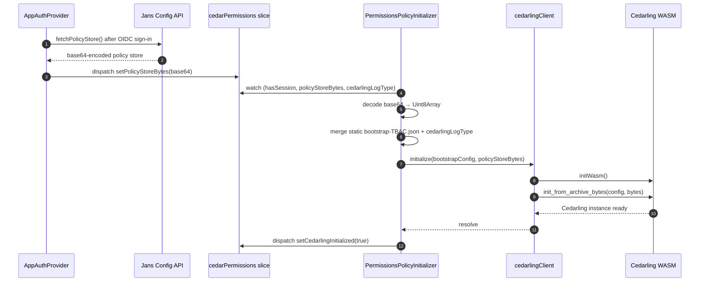
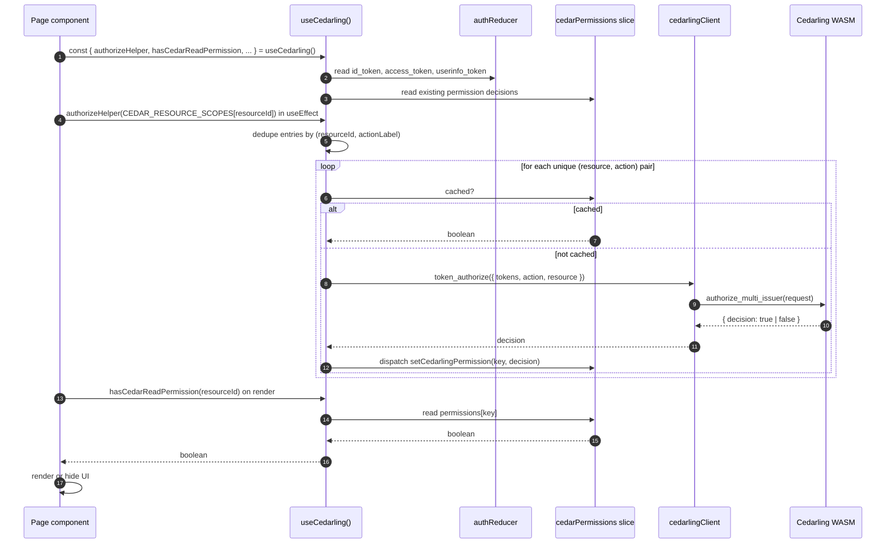

# Access Control with Cedarling

## Introduction

The Admin UI doesn't hard-code who-can-do-what. Instead, every permission check goes through **Cedarling** — a policy engine from the Janssen Project that decides, at runtime, whether the current user is allowed to perform a specific action on a specific resource.

A few things make this design unusual:

- **Cedarling runs inside the browser.** It is a [Cedar](https://www.cedarpolicy.com/) engine compiled to WebAssembly (WASM) and bundled into the app. There is no network call to evaluate a permission — the engine, the policies, and the user's tokens are all in memory in the same tab.
- **Policies are data, not code.** The set of rules ("a user with role X can read resource Y") lives in a JSON file called a **policy store**, which is loaded into Cedarling at startup. Changing who can do what means updating the policy store, not editing components.
- **The UI check is the first gate, not the only one.** Even if Cedarling says "yes", the Config API on the server still validates the same action and can return `403`. Cedarling exists to hide UI elements the user can't use; it does not replace server-side authorization.

Every page that needs to gate a button, an action, or a whole section pulls a small hook (`useCedarling`) and asks: _can this user read / write / delete this resource?_ The answer is a boolean. The first answer for each `(resource, action)` pair triggers a WASM call; every later answer is read from a Redux cache.

## Flow diagram

There are two distinct phases. They happen in this order, and the second one cannot run until the first one finishes.

### Phase 1 — Bootstrap (once per session, right after sign-in)



### Phase 2 — Per-page permission check (every time a guarded page mounts)



## Explanation of the flow

### Phase 1 — Bootstrap (steps 1-12 in the diagram)

When a user signs in successfully, `AppAuthProvider` doesn't just store the tokens — it also fetches the **policy store** from the Jans Config API (step 1). The response is a base64-encoded blob containing the Cedar policies that describe who can do what. `AppAuthProvider` puts that blob into the `cedarPermissions` Redux slice (step 3).

`PermissionsPolicyInitializer` is a render-less component mounted at the top of the app tree. Its only job is to watch the Redux store for three things to be true at the same time:

- a session exists (`hasSession`)
- the policy store bytes have arrived (`policyStoreBytes` is non-empty)
- a log type is configured (`cedarlingLogType`)

Once all three are present (step 4), the initializer decodes the base64 string into a `Uint8Array` (step 5), merges a static bootstrap config (`app/cedarling/config/cedarling-bootstrap-TBAC.json`) with the runtime log type (step 6), and calls `cedarlingClient.initialize(config, bytes)` (step 7).

`cedarlingClient` is a thin singleton wrapper around the WASM module. Its `initialize` function does two things: it loads the WASM binary into memory (`initWasm()`, step 8), then asks the WASM module to construct a `Cedarling` instance from the bootstrap config and the policy store bytes (`init_from_archive_bytes`, step 9). The same client also guards against double-init using a promise singleton, so if `PermissionsPolicyInitializer` re-runs while initialization is mid-flight, the second call returns the in-progress promise instead of starting over.

When `init_from_archive_bytes` resolves (step 10), the client marks itself ready and the initializer dispatches `setCedarlingInitialized(true)` (step 12). From this point on, any component can ask Cedarling for a decision.

If initialization fails, the initializer retries up to 10 times with a 1-second delay between tries. If it still fails after 10 attempts, it dispatches `setCedarFailedStatusAfterMaxTries`, which is the signal the rest of the app uses to render a "Cedarling unavailable" fallback instead of the normal UI.

### Phase 2 — Per-page permission check (steps 1-13 in the diagram)

Every page that needs to gate something on a permission follows the same pattern. Take a concrete example: the OIDC Clients list page.

When the page component mounts (step 1), it calls the `useCedarling()` hook (step 1 — same call). The hook pulls the three tokens (`id_token`, `access_token`, `userinfo_token`) out of `authReducer` (step 2) and the existing decision cache out of `cedarPermissions` (step 3). It returns a stable object exposing `authorizeHelper`, `hasCedarReadPermission`, `hasCedarWritePermission`, `hasCedarDeletePermission`, plus loading and error state.

In a `useEffect`, the page then calls `authorizeHelper(CEDAR_RESOURCE_SCOPES[ADMIN_UI_RESOURCES.Clients])` (step 4). The argument is an array of `ResourceScopeEntry` objects, each shaped like `{ permission: 'https://jans.io/oauth/jans-auth-server/config/openid/clients.readonly', resourceId: 'Clients' }`. The `permission` field is a string URL that identifies the OAuth scope; the `resourceId` is the logical resource name in the Cedar policy store.

`authorizeHelper` does two non-obvious things:

1. **It derives an action label from the URL.** A URL containing `write` becomes the `write` action; one containing `delete` becomes `delete`; everything else becomes `read`. A handful of special-case URLs (SSA admin/developer, SCIM bulk, revoke session, OpenID) are also treated as `write`. This is `getActionLabelFromUrl` inside the hook.
2. **It dedupes by `(resourceId, actionLabel)`.** If the page asks Cedarling about the same resource and action twice in the same call — for example, two different scope URLs that both resolve to `(Clients, read)` — the helper fires the underlying authorization exactly once and reuses the decision for both entries (step 5).

For each unique `(resource, action)` pair, the helper checks the cache first (step 6). If a decision was previously computed in this session, it is returned immediately and no WASM call happens. If not (step 7), the helper builds a `TokenAuthorizationRequest`:

- All three tokens, mapped to their Cedar entity types (`GluuFlexAdminUI::Access_token`, `::id_token`, `::Userinfo_token`)
- The action, formatted as `GluuFlexAdminUI::Action::"read"` (or `"write"` / `"delete"`)
- The resource, as a Cedar entity with the resourceId

It hands the request to `cedarlingClient.token_authorize` (step 8), which calls into WASM (`authorize_multi_issuer`, step 9). The WASM evaluates the Cedar policies against the tokens, the action, and the resource entity, then returns a `{ decision: boolean }` (step 10). The hook dispatches that decision into the `cedarPermissions` slice under the key `${resourceId}_${actionLabel}` (step 11).

After `authorizeHelper` finishes, the page renders. During render, the page calls `hasCedarReadPermission(ADMIN_UI_RESOURCES.Clients)` (step 12) to decide whether to show the "Clients" table at all, and `hasCedarWritePermission(...)` to decide whether to show "Add Client" / "Edit" / "Delete" buttons (step 13). Each of these is a pure Redux selector — it reads the cached boolean and returns it. After the first `authorizeHelper` call on a page, every subsequent render of that page costs nothing: no WASM, no network, just a cache hit.

A 403 from the Config API is still possible if a Cedarling decision and the server-side policy check disagree. Cedarling is the **early gate** for what the user can see and click, not the final word — the Config API always re-validates. When the Config API disagrees, the user sees a toast and the affected query fails; Cedarling decisions stay cached.

## Where the code lives

Everything Cedarling-related is consolidated under `app/cedarling/`, with three small pieces wired into the broader app. The tree below shows what each folder owns; the prose after points out the files most worth knowing.

```text
app/cedarling/
├── client/         # cedarlingClient singleton — wraps the WASM module
├── config/         # cedarling-bootstrap-TBAC.json, policy-store-dev.json, policy-store-prod.json
├── constants/      # CEDARLING_CONSTANTS, CEDAR_RESOURCE_SCOPES map
├── enums/          # CedarlingLogType
├── hooks/          # useCedarling() — the hook every page uses
├── types/          # AdminUiFeatureResource, ResourceScopeEntry, AuthorizationResponse, …
└── utility/        # ADMIN_UI_RESOURCES, CEDARLING_BYPASS, buildCedarPermissionKey

app/redux/features/cedarPermissionsSlice.ts
                    # Redux slice storing initialized state, policyStoreBytes,
                    # the permission decision cache, and error / retry state

app/components/App/PermissionsPolicyInitializer.tsx
                    # invisible component — owns the Phase 1 bootstrap

app/utils/AppAuthProvider.tsx
                    # fetches the policy store after sign-in and dispatches it to Redux
```

The Cedar policy store JSON files are selected at build time. `vite.config.ts` reads the build mode and injects either `policy-store-dev.json` or `policy-store-prod.json` so the right one is embedded in the bundle. Look in `vite.config.ts` under `getPolicyStoreConfig` if you need to change that mapping.

## How to use it

To gate a button, a table, or a whole page on a Cedar permission, three things need to be in place:

1. The page's resource must exist in `ADMIN_UI_RESOURCES` (`app/cedarling/utility/resources.ts`).
2. The scopes that map to that resource must exist in `CEDAR_RESOURCE_SCOPES` (`app/cedarling/constants/resourceScopes.ts`) — this is the array `authorizeHelper` receives.
3. The matching Cedar policy must exist in both `policy-store-dev.json` and `policy-store-prod.json` (otherwise the answer will always be "no").

In the component:

```ts
import { useEffect, useMemo } from 'react'
import { useCedarling } from '@/cedarling/hooks/useCedarling'
import { ADMIN_UI_RESOURCES } from '@/cedarling/utility'
import { CEDAR_RESOURCE_SCOPES } from '@/cedarling/constants/resourceScopes'

const RESOURCE_ID = ADMIN_UI_RESOURCES.Clients
const SCOPES = CEDAR_RESOURCE_SCOPES[RESOURCE_ID]

const ClientListPage = () => {
  const { authorizeHelper, hasCedarReadPermission, hasCedarWritePermission } = useCedarling()

  useEffect(() => {
    if (SCOPES?.length) {
      authorizeHelper(SCOPES)
    }
  }, [authorizeHelper])

  const canRead = useMemo(() => hasCedarReadPermission(RESOURCE_ID), [hasCedarReadPermission])
  const canWrite = useMemo(() => hasCedarWritePermission(RESOURCE_ID), [hasCedarWritePermission])

  if (!canRead) return <NoAccess />

  return (
    <>
      <ClientsTable />
      {canWrite && <AddClientButton />}
    </>
  )
}
```

A few rules:

- Always import the resource id by reference (`ADMIN_UI_RESOURCES.Clients`). Never inline a string like `'Clients'` — typos compile but always evaluate to `false` at runtime.
- Always call `authorizeHelper` in a `useEffect`, not in the render body. The helper dispatches Redux actions, which cannot happen during render.
- Wrap `hasCedarReadPermission` / `hasCedarWritePermission` in `useMemo`. They are cheap, but the gating logic that depends on them often is not.

## Policy store

The policy store is the set of Cedar policies that decide every permission outcome. Two files live in `app/cedarling/config/`:

- `policy-store-dev.json` — loaded in development builds (`npm start`, `npm run build:dev`)
- `policy-store-prod.json` — loaded in production builds (`npm run build:prod`)

`vite.config.ts` selects the right file based on the build mode and embeds it into the bundle as a base64 string. The Config API ships the same store to the browser via `fetchPolicyStore()` at runtime — at the moment, both are the same file, but the runtime fetch lets the policy store change without rebuilding the UI.

When you add or change a policy, update **both** dev and prod files. A policy that exists in dev but not in prod will return "deny" in production with no obvious error.

## Bypass (local development only)

`CEDARLING_BYPASS` is a constant in `app/cedarling/utility/`. When the code that consumes it is wired to short-circuit on `CEDARLING_BYPASS === true`, every permission check returns `true`. This exists for local debugging when you want to see a page render without setting up roles end-to-end.

Use it sparingly, and never ship a component that hard-codes the bypass. The whole point of Cedarling is that permissions are data — bypassing it defeats that.

## Adding a new permission check

A walkthrough for adding a Cedarling-gated page from scratch:

1. **Add the resource id.** Open `app/cedarling/utility/resources.ts` and add an entry to `ADMIN_UI_RESOURCES`:

   ```ts
   export const ADMIN_UI_RESOURCES = {
     // …existing
     MyNewFeature: 'MyNewFeature',
   } as const
   ```

2. **Add the scopes.** Open `app/cedarling/constants/resourceScopes.ts` and add an entry to `CEDAR_RESOURCE_SCOPES`:

   ```ts
   [ADMIN_UI_RESOURCES.MyNewFeature]: [
     { permission: MY_FEATURE_READ, resourceId: ADMIN_UI_RESOURCES.MyNewFeature },
     { permission: MY_FEATURE_WRITE, resourceId: ADMIN_UI_RESOURCES.MyNewFeature },
   ],
   ```

   `MY_FEATURE_READ` / `MY_FEATURE_WRITE` are the OAuth scope URLs the Config API uses for this feature — they live in `app/utils/PermChecker.ts`.

3. **Add the Cedar policy.** Edit both `policy-store-dev.json` and `policy-store-prod.json` to include a policy that grants `MyNewFeature` access to the relevant role. Without this, every check on the new resource will return `false`.

4. **Wire it into the component.** Use the example under [How to use it](#how-to-use-it). Call `authorizeHelper` in `useEffect`; gate render and actions on `hasCedarReadPermission` / `hasCedarWritePermission` / `hasCedarDeletePermission`.

5. **Verify in the browser.** Sign in as a user with the role that should have access — confirm the page renders. Sign in as a user without it — confirm the page is gated. If the gated user can still see it, double-check that the resource id in the component matches the one in `CEDAR_RESOURCE_SCOPES`, and that the policy exists in both store files.
