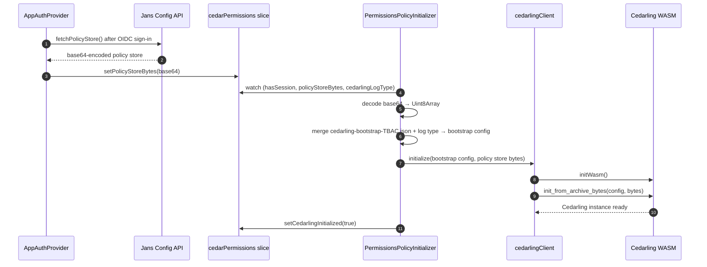
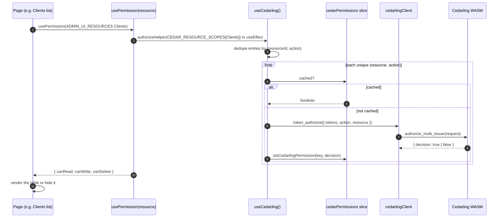

# Access Control using Cedarling

## Introduction

The Admin UI never hard-codes who-can-do-what. Instead, every permission check goes through **Cedarling**: a [Cedar](https://www.cedarpolicy.com/) policy engine, provided by the Janssen Project, compiled to WebAssembly (WASM) and bundled into the app.

Three things make this design unusual:

- **Cedarling runs inside the browser.** The engine, the policies, and the user's tokens are all in memory in the same tab. There is no network round-trip to evaluate a permission.
- **Policies are data, not code.** The rules ("a user with role X can read resource Y") live in a JSON file called a **policy store**, loaded into Cedarling at startup. Changing who can do what is a policy-store edit, not a component change.
- **The UI gate is the first gate, not the only one.** Even when Cedarling says "yes", the Jans Config API revalidates server-side and can still return 403. Cedarling hides UI elements the user can't use. It does not replace server-side authorization.

The check itself is simple: every page that gates a button, an action, or a whole section calls `usePermission(resource)` and gets back `{ canRead, canWrite, canDelete }`. The first answer for each `(resource, action)` pair triggers a WASM call. Every later answer is a Redux cache read.

## Flow diagram

There are two distinct phases. Phase 1 happens once per session, right after sign-in. Phase 2 happens every time a guarded page mounts.

### Phase 1: Bootstrap



### Phase 2: Per-page permission check



## Explanation of the flow

### Phase 1: Bootstrap

When the user finishes signing in, [`app/utils/AppAuthProvider.tsx`](../app/utils/AppAuthProvider.tsx) does two things: it stores the tokens, and it calls `fetchPolicyStore()` against the Jans Config API. The response is a base64-encoded blob containing the Cedar policies that describe who can do what. `AppAuthProvider` writes that blob into the [`cedarPermissions` slice](../app/redux/features/cedarPermissionsSlice.ts) (`setPolicyStoreBytes`).

[`app/components/App/PermissionsPolicyInitializer.tsx`](../app/components/App/PermissionsPolicyInitializer.tsx) is a render-less component mounted at the top of the app tree. Its only job is to watch the Redux store and wait until three things are present at the same time:

- a session exists (`hasSession`)
- the policy store bytes have arrived (`policyStoreBytes` is non-empty)
- a log type is configured (`cedarlingLogType`)

Once all three are ready, it:

1. **Decodes** the base64 string into a `Uint8Array`.
2. **Merges the bootstrap config**: a static JSON file at [`app/cedarling/config/cedarling-bootstrap-TBAC.json`](../app/cedarling/config/cedarling-bootstrap-TBAC.json) gets combined with the runtime-configured log type to produce the full bootstrap configuration that Cedarling will initialize with. The log type comes from the Config API (`authReducer.config.cedarlingLogType`) and is one of the values in [`CEDARLING_LOG_TYPE`](../app/cedarling/constants/cedarlingConstants.ts): `OFF` (default) or `STD_OUT`. This step tells Cedarling _how_ to behave (logging, schema, token issuers). The policy store tells it _what to enforce_.
3. **Initializes Cedarling** by calling `cedarlingClient.initialize(bootstrap config, policy store bytes)`. [`cedarlingClient`](../app/cedarling/client/) is a thin singleton wrapper around the WASM module. Its `initialize` function loads the WASM binary (`initWasm()`) and asks the WASM module to construct a `Cedarling` instance from the bootstrap config and the policy store bytes (`init_from_archive_bytes`). The client guards against double-init using a promise singleton. If Phase 1 re-runs while initialization is mid-flight, the second call returns the in-progress promise instead of starting over.
4. **Marks Cedarling ready** with `setCedarlingInitialized(true)`. From this point on, any component can ask Cedarling for a decision.

If initialization fails, the initializer retries up to **10 times with a 1-second delay** between tries (both values are inline in [`PermissionsPolicyInitializer.tsx`](../app/components/App/PermissionsPolicyInitializer.tsx)). If it still fails after 10 attempts, it dispatches `setCedarFailedStatusAfterMaxTries`, which is the signal the rest of the app uses to render a "Cedarling unavailable" fallback instead of the normal UI.

### Phase 2: Per-page permission check

Take the OIDC Clients list page as a concrete example. The page calls [`usePermission(ADMIN_UI_RESOURCES.Clients)`](../app/cedarling/hooks/usePermission.ts) and gets back `{ canRead, canWrite, canDelete }`. Those three booleans decide whether the table renders and which action buttons appear.

`usePermission` does two things. On mount it looks up the resource's scope list in `CEDAR_RESOURCE_SCOPES` and passes it to `authorizeHelper` inside a `useEffect`, which fills the decision cache. On every render it reads the cached decisions back through `hasCedarReadPermission`, `hasCedarWritePermission`, and `hasCedarDeletePermission`, defaulting each to `false` when no decision exists yet.

Under the hood `usePermission` is built on [`useCedarling()`](../app/cedarling/hooks/useCedarling.ts), the lower-level hook that pulls the three tokens (`id_token`, `access_token`, `userinfo_token`) out of `authReducer`, reads the decision cache out of `cedarPermissions`, and returns a stable object: `{ authorizeHelper, hasCedarReadPermission, hasCedarWritePermission, hasCedarDeletePermission }`. Most components use `usePermission`. `useCedarling` is used directly only where a component needs to evaluate many resources at once, such as the sidebar.

**`authorizeHelper`** is the one entry point for asking Cedarling about decisions. It takes an array of `ResourceScopeEntry` objects (each shaped `{ action, resourceId }`), dedupes by `(resourceId, action)` so it fires exactly one WASM call per unique pair, and returns an `AuthorizationResult[]` aligned to the original input.

**Where do the scopes come from?** A single catalog, [`RESOURCE_ACTIONS`](../app/cedarling/constants/resourceCatalog.ts), declares the allowed actions per resource, for example `Clients: ['read', 'write', 'delete']`. Two things derive from it in [`app/cedarling/utility/resources.ts`](../app/cedarling/utility/resources.ts):

- `ADMIN_UI_RESOURCES`: the resource-id map, one key per resource.
- `CEDAR_RESOURCE_SCOPES`: for each resource, its action list turned into `{ action, resourceId }` entries, which is exactly what `authorizeHelper` consumes.

So adding a resource or changing its allowed actions is a single edit to `RESOURCE_ACTIONS`.

**What `authorizeHelper` does internally:**

1. **Dedupes by `(resourceId, action)`.** Repeated pairs in the input collapse to one underlying authorization, and the decision is reused for every matching entry. This is the "dedupe" loop in the diagram.
2. **For each unique pair**, the helper first checks the Redux cache. If a decision was already computed in this session, it is returned immediately and no WASM call happens. On a cache miss, the helper builds a `TokenAuthorizationRequest`:
   - All three tokens, mapped to Cedar entity types (`GluuFlexAdminUI::Access_token`, `::id_token`, `::Userinfo_token`).
   - The action, formatted as `GluuFlexAdminUI::Action::"read"` (or `"write"` / `"delete"`).
   - The resource, as a Cedar entity carrying the `resourceId`.

   The entity-type prefixes live in [`CEDARLING_CONSTANTS`](../app/cedarling/constants/cedarlingConstants.ts) and must stay in sync with the policy-store schema.

3. **Calls `cedarlingClient.token_authorize(request)`**, which calls into WASM (`authorize_multi_issuer`). The WASM evaluates the Cedar policies against the tokens, action, and resource, and returns `{ decision: true | false }`. The decision is cached under the key `${resourceId}::${action}` ([`buildCedarPermissionKey`](../app/cedarling/utility/resources.ts)).

A failed authorization is not cached: the catch path returns `false` for that call but skips the cache write, so a transient WASM or init error retries on the next check instead of sticking as a permanent denial.

After the first `usePermission` call on a page, every subsequent render costs nothing: no WASM, no network, just a cache hit.

A 403 from the Config API is still possible if a Cedarling decision and the server-side policy check disagree. Cedarling is the **early gate** for what the user can see and click, not the final word. The Config API always revalidates. When the API disagrees, the user sees a toast and the affected query fails. Cached decisions stay.

## Where the code lives

```text
app/cedarling/
├── client/          # cedarlingClient - WASM wrapper, init promise singleton
├── config/          # cedarling-bootstrap-TBAC.json
│                    # policy-store-dev.json
│                    # policy-store-prod.json
├── components/      # Protected - declarative action gate
├── constants/       # RESOURCE_ACTIONS, CEDAR_ACTIONS, CEDARLING_BYPASS (resourceCatalog)
│                    # CEDARLING_CONSTANTS, CEDARLING_LOG_TYPE (cedarlingConstants)
├── hooks/           # useCedarling (low-level), usePermission (per-resource)
├── types/           # cedarTypes: CedarAction, AdminUiFeatureResource, ResourceScopeEntry, …
└── utility/         # ADMIN_UI_RESOURCES, CEDAR_RESOURCE_SCOPES, buildCedarPermissionKey

app/redux/features/cedarPermissionsSlice.ts
                     # decision cache, policy-store bytes, init state, retry state

app/components/App/PermissionsPolicyInitializer.tsx
                     # render-less component - owns Phase 1 bootstrap

app/utils/AppAuthProvider.tsx
                     # fetches the policy store after sign-in
```

`vite.config.ts` (`getPolicyStoreConfig`) picks `policy-store-dev.json` or `policy-store-prod.json` by build mode and embeds it into the bundle. The Config API ships the same store at runtime via `fetchPolicyStore()`: that is the runtime override path, used so the policy store can change without rebuilding the UI.

The `app/cedarling` module follows a one-way layering: `constants` ← `types` ← `utility` / `hooks` / `components`. Import from leaf paths (`@/cedarling/hooks/usePermission`, `@/cedarling/constants`, `@/cedarling/utility`, `@/cedarling/types`, `@/cedarling/components`). The top-level `@/cedarling` barrel is reserved for tests; it is blocked by `no-restricted-imports` in app and plugin code to keep Fast Refresh boundaries intact.

## How to use it

To gate a button, a table, or a whole page on a Cedar permission, two things must be in place:

1. The resource must exist in [`RESOURCE_ACTIONS`](../app/cedarling/constants/resourceCatalog.ts) with the actions it supports. `ADMIN_UI_RESOURCES` and `CEDAR_RESOURCE_SCOPES` derive from it.
2. The matching Cedar policy must exist in **both** `policy-store-dev.json` and `policy-store-prod.json` (otherwise the answer is always "deny").

Then in the component:

```tsx
import { usePermission } from '@/cedarling/hooks/usePermission'
import { ADMIN_UI_RESOURCES } from '@/cedarling/utility'

const resourceId = ADMIN_UI_RESOURCES.Clients

const ClientListPage = () => {
  const { canRead, canWrite, canDelete } = usePermission(resourceId)

  if (!canRead) return <NoAccess />
  return (
    <>
      <ClientsTable />
      {canWrite && <AddClientButton />}
      {canDelete && <DeleteAction />}
    </>
  )
}
```

`usePermission` runs the authorization in its own `useEffect`, so the component never calls `authorizeHelper` directly.

For a single child that should appear only under one action, [`Protected`](../app/cedarling/components/Protected.tsx) is the declarative form:

```tsx
import { Protected } from '@/cedarling/components'
import { ADMIN_UI_RESOURCES } from '@/cedarling/utility'
import { CEDAR_ACTIONS } from '@/cedarling/constants'
;<Protected resource={ADMIN_UI_RESOURCES.Clients} action={CEDAR_ACTIONS.WRITE}>
  <AddClientButton />
</Protected>
```

Rules:

- Match the action to the operation: read for viewing, write for add and edit, delete for delete. Gate the destination page and its confirm dialog on the same action as the button that opens them.
- Import the resource id from `ADMIN_UI_RESOURCES`. Never inline `'Clients'`: typos compile but always evaluate to `false`.
- Use `CEDAR_ACTIONS.READ` / `WRITE` / `DELETE`, never the bare strings.
- Use leaf import paths, not the top `@/cedarling` barrel.

## Adding a new permission check

1. Add the resource and its allowed actions to [`RESOURCE_ACTIONS`](../app/cedarling/constants/resourceCatalog.ts):

   ```ts
   export const RESOURCE_ACTIONS = {
     // …existing
     MyNewFeature: ['read', 'write'],
   } as const satisfies Record<string, readonly CedarAction[]>
   ```

   `ADMIN_UI_RESOURCES.MyNewFeature` and `CEDAR_RESOURCE_SCOPES[MyNewFeature]` are derived automatically. Every action a component reads through `usePermission` (and every action used on a sidebar entry) must be listed here, otherwise that decision is always `false`.

2. Add the Cedar policy to **both** `policy-store-dev.json` and `policy-store-prod.json`. A policy in dev but not prod returns "deny" in production with no obvious error.

3. Gate the component with `usePermission(ADMIN_UI_RESOURCES.MyNewFeature)` or `<Protected>` as shown above.

4. Verify in the browser. Sign in as a user with the role that should have access and confirm the page renders. Sign in as a user without it and confirm the page is gated.

## The `CEDARLING_BYPASS` sentinel

`CEDARLING_BYPASS` (`'CEDARLING_BYPASS'`, exported from [`app/cedarling/constants/resourceCatalog.ts`](../app/cedarling/constants/resourceCatalog.ts)) is a **production sentinel**, not a debug switch. Use it as the `resourceKey` on a menu item or route whose visibility should not depend on a Cedar decision. The sidebar code recognizes this exact value and short-circuits the permission check, returning the item unconditionally:

```ts
// app/routes/Apps/Gluu/GluuAppSidebar.tsx
if (item.resourceKey === CEDARLING_BYPASS) {
  return item
}
```

Real production usage in [`plugins/admin/plugin-metadata.ts`](../plugins/admin/plugin-metadata.ts) (the Health menu, for example):

```ts
{
  title: 'menus.health',
  path: ROUTES.ADMIN_HEALTH,
  action: CEDAR_ACTIONS.READ,
  resourceKey: CEDARLING_BYPASS,
}
```

Reach for it deliberately, only for menu entries or routes that should always render regardless of role. The default for every other entry must remain an `ADMIN_UI_RESOURCES.<Name>` resource id.
