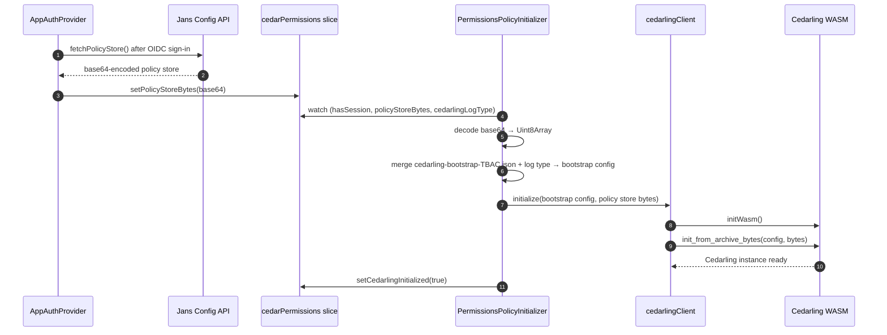
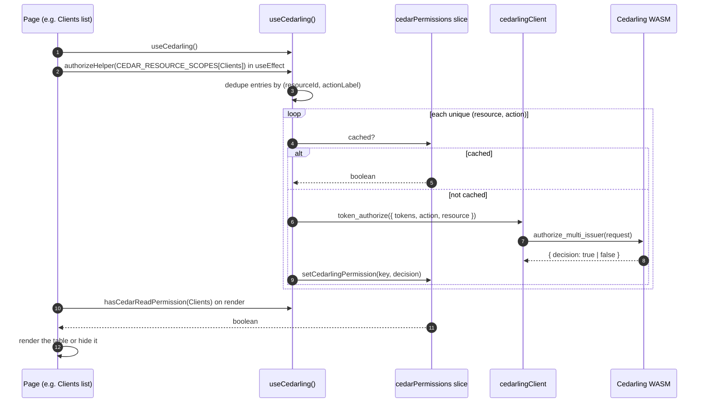

# Access Control using Cedarling

## Introduction

The Admin UI never hard-codes who-can-do-what. Instead, every permission check goes through **Cedarling** — a [Cedar](https://www.cedarpolicy.com/) policy engine, provided by the Janssen Project, compiled to WebAssembly (WASM) and bundled into the app.

Three things make this design unusual:

- **Cedarling runs inside the browser.** The engine, the policies, and the user's tokens are all in memory in the same tab. There is no network round-trip to evaluate a permission.
- **Policies are data, not code.** The rules ("a user with role X can read resource Y") live in a JSON file called a **policy store**, loaded into Cedarling at startup. Changing who can do what is a policy-store edit, not a component change.
- **The UI gate is the first gate, not the only one.** Even when Cedarling says "yes", the Jans Config API revalidates server-side and can still return 403. Cedarling hides UI elements the user can't use; it does not replace server-side authorization.

The check itself is simple: every page that gates a button, an action, or a whole section calls a small hook (`useCedarling`) and asks _can this user read / write / delete this resource?_ The first answer for each `(resource, action)` pair triggers a WASM call; every later answer is a Redux cache read.

## Flow diagram

There are two distinct phases. Phase 1 happens once per session, right after sign-in. Phase 2 happens every time a guarded page mounts.

### Phase 1 — Bootstrap



### Phase 2 — Per-page permission check



## Explanation of the flow

### Phase 1 — Bootstrap

When the user finishes signing in, [`app/utils/AppAuthProvider.tsx`](../app/utils/AppAuthProvider.tsx) does two things: it stores the tokens, and it calls `fetchPolicyStore()` against the Jans Config API. The response is a base64-encoded blob containing the Cedar policies that describe who can do what. `AppAuthProvider` writes that blob into the [`cedarPermissions` slice](../app/redux/features/cedarPermissionsSlice.ts) (`setPolicyStoreBytes`).

[`app/components/App/PermissionsPolicyInitializer.tsx`](../app/components/App/PermissionsPolicyInitializer.tsx) is a render-less component mounted at the top of the app tree. Its only job is to watch the Redux store and wait until three things are present at the same time:

- a session exists (`hasSession`)
- the policy store bytes have arrived (`policyStoreBytes` is non-empty)
- a log type is configured (`cedarlingLogType`)

Once all three are ready, it:

1. **Decodes** the base64 string into a `Uint8Array`.
2. **Merges the bootstrap config** — a static JSON file at [`app/cedarling/config/cedarling-bootstrap-TBAC.json`](../app/cedarling/config/cedarling-bootstrap-TBAC.json) gets combined with the runtime-configured log type to produce the full bootstrap configuration that Cedarling will initialize with. This step is what tells Cedarling _how_ to behave (logging, schema, token issuers, etc.); the policy store tells it _what to enforce_.
3. **Initializes Cedarling** by calling `cedarlingClient.initialize(bootstrap config, policy store bytes)`. [`cedarlingClient`](../app/cedarling/client/) is a thin singleton wrapper around the WASM module. Its `initialize` function loads the WASM binary (`initWasm()`) and asks the WASM module to construct a `Cedarling` instance from the bootstrap config and the policy store bytes (`init_from_archive_bytes`). The client guards against double-init using a promise singleton — if Phase 1 re-runs while initialization is mid-flight, the second call returns the in-progress promise instead of starting over.
4. **Marks Cedarling ready** with `setCedarlingInitialized(true)`. From this point on, any component can ask Cedarling for a decision.

If initialization fails, the initializer retries up to 10 times with a 1-second delay between tries. If it still fails after 10 attempts, it dispatches `setCedarFailedStatusAfterMaxTries`, which is the signal the rest of the app uses to render a "Cedarling unavailable" fallback instead of the normal UI.

### Phase 2 — Per-page permission check

Take the OIDC Clients list page as a concrete example. When the page component mounts, it calls the `useCedarling()` hook ([`app/cedarling/hooks/useCedarling.ts`](../app/cedarling/hooks/useCedarling.ts)). The hook pulls the three tokens (`id_token`, `access_token`, `userinfo_token`) out of `authReducer`, reads the existing decision cache out of `cedarPermissions`, and returns a stable object: `{ authorizeHelper, hasCedarReadPermission, hasCedarWritePermission, hasCedarDeletePermission, … }`.

**What is `authorizeHelper`?** It is a function the hook exposes that asks Cedarling for decisions on a set of resource scopes. It takes an array of `ResourceScopeEntry` objects, each shaped like `{ permission: '<scope URL>', resourceId: 'Clients' }`. The `permission` field is the OAuth scope URL the Config API uses for that operation; the `resourceId` is the logical resource name in the Cedar policy store.

**Where do the scopes come from?** Every Cedarling-gated page has an entry in [`CEDAR_RESOURCE_SCOPES`](../app/cedarling/constants/resourceScopes.ts) keyed by `ADMIN_UI_RESOURCES.<Name>`. That entry lists every OAuth scope URL the page might need a decision on. The page passes this whole array into `authorizeHelper` once, in a `useEffect`, when the page mounts.

**What `authorizeHelper` does internally:**

1. **Derives an action label from each scope URL.** A URL containing `write` becomes the `write` action; one containing `delete` becomes `delete`; everything else becomes `read`. A handful of special-case URLs (SSA admin/developer, SCIM bulk, revoke session, OpenID) are also forced to `write`. See `getActionLabelFromUrl` inside the hook.
2. **Dedupes by `(resourceId, actionLabel)`.** If two different scope URLs both resolve to `(Clients, read)` — for example, a regular read scope and an admin read scope that both grant read access — the helper fires the underlying authorization exactly once and reuses the decision for both entries. This is the "dedupe" loop in the diagram.
3. **For each unique pair**, the helper first checks the Redux cache. If a decision was already computed in this session, it is returned immediately and no WASM call happens. On a cache miss, the helper builds a `TokenAuthorizationRequest`:
   - All three tokens, mapped to Cedar entity types (`GluuFlexAdminUI::Access_token`, `::id_token`, `::Userinfo_token`).
   - The action, formatted as `GluuFlexAdminUI::Action::"read"` (or `"write"` / `"delete"`).
   - The resource, as a Cedar entity with the `resourceId`.
4. **Calls `cedarlingClient.token_authorize(request)`**, which calls into WASM (`authorize_multi_issuer`). The WASM evaluates the Cedar policies against the tokens, action, and resource, and returns `{ decision: true | false }`. The hook caches that decision under the key `${resourceId}_${actionLabel}`.

After `authorizeHelper` finishes, the page renders. During render, it calls `hasCedarReadPermission(ADMIN_UI_RESOURCES.Clients)` to decide whether to show the clients table at all, and `hasCedarWritePermission(...)` to decide whether to show "Add Client" / "Edit" / "Delete" buttons. Each of these is a pure Redux selector — it reads the cached boolean and returns it. After the first `authorizeHelper` call on a page, every subsequent render costs nothing: no WASM, no network, just a cache hit.

A 403 from the Config API is still possible if a Cedarling decision and the server-side policy check disagree. Cedarling is the **early gate** for what the user can see and click, not the final word — the Config API always revalidates. When the API disagrees, the user sees a toast and the affected query fails; cached decisions stay.

## Where the code lives

```text
app/cedarling/
├── client/          # cedarlingClient — WASM wrapper, init promise singleton
├── config/          # cedarling-bootstrap-TBAC.json
│                    # policy-store-dev.json
│                    # policy-store-prod.json
├── constants/       # CEDAR_RESOURCE_SCOPES — scope arrays per resource
├── hooks/           # useCedarling() — the hook every page uses
├── types/           # AdminUiFeatureResource, ResourceScopeEntry, AuthorizationResponse, …
└── utility/         # ADMIN_UI_RESOURCES, CEDARLING_BYPASS, buildCedarPermissionKey

app/redux/features/cedarPermissionsSlice.ts
                     # decision cache, policy-store bytes, init state, retry state

app/components/App/PermissionsPolicyInitializer.tsx
                     # render-less component — owns Phase 1 bootstrap

app/utils/AppAuthProvider.tsx
                     # fetches the policy store after sign-in
```

`vite.config.ts` (`getPolicyStoreConfig`) picks `policy-store-dev.json` or `policy-store-prod.json` by build mode and embeds it into the bundle. The Config API ships the same store at runtime via `fetchPolicyStore()` — that's the runtime override path, used so the policy store can change without rebuilding the UI.

## How to use it

To gate a button, a table, or a whole page on a Cedar permission, three things must be in place:

1. The resource id must exist in [`ADMIN_UI_RESOURCES`](../app/cedarling/utility/resources.ts).
2. The scope array must exist in [`CEDAR_RESOURCE_SCOPES`](../app/cedarling/constants/resourceScopes.ts) under that resource id.
3. The matching Cedar policy must exist in **both** `policy-store-dev.json` and `policy-store-prod.json` (otherwise the answer is always "deny").

Then in the component:

```ts
import { useEffect, useMemo } from 'react'
import { useCedarling } from '@/cedarling/hooks/useCedarling'
import { ADMIN_UI_RESOURCES } from '@/cedarling/utility'
import { CEDAR_RESOURCE_SCOPES } from '@/cedarling/constants/resourceScopes'

const RESOURCE_ID = ADMIN_UI_RESOURCES.Clients
const SCOPES = CEDAR_RESOURCE_SCOPES[RESOURCE_ID]

const ClientListPage = () => {
  const { authorizeHelper, hasCedarReadPermission, hasCedarWritePermission } = useCedarling()

  useEffect(() => {
    if (SCOPES?.length) authorizeHelper(SCOPES)
  }, [authorizeHelper])

  const canRead = useMemo(() => hasCedarReadPermission(RESOURCE_ID), [hasCedarReadPermission])
  const canWrite = useMemo(() => hasCedarWritePermission(RESOURCE_ID), [hasCedarWritePermission])

  if (!canRead) return <NoAccess />
  return (
    <>
      <ClientsTable />
      {canWrite && <AddClientButton />}
    </>
  )
}
```

Rules:

- Import the resource id (`ADMIN_UI_RESOURCES.Clients`); never inline `'Clients'` — typos compile but always evaluate to `false`.
- Call `authorizeHelper` in `useEffect`, never in the render body — it dispatches Redux actions.
- Wrap `hasCedar*Permission` calls in `useMemo`.

## Adding a new permission check

1. Add the resource id to [`app/cedarling/utility/resources.ts`](../app/cedarling/utility/resources.ts):

   ```ts
   export const ADMIN_UI_RESOURCES = {
     // …existing
     MyNewFeature: 'MyNewFeature',
   } as const
   ```

2. Add the scopes to [`app/cedarling/constants/resourceScopes.ts`](../app/cedarling/constants/resourceScopes.ts):

   ```ts
   [ADMIN_UI_RESOURCES.MyNewFeature]: [
     { permission: MY_FEATURE_READ, resourceId: ADMIN_UI_RESOURCES.MyNewFeature },
     { permission: MY_FEATURE_WRITE, resourceId: ADMIN_UI_RESOURCES.MyNewFeature },
   ],
   ```

   `MY_FEATURE_READ` / `MY_FEATURE_WRITE` are the OAuth scope URLs from [`app/utils/PermChecker.ts`](../app/utils/PermChecker.ts).

3. Add the Cedar policy to **both** `policy-store-dev.json` and `policy-store-prod.json`. A policy in dev but not prod returns "deny" in production with no obvious error.

4. Wire `useCedarling()` into the component as shown above.

5. Verify in the browser. Sign in as a user with the role that should have access — confirm the page renders. Sign in as a user without it — confirm the page is gated.

## Bypass (local dev only)

`CEDARLING_BYPASS` in [`app/cedarling/utility/`](../app/cedarling/utility/) short-circuits every permission check to `true`. It exists for local debugging when you want to see a page render without setting up roles end-to-end.

Never hard-code the bypass in a component — the whole point of Cedarling is that permissions are data; bypassing it defeats that.
