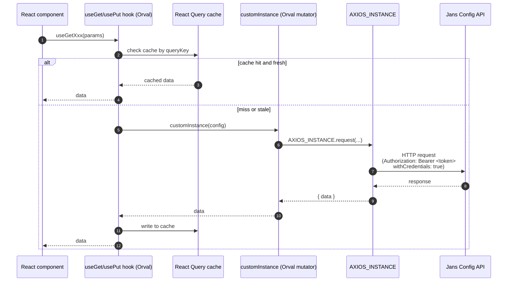

# Talking to the Jans Config API

## Introduction

The Admin UI is a pure client — it stores nothing of its own. Everything it reads or writes — OIDC clients, scopes, users, custom scripts, FIDO / SAML / SCIM / SMTP configuration, attributes, sessions, audit logs, license metadata — lives in the **Jans Config API**, a Janssen project that exposes the configuration of the Auth Server over REST. Every page in the Admin UI is a view onto that API.

To talk to it, the Admin UI does not hand-write any HTTP code. Instead, three things work together:

- **OpenAPI specs** published by the Config API and its plugins describe every endpoint.
- **Orval** (a code generator) consumes those specs and emits typed TypeScript hooks — one set per operation — that internally call a shared **axios** instance.
- **TanStack React Query** wraps those hooks, providing request dedup, caching, retries, and invalidation.

The result is that every backend call in the codebase looks like `const { data } = useGetSomething()` or `const mutation = usePutSomething()`. There is no `fetch`, no manual `axios.post`, no hand-rolled query key. If you find yourself writing one, the answer is almost always to regenerate the client.

This document walks through how that pipeline is set up, how the runtime base URL is decided, and the conventions you should follow when using the generated hooks.

## The data path

A single Config API request flows through several layers. Understanding the layering makes it easier to debug — when something goes wrong, you can narrow down which layer is at fault.



### Explanation of the flow

1. A component calls a generated hook — for example `useGetClients({ limit: 10 })`.
2. The hook asks React Query for the cached entry for this `queryKey`. If the entry exists and is still considered fresh (within the configured `staleTime`), React Query returns it immediately and no network request happens.
3. On a cache miss, the hook calls Orval's mutator function `customInstance`, defined in [`admin-ui/orval/axiosInstance.ts`](../orval/axiosInstance.ts). The mutator wraps every request with a cancel token so React Query can abort in-flight calls if the component unmounts.
4. `customInstance` calls the shared axios instance `AXIOS_INSTANCE`. The instance was created with the resolved base URL (see [Base URL resolution](#base-url-resolution)) and the bearer-token header was set earlier by `AuthSaga` via `setApiToken(...)`.
5. The HTTP request reaches the Config API. Two things authenticate it: the `Authorization: Bearer <token>` header (the Config API access token from `fetchApiTokenWithDefaultScopes`) and the admin-UI session cookie (because `withCredentials: true` is configured on the instance — see [auth.md](./auth.md#admin-ui-session)).
6. The Config API responds. Errors with status `401` route through the AppAuth refresh / re-auth logic; `403` is treated as a permission denial and surfaced as a toast (see [auth.md](./auth.md#401-vs-403)).
7. The data is written to the React Query cache under its `queryKey` and returned to the component. The next call to the same hook anywhere in the app reuses this cache entry.

Mutations (`usePutXxx`, `usePostXxx`, etc.) follow the same path but skip the cache read and explicitly invalidate query keys on success — see [React Query conventions](#react-query-conventions).

## Where things live

Several files cooperate to make the pipeline work. Each one owns a single concern.

| Concern                            | File                                                           |
| ---------------------------------- | -------------------------------------------------------------- |
| axios instance + base URL          | [`admin-ui/orval/axiosInstance.ts`](../orval/axiosInstance.ts) |
| Orval generator config             | [`admin-ui/orval.config.ts`](../orval.config.ts)               |
| OpenAPI merge config               | [`admin-ui/openapi-merge.json`](../openapi-merge.json)         |
| Merged OpenAPI spec (generated)    | `admin-ui/configApiSpecs.yaml`                                 |
| Generated client (do **not** edit) | `admin-ui/jans_config_api_orval/src/`                          |
| Path alias                         | `JansConfigApi` → `jans_config_api_orval/src/index`            |
| Audit logging helpers              | `admin-ui/app/audit/`                                          |
| React Query defaults               | `admin-ui/app/utils/queryUtils.ts`                             |

The generated client lives under `jans_config_api_orval/` and is gitignored — regenerate it locally with `npm run api:orval` (see below). Never hand-edit it; the next regeneration will silently overwrite your changes.

## Regenerating the client

Whenever the upstream Jans Config API OpenAPI specs change, the local client needs to be regenerated. Run:

```bash
npm run api:orval
```

This script does six things in order:

1. **Clean.** Deletes `admin-ui/jans_config_api_orval/` so stale generated files are not mixed with new ones.
2. **Merge.** Runs `openapi-merge-cli` using [`admin-ui/openapi-merge.json`](../openapi-merge.json). That config lists nine upstream OpenAPI YAMLs (the core Config API plus FIDO2, user management, jans-admin-ui, jans-link, SCIM, kc-saml, kc-link, and lock plugins). They are merged into a single `admin-ui/configApiSpecs.yaml`.
3. **Generate.** Runs `orval --config ./orval.config.ts`. Orval reads the merged spec and emits typed hooks, query-key helpers, and schema types into `jans_config_api_orval/src/`.
4. **Fix enums.** Runs `admin-ui/script/fix-orval-enums.ts` to repair an Orval quirk where enum imports come out wrong for some patterns the project uses.
5. **Generate barrel.** Runs `admin-ui/script/gen-orval-barrel.ts` to build a single re-export entry point at `jans_config_api_orval/src/index.ts`. This is what the `JansConfigApi` alias resolves to.
6. **Verify mutations.** Runs `admin-ui/script/verify-orval-mutations.ts` to catch generation issues where mutation hooks lost their argument shapes — a guardrail against silent breakage.

If any step fails, the script exits non-zero and the existing `jans_config_api_orval/` is left in whatever partial state the failure produced. Re-run after fixing the underlying issue.

## Generated hooks

Orval emits hooks following a consistent naming pattern, one set per OpenAPI operation. The patterns are predictable so you can guess the name of a hook from its operation id.

| Pattern                     | Purpose                                              |
| --------------------------- | ---------------------------------------------------- |
| `useGet<Operation>`         | Query hook (read)                                    |
| `usePut<Operation>` etc.    | Mutation hook (`Put` / `Post` / `Delete` / `Patch`)  |
| `getGet<Operation>QueryKey` | Query-key helper — use for `invalidateQueries`       |
| `type <Schema>`             | TypeScript types for each schema in the OpenAPI spec |

Import them from the `JansConfigApi` alias — never from the underlying generated paths, which can change between regenerations:

```ts
import { useGetClients, usePutClient, getGetClientsQueryKey, type Client } from 'JansConfigApi'
```

Once imported, the hooks behave like any React Query hook. A read in a component looks like:

```ts
const { data, isLoading, error } = useGetClients({ limit: 10 })
```

A mutation with cache invalidation looks like:

```ts
const queryClient = useQueryClient()
const mutation = usePutClient({
  mutation: {
    onSuccess: () => {
      queryClient.invalidateQueries({ queryKey: getGetClientsQueryKey() })
    },
  },
})
```

If a hook you need does not exist, the upstream OpenAPI spec is missing the operation — fix it upstream and regenerate. **Do not hand-write a fetch** against the Config API; that path is intentionally not supported here.

## Base URL resolution

The Admin UI ships a single production bundle that has to run unchanged on a developer's laptop, on a Jenkins-deployed environment, and on a customer's installer VM. To make that work, the axios base URL is decided at boot through a three-step fallback chain in [`admin-ui/orval/axiosInstance.ts`](../orval/axiosInstance.ts):

1. **`window.configApiBaseUrl`** — set at runtime by `env-config.js` (described below). If this is set and does **not** look like an un-substituted `%(...)s` placeholder (matched by `REGEX_PYTHON_PLACEHOLDER`), it wins.
2. **`process.env.CONFIG_API_BASE_URL`** — baked in from `.env.<mode>` at build time by Vite. Used in dev and as a build-time default.
3. **Empty string** — last-resort fallback so axios still constructs without throwing if neither of the above is set. Requests will fail with relative-URL errors, which is the desired loud failure.

Whichever value wins becomes the `baseURL` of the shared `AXIOS_INSTANCE`. Every generated hook calls through this same instance.

## Runtime env injection

The mechanism that puts the right `window.configApiBaseUrl` in the browser is a small script tag in `admin-ui/index.html`:

```html
<script src="/admin/env-config.js"></script>
```

The job of `env-config.js` is to set `window.configApiBaseUrl` (and a few sibling globals) before the main app bundle runs. The same `dist/` bundle is used in every environment; only this one script differs.

| Environment                        | Who provides `env-config.js`                                                                                                                                                  |
| ---------------------------------- | ----------------------------------------------------------------------------------------------------------------------------------------------------------------------------- |
| Production (Janssen installer VMs) | The installer renders it next to `index.html`                                                                                                                                 |
| Jenkins-deployed flex envs         | Same installer mechanism; `index.html`'s `%(...)s` placeholders are also `sed`-substituted during deploy (see [build-deploy.md](./build-deploy.md))                           |
| Dev (Vite)                         | The `admin-ui:env-config` plugin in `vite.config.ts` serves it via `configureServer` — populated from `CONFIG_API_BASE_URL` in `.env.development`, or an empty no-op if unset |

If a 404 on `/admin/env-config.js` appears in dev, the in-dev plugin is not running — restart the dev server (Vite does not hot-reload `vite.config.ts`).

## Audit logging

Every write through the Config API should produce an audit record. The Admin UI uses a small set of helpers to keep the audit payloads consistent across plugins.

The helpers live under [`admin-ui/app/audit/`](../app/audit/):

- **`useAuditContext()`** and **`getCurrentAuditContext()`** read `client_id`, `ip_address`, and `userinfo` from the auth slice. Use the hook in components and the plain function inside sagas where you cannot call hooks.
- **`createSuccessAuditInit(context, options?)`** wraps the context into a payload tagged `status: 'success'`. Mutate it before posting to add the specific action, resource, and message.
- **Action constants** are exported from `@/audit/UserActionType`: `CREATE`, `UPDATE`, `DELETION`, `PATCH`, `FETCH`. Always use these constants — never inline the string.
- **Resource constants** are split by ownership:
  - Host-wide ones (used by code outside any single plugin) live in `@/audit`, e.g. `API_USERS`, `API_LICENSE`.
  - Plugin-specific ones live under `plugins/<name>/redux/audit/Resources`. For example, `auth-server` exports `OIDC`, `SCOPE`, `SESSION`. A plugin owns its own resource names.

The audit payload is posted via `postUserAction` from the backend API helper. See `app/redux/api/backend-api.ts` and look at the License saga ([`admin-ui/app/redux/sagas/LicenseSaga.ts`](../app/redux/sagas/LicenseSaga.ts)) for an end-to-end example.

## React Query conventions

A few rules keep the React Query usage consistent across the codebase.

**Use the generated query-key helpers.** Every Orval hook ships a corresponding `getGetXxxQueryKey()` function. Use it instead of hand-writing the key:

```ts
queryClient.invalidateQueries({ queryKey: getGetClientsQueryKey() })
```

Hand-written keys drift; the generated helpers stay in sync with the generated hooks.

**Use the default cache times.** `DEFAULT_STALE_TIME` and `DEFAULT_GC_TIME` are exported from [`admin-ui/app/utils/queryUtils.ts`](../app/utils/queryUtils.ts) and applied globally in `app/index.tsx`. Override them only when you have a specific reason — most of the Admin UI runs fine on the defaults.

**Invalidate after mutations.** A mutation that updates server state should invalidate the queries that read that state. The standard pattern is `onSuccess` callbacks calling `queryClient.invalidateQueries(...)`:

```ts
const mutation = usePutClient({
  mutation: {
    onSuccess: () => {
      queryClient.invalidateQueries({ queryKey: getGetClientsQueryKey() })
      queryClient.invalidateQueries({ queryKey: getGetClientByInumQueryKey(inum) })
    },
  },
})
```

**Do not call `fetch` or `axios` directly.** Any code that bypasses the generated hooks loses caching, dedup, retry, cancellation, and the bearer-token / session-cookie wiring. If the upstream OpenAPI is missing an endpoint, fix it upstream and regenerate.

## Where to read next

- [auth.md](./auth.md) — how the bearer token gets into the axios instance, and how the admin-UI session cookie is set up
- [architecture.md](./architecture.md) — where the Config API fits in the wider host / plugin architecture
- [cedarling.md](./cedarling.md) — the UI gate that sits in front of Config API calls
- [build-deploy.md](./build-deploy.md) — how the runtime env-injection mechanism is wired across dev / Jenkins / installer
- [recipes.md](./recipes.md) — step-by-step playbooks (regenerating the client, adding a new audit-logged mutation, etc.)
