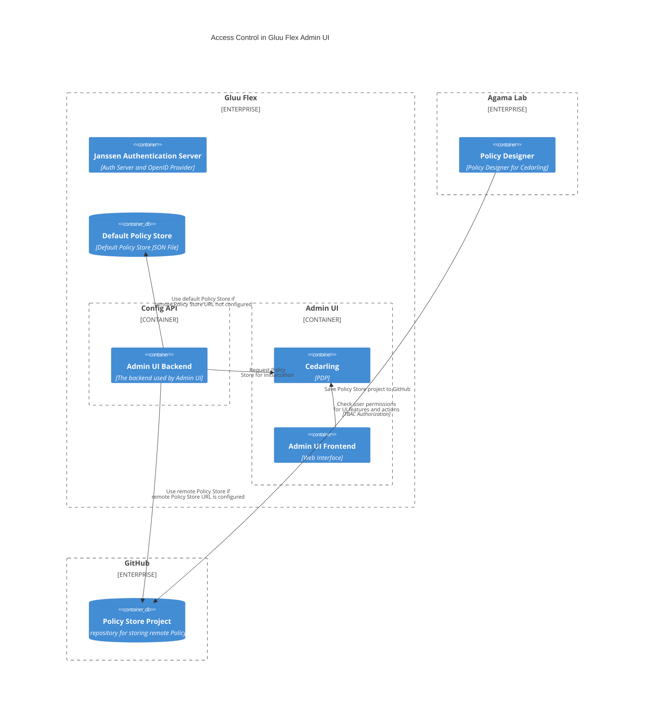

---
tags:
  - administration
  - admin-ui
  - access control
  - cedarling
  - security
---

# Access Control in Admin UI

The role of the user logged-in to Gluu Flex Admin UI decides if the user will have access to a certain Admin UI's feature or not. After user authentication the user's role and other claims are packed in bundle of tokens (access_token, id_token and userinfo_token). [Cedarling](https://docs.jans.io/stable/cedarling) PDP embedded with GUI, processes the tokens and decides if the action (like Read, Write or Delete) is allowed on this resource (feature). The Cedarling's Token-based Access Control (TBAC) is used for managing access control in Gluu Flex Admin UI.

## Admin UI Features (Resources)

The Admin UI features (or resources) are categorised into following parent groups. This categorization is done for resource grouping in cedar policies used for governing the authorization decision taken by Cedarling.

- System and monitoring
    - Dashboard
    - Health
    - License
    - MAU
    - Settings
    - Security
    - Webhooks
    - Assets
    - AuditLogs
- AuthServer and configuration
    - Clients
    - Scopes
    - Keys
    - AuthServerProperties
    - Logging
    - SSA
    - Authn
    - ConfigAPIProperties
    - Sessions
- Identity and Access
    - Users
    - Scripts
    - UserClaims
- Service
    - Cache
    - Persistence
    - SMTP
    - SCIM
    - FIDO
    - SAML
    - Lock

In the Policy Store we use [default_entities](https://docs.jans.io/stable/cedarling/cedarling-policy-store/#default-entities) to map the parent group with the sub features. For e.g. here we are showing the default entity json to map the features under `System and monitoring` parent group.

```json
{
	"1694c954f8d9": {
		"uid": {
			"type": "Gluu::Flex::AdminUI::Resources::Features",
			"id": "Dashboard"
		},
		"attrs": {},
		"parents": [
			{
				"type": "Gluu::Flex::AdminUI::Resources::ParentResource",
				"id": "SystemAndMonitoring"
			}
		]
	},
	"2694c954f8d8": {
		"uid": {
			"type": "Gluu::Flex::AdminUI::Resources::Features",
			"id": "License"
		},
		"attrs": {},
		"parents": [
			{
				"type": "Gluu::Flex::AdminUI::Resources::ParentResource",
				"id": "SystemAndMonitoring"
			}
		]
	},
	"3694c954f8d7": {
		"uid": {
			"type": "Gluu::Flex::AdminUI::Resources::Features",
			"id": "MAU"
		},
		"attrs": {},
		"parents": [
			{
				"type": "Gluu::Flex::AdminUI::Resources::ParentResource",
				"id": "SystemAndMonitoring"
			}
		]
	},
	"4694c954f8d6": {
		"uid": {
			"type": "Gluu::Flex::AdminUI::Resources::Features",
			"id": "Security"
		},
		"attrs": {},
		"parents": [
			{
				"type": "Gluu::Flex::AdminUI::Resources::ParentResource",
				"id": "SystemAndMonitoring"
			}
		]
	},
	"6494c954f8d6": {
		"uid": {
			"type": "Gluu::Flex::AdminUI::Resources::Features",
			"id": "Settings"
		},
		"attrs": {},
		"parents": [
			{
				"type": "Gluu::Flex::AdminUI::Resources::ParentResource",
				"id": "SystemAndMonitoring"
			}
		]
	},
...
}
```

## Managing Admin UI's Policy Store

After installation, Admin UI uses a default Policy Store for GUI access control. The logged-in user can use the [Cedarling configuration screen](./configuration.md#cedarling-configuration) to configure a remote Policy Store generated by [Agama-Lab](https://cloud.gluu.org/agama-lab) using its URL. When the Policy Store URL is configured, the backend parses the Policy Store to determine the roles and the role-to-scope mappings. The Policy Store is used for managing GUI access control. The aggregated role-to-scope mapping (obtained by parsing the Policy Store) ensures that only the mapped scopes are added in the authorization tokens to access the appropriate protected Config API endpoints.



## Policies

The Cedar policies in the Policy Store empowers the administrator with following:

### Manage the access control in Admin UI

The Cedar policies are rules which decide if the logged-in user can perform Read, Write or Delete action on a feature or not. By writing the appropriate cedar policies the administrator can manage access control in Admin UI. For e.g the below policy allows the user with role **admin** to perform **Read**, **Write** or **Delete** actions on all the features under the parent group **AuthServerAndConfiguration**.

```cedar
@id("AdminCanManageAuthServerConfiguration")
permit (
  principal in Gluu::Flex::AdminUI::Role::"admin",
  action in [Gluu::Flex::AdminUI::Action::"read",
  Gluu::Flex::AdminUI::Action::"write",
  Gluu::Flex::AdminUI::Action::"delete"],
  resource in Gluu::Flex::AdminUI::Resources::ParentResource::"AuthServerAndConfiguration"
);
```

Below policy gives the users with role **viewer** the **Read** access to all the features under the **IdentityAndAccess** parent group.

```cedar
@id("ViewerCanViewUserIdentityAndAccess")
permit (
  principal in Gluu::Flex::AdminUI::Role::"viewer",
  action in Gluu::Flex::AdminUI::Action::"read",
  resource in Gluu::Flex::AdminUI::Resources::ParentResource::"IdentityAndAccess"
);
```

Below policy gives the users with role **auditor** the **Read**, **Write** and **Delete** access to only the **Clients** feature of Admin UI.

```cedar
@id("AuditorCanManageClients")
permit (
  principal in Gluu::Flex::AdminUI::Role::"auditor",
  action in [Gluu::Flex::AdminUI::Action::"read",
  Gluu::Flex::AdminUI::Action::"write",
  Gluu::Flex::AdminUI::Action::"delete"],
  resource in Gluu::Flex::AdminUI::Resources::Features::"Clients"
);
```

### Adding new Roles in Admin UI

To add new Admin UI user roles, the administrator just need to introduce the policies associated with those roles in the Policy Store. On saving the Policy Store the Admin UI parses it and aggregates the roles and role-to-scope mapping. The aggregated data is saved into the persistence.

### Writing policies: Parent Groups as resources

The principal element in a [Cedar policy](https://docs.cedarpolicy.com/) represents a user, service, or other identity that can make a request to perform an action on a resource in your application. We will learn how to write an Admin UI policy using a sample scenario: a logged-in user with the **admin** role can manage the **Auth Server and its configuration**.

```cedar
@id("AdminCanManageAuthServerConfiguration")
permit (
  principal in Gluu::Flex::AdminUI::Role::"admin",
  action in [Gluu::Flex::AdminUI::Action::"read",
  Gluu::Flex::AdminUI::Action::"write",
  Gluu::Flex::AdminUI::Action::"delete"],
  resource in Gluu::Flex::AdminUI::Resources::ParentResource::"AuthServerAndConfiguration"
);
```
**Principal :**
We are using the administrator's **role** as principal while writing the policies for Admin UI. Here `Gluu::Flex::AdminUI::` is the namespace in cedar schema where the `Role` entity resides. The **admin** surrounded by inverted commas is the Entity Id of the **Role** entity and is basically the role name.

**Action :**
In this policy, we are allowing **Read**, **Write** and **Delete** actions on the resource. Here we have `action in [Gluu::Flex::AdminUI::Action::"read", Gluu::Flex::AdminUI::Action::"write", Gluu::Flex::AdminUI::Action::"delete"]`. The `Gluu::Flex::AdminUI::` is the namespace where all action entities reside.

**Resource :**
As we have categorised Admin UI features (or resources) into the parent groups, `resource in Gluu::Flex::AdminUI::Resources::ParentResource::"AuthServerAndConfiguration"` allows the user with role **admin** to perform **Read**, **Write** and **Delete** actions on all the features under **AuthServerAndConfiguration** parent group. Here `Gluu::Flex::AdminUI::Resources::` is the namespace where **ParentResource** entity resides. The **ParentResource** entity represents the parent group and **AuthServerAndConfiguration** in inverted commas is the entity id representing name of the parent group.

### Writing policies: Specific Admin UI Feature

To define policies for a specific Admin UI feature (e.g., Clients, Scopes, Users), use the format `Gluu::Flex::AdminUI::Resources::Features` followed by the resource’s Entity ID enclosed in quotation marks in resource clause. For e.g. below policy allows **Read**, **Write** and **Delete** action to the user with role **auditor** on **Clients** resource.

```cedar
@id("AuditorCanManageClients")
permit (
  principal in Gluu::Flex::AdminUI::Role::"auditor",
  action in [Gluu::Flex::AdminUI::Action::"read",
  Gluu::Flex::AdminUI::Action::"write",
  Gluu::Flex::AdminUI::Action::"delete"],
  resource in Gluu::Flex::AdminUI::Resources::Features::"Clients"
);
```
Please see the Entity Ids of the Parent Groups and their underlying features in this table:

|Parent Group|Features|
|------------|--------|
|AuthServerAndConfiguration|Clients, Scopes, Keys, AuthenticationServerConfiguration, Logging, SSA, Authentication, ConfigApiConfiguration, Session|
|IdentityAndAccess|Users, Scripts, Attributes|
|SystemAndMonitoring|Dashboard, License, MAU, Security, Settings, Webhooks, Assets, AuditLogs|
|Service|Persistence, SMTP, SCIM, FIDO, SAML, Lock|
