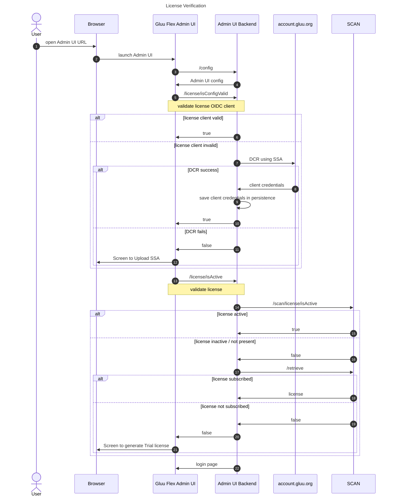
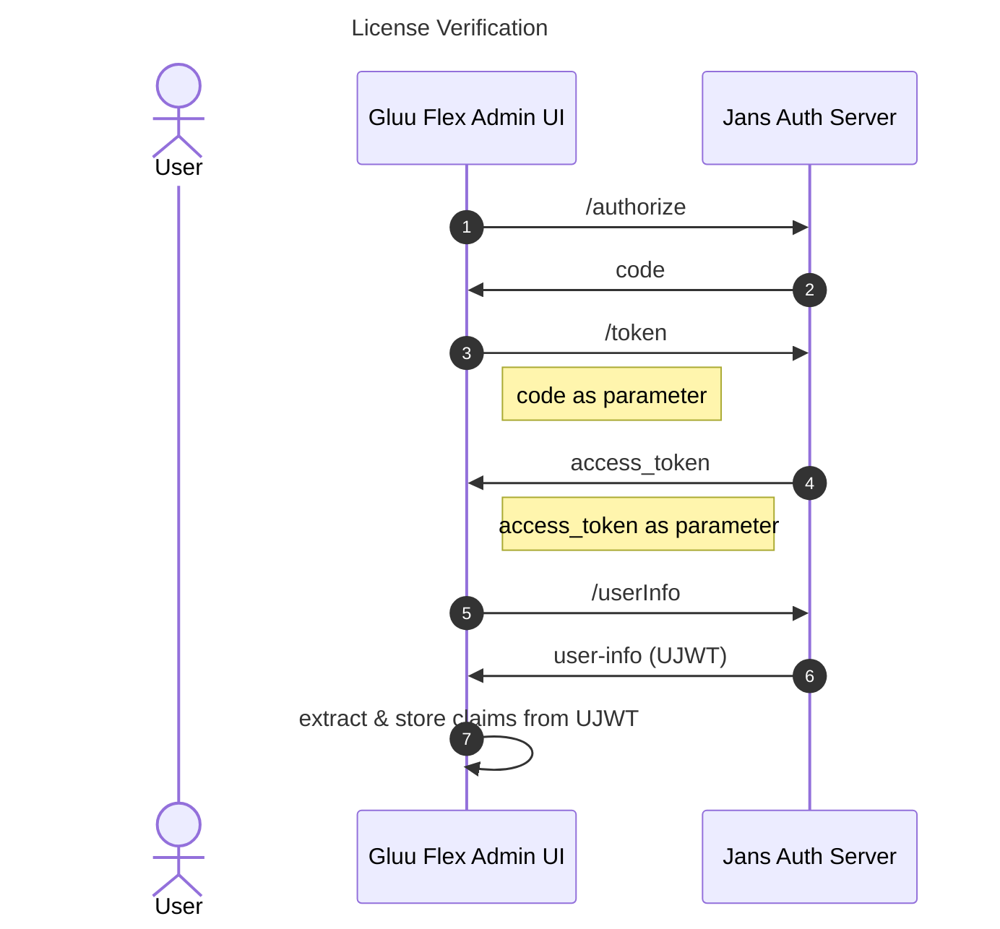
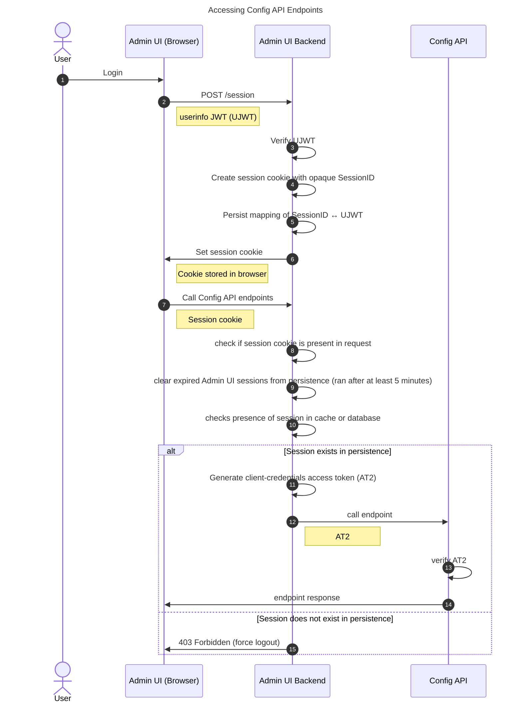
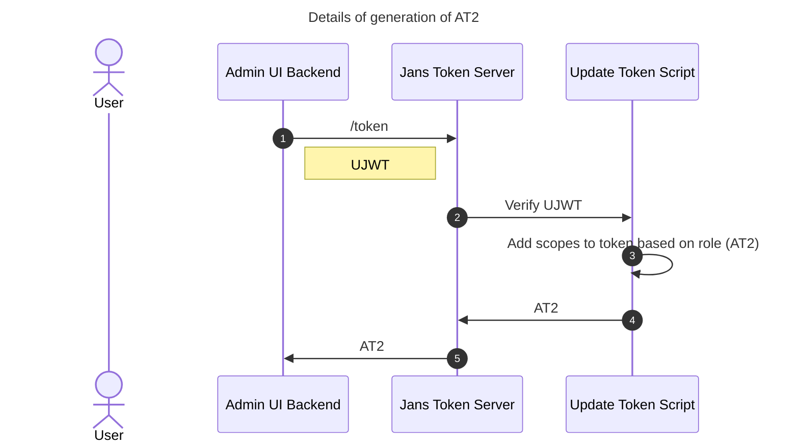

---
tags:
- administration
- admin-ui
- interaction
---
# Interaction with Jans Auth Server

This user-friendly interface facilitates interaction with the [Jans Auth Server](https://docs.jans.io) through a REST API layer known as the [Jans Config API](https://docs.jans.io/v1.0.16/admin/config-guide/config-api). Here, we'll explore the working mechanism of the Gluu Flex Admin UI, focusing on its interaction with the Jans Auth Server and the key steps involved.

When accessing the Gluu Flex Admin UI through a web browser, the following steps are involved:

## License Verification

1. The user accesses the Gluu Flex Admin UI frontend through a web browser.
2. The frontend requests the Admin UI backend to retrieve Admin UI configuration from Janssen persistence. The [Admin UI configuration](./configuration.md) includes OIDC client details for accessing the Auth Server, OIDC client details for accessing the Token Server, OIDC client details for accessing the License APIs, and license metadata. It's important to note that **the Admin UI backend is implemented as a Jans Config API plugin**.
3. The frontend calls the Admin UI backend API (`/isConfigValid`) to validate the license configuration in persistence, essentially verifying the validity of the OIDC client used to access the License APIs. If it is not valid, the same API tries to register a new OIDC client using the SSA uploaded during installation. In case the SSA is invalid, the Admin UI shows a page to upload a new valid SSA. To minimize network calls to account.gluu.org, `/isConfigValid` verifies the OIDC client validity only at a set interval (default: 30 days). Otherwise, `/isConfigValid` checks if the required OIDC client for License APIs exists in the Admin UI configuration (persistence).
4. After validating the OIDC client, the Admin UI calls the backend API (/isActive) to check if a valid license is present in the license configuration. It verifies whether the license key and its details are valid and not expired. At regular intervals (default is 30 days), the Admin UI backend calls the SCAN API (/scan/license/isActive) to verify license validity and sync its details into the license configuration (persistence).
5. If a valid license is not present, the frontend calls the backend API (/retrieve) to retrieve the license for the user via the SCAN API (/scan/license/retrieve). The license can only be retrieved from SCAN if the user has subscribed to the Admin UI license in Agama Lab.
6. If the user has not already subscribed to a valid license in Agama Lab, the Admin UI displays a page to generate a 30-day trial license. The user cannot generate another trial license after expiry of a generated trial license and will need to subscribe to the Admin UI license in Agama Lab to access the user interface.
7. After verification of valid license the frontend initiates the Authorization Code Flow by redirecting the user to the login page.

## The Authorization Code Flow

1. The frontend initiates the Authorization Code Flow by calling authorization url and redirecting the user to the login page of the Janssen authorization server for user authentication.
2. Upon successful authentication, the authorization server sends an authorization `code` and a `state` to the frontend. The frontend verifies the state.
3. The frontend utilizes the authorization code to first obtain an access token (`AT1`) from the token endpoint of the authorization server.
4. With AT1, the frontend requests the User-Info in JWT format (`UJWT`) from the authorization server by calling userInfo endpoint.
7. The frontend stores the UJWT and its claims, including the user's role ( claim name is `jansAdminUIRole`) and other relevant information, in the Redux store.

## Accessing Config-API Endpoints

To access Config API endpoints, Admin UI Backend generates client_credentials token by following below steps:

1. Admin UI Frontend calls **POST** `/session` endpoint of Admin UI Backend by passing User-Info JWT (UJWT) as parameter.
2. The Admin UI backend verifies the signature of the UJWT. If the signature is valid, it creates session cookie with a random Session ID. Store the mapping of Session ID and UJWT along with created_date and expiry_date into the Jans persistence (in `adminUISession` table).
3. The session cookie is sent back to Admin UI Frontend in response and is stored in browser.
4. For making any request to Config API endpoints the Admin UI Frontend (Browser) will call Config API endpoint. The session cookie will be automatically paired with the request.
5. The Admin UI Backend will intercept the request. It will check if the valid session cookie is present in request.
6. Admin UI Backend will verify the cookie's Session ID presence in `adminUISession` table. Also fetch UJWT of the record from table.
7. If the session cookie is valid then Admin UI Backend will generate client_credentials token (AT2).
8. To generate an AT2, the backend requests the Token Server. **The Token Server and Authorization Server can be the same or different.**
9. The Token Server employs an `update-token script` that validates the UJWT and refers to the role-scope mapping in the persistence.
10. The update-token script validates the UJWT and includes the appropriate scopes in AT2 based on the user's role.
11. The AT2 will be used to call Config API endpoint. 
12. The response obtained from Config API will be sent back to the Admin UI Frontend (Browser).
13. If the cookie's Session ID is not presence in `adminUISession` table, send **403-Forbidden** error in response asking Admin UI to force logout.

## Conclusion

The Gluu Flex Admin UI simplifies the process of managing configuration and features of the Jans Auth Server through an intuitive graphical user interface. By following the Authorization Code Flow and leveraging API protection and scopes, the Gluu Flex Admin UI ensures secure and controlled interaction with the Jans Auth Server's REST API layer. This seamless interaction empowers administrators to efficiently manage the Jans Auth Server's settings while adhering to strict access controls and security protocols.
