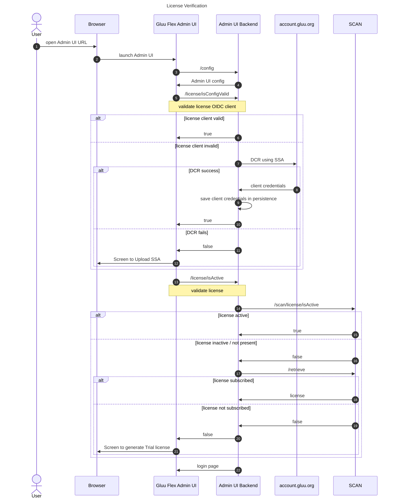
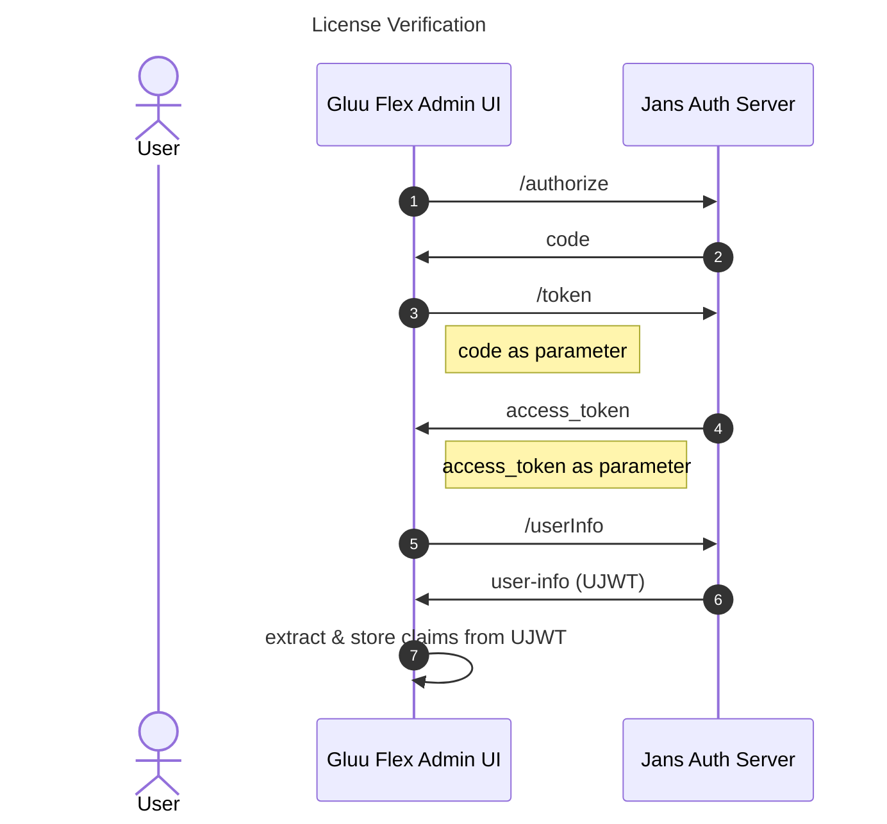
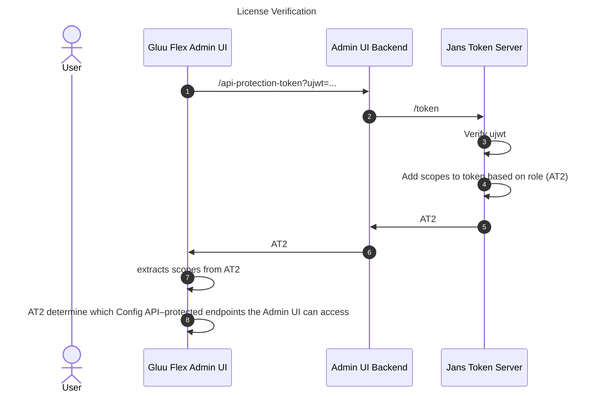
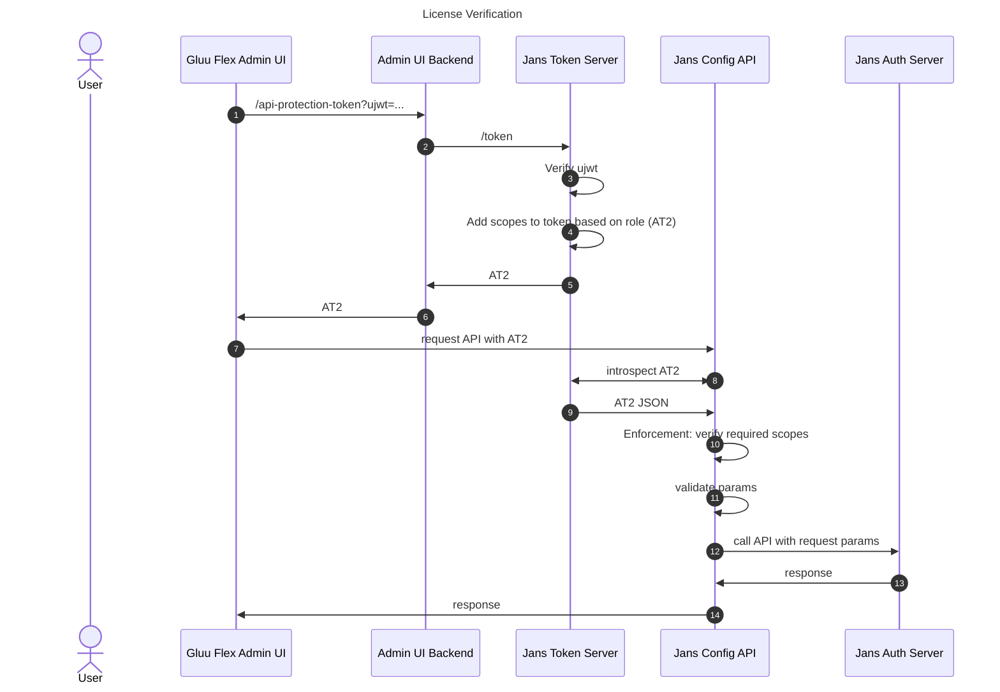

---
tags:
- administration
- admin-ui
- interaction
---
# Interaction with Jans Auth Server

This user-friendly interface facilitates interaction with the [Jans Auth Server](https://docs.jans.io) through a REST API layer known as the [Jans Config API](https://docs.jans.io/v1.0.16/admin/config-guide/config-api). Here, we'll explore the working mechanism of the Gluu Flex Admin UI, focusing on its interaction with the Jans Auth Server and the key steps involved.

When accessing the Gluu Flex Admin UI through a web browser, the following steps are involved:

## License Verification

1. The user accesses the Gluu Flex Admin UI frontend through a web browser.
2. The frontend requests the Admin UI backend to retrieve Admin UI configuration from Janssen persistence. The [Admin UI configuration](./configuration.md) includes OIDC client details for accessing the Auth Server, OIDC client details for accessing the Token Server, OIDC client details for accessing the License APIs, and license metadata. It's important to note that **the Admin UI backend is implemented as a Jans Config API plugin**.
3. The frontend calls the Admin UI backend API (`/isConfigValid`) to validate the license configuration in persistence, essentially verifying the validity of the OIDC client used to access the License APIs. If it is not valid, the same API tries to register a new OIDC client using the SSA uploaded during installation. In case the SSA is invalid, the Admin UI shows a page to upload a new valid SSA. To minimize network calls to account.gluu.org, `/isConfigValid` verifies the OIDC client validity only at a set interval (default: 30 days). Otherwise, `/isConfigValid` checks if the required OIDC client for License APIs exists in the Admin UI configuration (persistence).
4. After validating the OIDC client, the Admin UI calls the backend API (/isActive) to check if a valid license is present in the license configuration. It verifies whether the license key and its details are valid and not expired. At regular intervals (default is 30 days), the Admin UI backend calls the SCAN API (/scan/license/isActive) to verify license validity and sync its details into the license configuration (persistence).
5. If a valid license is not present, the frontend calls the backend API (/retrieve) to retrieve the license for the user via the SCAN API (/scan/license/retrieve). The license can only be retrieved from SCAN if the user has subscribed to the Admin UI license in Agama Lab.
6. If the user has not already subscribed to a valid license in Agama Lab, the Admin UI displays a page to generate a 30-day trial license. The user cannot generate another trial license after expiry of a generated trial license and will need to subscribe to the Admin UI license in Agama Lab to access the user interface.
7. After verification of valid license the frontend initiates the Authorization Code Flow by redirecting the user to the login page.

## The Authorization Code Flow

1. The frontend initiates the Authorization Code Flow by calling authorization url and redirecting the user to the login page of the Janssen authorization server for user authentication.
2. Upon successful authentication, the authorization server sends an authorization `code` and a `state` to the frontend. The frontend verifies the state.
3. The frontend utilizes the authorization code to first obtain an access token (`AT1`) from the token endpoint of the authorization server.
4. With AT1, the frontend requests the User-Info in JWT format (`UJWT`) from the authorization server by calling userInfo endpoint.
7. The frontend stores the UJWT and its claims, including the user's role ( claim name is `jansAdminUIRole`) and other relevant information, in the Redux store.

## API Protection and Scopes

To ensure security and access control, Gluu Flex Admin UI leverages API protection and scopes:

1. The Jans Config API's endpoints are protected and can only be accessed using a token (`AT2`) with the required scopes.
2. To generate an AT2, the frontend requests the Token Server via the backend. **The Token Server and Authorization Server can be the same or different.**
3. The Token Server employs an update-token script that validates the UJWT and refers to the role-scope mapping in the Token Server persistence.
4. The update-token script validates the UJWT and includes the appropriate scopes in AT2 based on the user's role.
5. The frontend receives AT2 and associated scopes from the backend.
6. The scopes provided in AT2 determine which Config API–protected endpoints the Admin UI can access. Refer this [doc](./access-control.md) for GUI access control.

## Accessing Config-API Endpoints

To access config-api endpoints, the following steps are taken:

1. The Admin UI frontend requests AT2 from the Token Server through the backend.
2. Armed with AT2, the frontend sends a request to the desired Jans Config API endpoint. AT2 is included in the authorization header, along with other request parameters.
3. At the Jans Config API, AT2 is validated, and the provided scopes are verified to ensure the necessary scope for the requested endpoint is present.
4. If the above steps are successful, the requested data is fetched from the Jans Config API and forwarded to the frontend.

## Conclusion

The Gluu Flex Admin UI simplifies the process of managing configuration and features of the Jans Auth Server through an intuitive graphical user interface. By following the Authorization Code Flow and leveraging API protection and scopes, the Gluu Flex Admin UI ensures secure and controlled interaction with the Jans Auth Server's REST API layer. This seamless interaction empowers administrators to efficiently manage the Jans Auth Server's settings while adhering to strict access controls and security protocols.