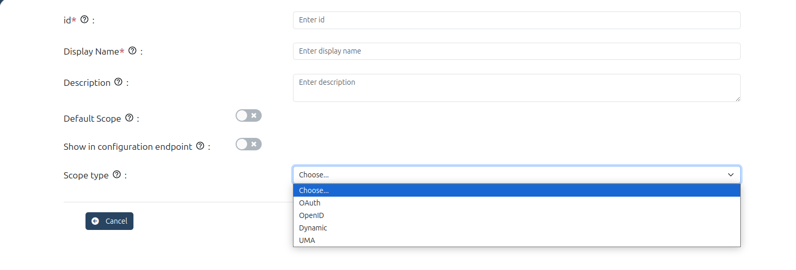
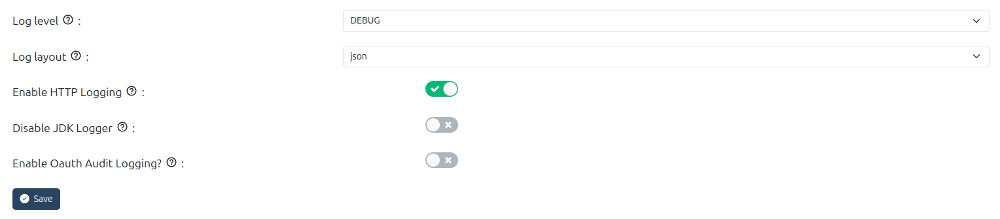
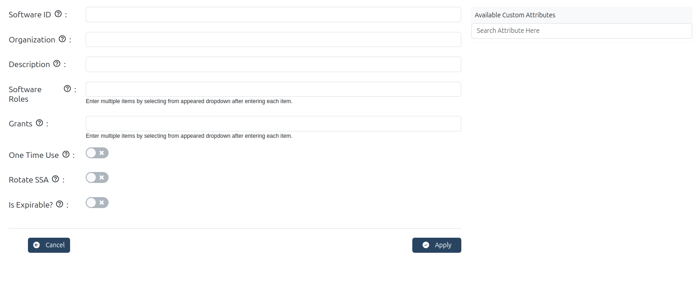
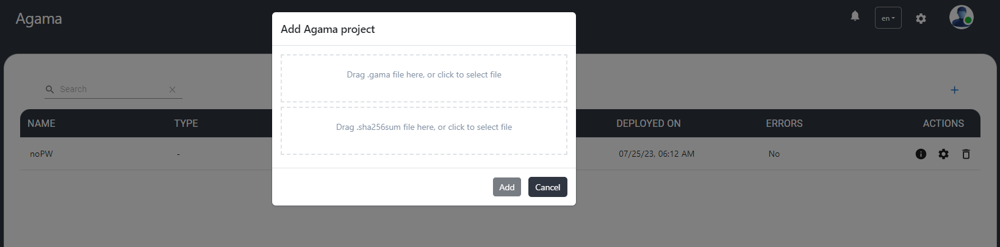
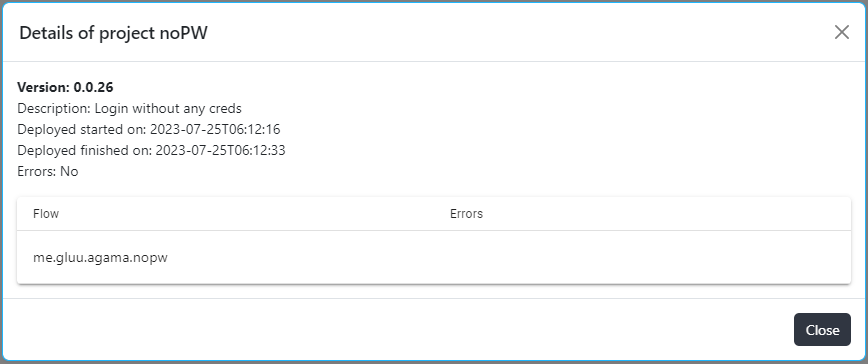
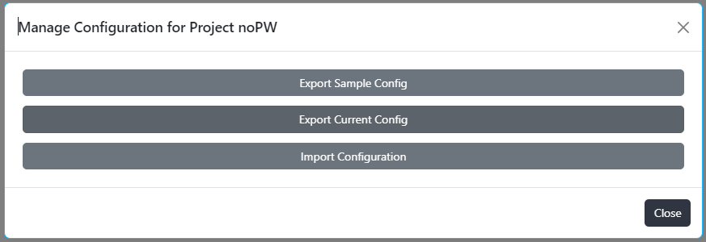

---
tags:
  - clients
  - scopes
  - keys
  - auth server
  - logging
  - Authn
  - admin-ui
  - configuration
  - sessions
---

# Auth Server

The **Auth Server** menu covers the following important submenus to configure 
and manage the Auth server.

- Clients
- Scopes
- Keys
- Auth server properties
- Logging
- SSA
- Authentication
- Config API properties
- Sessions

## Clients

The logged-in user with appropriate permissions can view, register, edit, and delete OIDC clients on the auth server using
Gluu Flex Admin UI.

### Basic

| Client fields                                                                   | Description                                                                                                                                                                                                                                                                                                                                                                                                                      |
| ------------------------------------------------------------------------------ | -------------------------------------------------------------------------------------------------------------------------------------------------------------------------------------------------------------------------------------------------------------------------------------------------------------------------------------------------------------------------------------------------------------------------------- |
| **Client name**                                                                    | Name of the Client to be presented to the End-User.                                                                                                                                                                                                                                                                                                                                                                              |
| **Client secret**                                                                  | Client Secret. The same Client Secret value MUST NOT be assigned to multiple Clients.                                                                                                                                                                                                                                                                                                                                            |
| **Description**                                                                    | Description of the client.                                                                                                                                                                                                                                                                                                                                                                                                       |
| **Authn method token endpoint**                                                    | Requested Client Authentication method for the Token Endpoint. The options are client_secret_post, client_secret_basic, client_secret_jwt, private_key_jwt, and none.                                                                                                                                                                                                                                                            |
| **Subject type**                                                                   | Subject type requested for responses to this client. The subject_types_supported Discovery parameter contains a list of the supported subject_type values for this server. Valid types include pairwise and public.                                                                                                                                                                                                              |
| **Sector Identifier URI**                                                          | URL using the https scheme to be used in calculating Pseudonymous Identifiers by the OP. The URL references a file with a single JSON array of redirect_uri values.                                                                                                                                                                                                                                                              |
| **Grants**                                                                         | List of the OAuth 2.0 Grant Types that the Client is declaring that it will restrict itself to using.                                                                                                                                                                                                                                                                                                                            |
| **Response types**                                                                 | List of the OAuth 2.0 response_type values that the client is declaring that it will restrict itself to using. If omitted, the default is that the Client will use only the code Response Type.                                                                                                                                                                                                                                  |
| **Active**                                                                         | Specifies whether the client is enabled.                                                                                                                                                                                                                                                                                                                                                                                         |
| **Application type**                                                               | Kind of the application. The default, if omitted, is web.                                                                                                                                                                                                                                                                                                                                                                        |
| **Redirect URIs**                                                                  | List of Redirection URI values used by the Client. One of these registered Redirection URI values MUST exactly match the redirect_uri parameter value used in each Authorization Request                                                                                                                                                                                                                                         |
| **Redirect Regex**                                                                 | When this field is set, then redirect-URI must match with regex.                                                                                                                                                                                                                                                                                                                                                                  |
| **Scopes**                                                                         | List of scopes granted to the client.                                                                                                                                                                                                                                                                                                                                                                                            |

### Tokens

| Client fields                                                                  | Description                                                                                                                                                                                                                                                                                                                                                                                                                      |
| ------------------------------------------------------------------------------ | -------------------------------------------------------------------------------------------------------------------------------------------------------------------------------------------------------------------------------------------------------------------------------------------------------------------------------------------------------------------------------------------------------------------------------- |
| **Access token type**                                                              | Type of the access token (JWT or reference) generated by the client.                                                                                                                                                                                                                                                                                                                                                             |
| **Include claims in id_token**                                                     | The claims will be included in id_token if this field is enabled                                                                                                                                                                                                                                                                                                                                                                 |
| **Add auth_time to id_token**                                                      | When enabled, then the auth_time claim is required in id_token.                                                                                                                                                                                                                                                                                                                                                                   |
| **Run Introspection Script Before AccessToken As JWT Creation And Include Claims** | When this field is enabled, then the Introspection Script will run before access token generation.                                                                                                                                                                                                                                                                                                                                    |
| **Token binding confirmation method for id_token**                                 | Specifies the JWT Confirmation Method member name (e.g., tbh) that the Relying Party expects when receiving Token Bound ID Tokens. The presence of this parameter indicates that the Relying Party supports the token binding of ID tokens. If omitted, the default is that the Relying Party  does not support the Token Binding of ID Tokens.                                                                               |
| Access token additional audiences                                              | The client audiences.                                                                                                                                                                                                                                                                                                                                                                                                            |
| Access token lifetime                                                          | The client-specific access-token expiration.                                                                                                                                                                                                                                                                                                                                                                                     |
| Refresh token lifetime                                                         | The client-specific refresh-token expiration.                                                                                                                                                                                                                                                                                                                                                                                    |
| Default max authn age                                                          | The default maximum authentication age.                                                                                                                                                                                                                                                                                                                                                                                          |

### Logout

| Client fields                                                                  | Description                                                                                                                                                                                                                                                                                                                                                                                                                      |
| ------------------------------------------------------------------------------ | -------------------------------------------------------------------------------------------------------------------------------------------------------------------------------------------------------------------------------------------------------------------------------------------------------------------------------------------------------------------------------------------------------------------------------- |
| Front channel. logout URI                                                      | Relying Party (RP) URL that will cause the RP to log itself out when rendered in an iframe by the OP. This is used in the front-channel logout mechanisms, which communicate logout requests from the OP to RPs via the User Agent.                                                                                                                                                                                              |
| Post logout redirect URI                                                       | Provide the URLs supplied by the RP to request that the user be redirected to this location after a logout has been performed.                                                                                                                                                                                                                                                                                                   |
| Back channel. logout URI                                                       | Relying Party (RP) URL that will cause the RP to log itself out when sent a Logout Token by the OP. This is used in the back-channel logout mechanisms, which communicate logout requests directly between the OP and RPs.                                                                                                                                                                                                       |
| Back channel. logout session required                                          | Boolean value specifying whether the RP requires that a sid (session ID) Claim be included in the Logout Token to identify the RP session with the OP when the backchannel_logout_uri is used.                                                                                                                                                                                                                                   |
| Front channel. logout session required                                         | Boolean value specifying whether the RP requires that iss (issuer) and sid (session ID) query parameters be included to identify the RP session with the OP when the frontchannel_logout_uri is used.                                                                                                                                                                                                                            |

### Software Info

| Client fields                                                                  | Description                                                                                                                                                                                                                                                                                                                                                                                                                      |
| ------------------------------------------------------------------------------ | -------------------------------------------------------------------------------------------------------------------------------------------------------------------------------------------------------------------------------------------------------------------------------------------------------------------------------------------------------------------------------------------------------------------------------- |
| Client URI                                                                     | URL of the home page of the Client. The value of this field must point to a valid Web page.                                                                                                                                                                                                                                                                                                                                      |
| Policy URI                                                                     | URL that the Relying Party Client provides to the End-User to read about how the profile data will be used.                                                                                                                                                                                                                                                                                                                      |
| Logo URI                                                                       | URL that references a logo for the Client application.                                                                                                                                                                                                                                                                                                                                                                           |
| Terms of service URI                                                           | URL that the Relying Party Client provides to the End-User to read about the Relying Party's terms of service.                                                                                                                                                                                                                                                                                                                   |
| Contacts                                                                       | OpenID connect client contacts list.                                                                                                                                                                                                                                                                                                                                                                                             |
| Authorized JS origins                                                          | Specifies authorized JavaScript origins.                                                                                                                                                                                                                                                                                                                                                                                         |
| Software id                                                                    | Specifies a unique identifier string (UUID) assigned by the client developer or software publisher used by registration endpoints to identify the client software to be dynamically registered.                                                                                                                                                                                                                                  |
| Software version                                                               | Specifies a version identifier string for the client software identified by 'software_id'. The value of the 'software_version' should change on any update to the client software identified by the same 'software_id'.                                                                                                                                                                                                          |
| Software statement                                                             | Specifies a software statement containing client metadata values about the client software as claims. This is a string value containing the entire signed JWT.                                                                                                                                                                                                                                                                   |

### CIBA / PAR / UMA

| Client fields                                                                  | Description                                                                                                                                                                                                                                                                                                                                                                                                                      |
| ------------------------------------------------------------------------------ | -------------------------------------------------------------------------------------------------------------------------------------------------------------------------------------------------------------------------------------------------------------------------------------------------------------------------------------------------------------------------------------------------------------------------------- |
| CIBA: Token delivery method                                                    | Specifies how backchannel token will be delivered.                                                                                                                                                                                                                                                                                                                                                                               |
| CIBA: Client notification endpoint                                             | Client Initiated Backchannel Authentication (CIBA) enables a Client to initiate the authentication of an end-user by means of out-of-band mechanisms. Upon receipt of the notification, the Client makes a request to the token endpoint to obtain the tokens.                                                                                                                                                                   |
| CIBA: Require user code param                                                  | If selected the auth_time claim is included in id_token.                                                                                                                                                                                                                                                                                                                                                                         |
| PAR: Require lifetime                                                          | Represents the lifetime of Pushed Authorisation Request (PAR).                                                                                                                                                                                                                                                                                                                                                                   |
| PAR: Require PAR                                                               | Is Pushed Authorisation Request (PAR) required?                                                                                                                                                                                                                                                                                                                                                                                  |
| UMA: RPT token type                                                            | Type of RPT token (JWT or reference).                                                                                                                                                                                                                                                                                                                                                                                            |
| UMA: Claims redirect URI                                                       | Array of The Claims Redirect URIs to which the client wishes the authorization server to direct the requesting party's user agent after completing its interaction.                                                                                                                                                                                                                                                              |
| UMA: RPT Modification Script                                                   | List of Requesting Party Token (RPT) claims scripts.                                                                                                                                                                                                                                                                                                                                                                             |

### Encryption / Signing

| Client fields                                                                  | Description                                                                                                                                                                                                                                                                                                                                                                                                                      |
| ------------------------------------------------------------------------------ | -------------------------------------------------------------------------------------------------------------------------------------------------------------------------------------------------------------------------------------------------------------------------------------------------------------------------------------------------------------------------------------------------------------------------------- |
| Client JWKS URI                                                                | URL for the Client's JSON Web Key Set (JWK) document containing the key(s) that are used for signing requests to the OP. The JWK Set may also contain the Client's encryption key(s) that are used by the OP to encrypt the responses to the client. When both signing and encryption keys are made available, a use (Key Use) parameter value is required for all keys in the document to indicate each key's intended usage. |
| Client JWKS                                                                    | List of JSON Web Key (JWK) - A JSON object that represents a cryptographic key. The members of the object represent properties of the key, including its value.                                                                                                                                                                                                                                                                  |
| id_token subject type                                                          | The subject identifiers in ID tokens.                                                                                                                                                                                                                                                                                                                                                                                            |

| Client fields                                                                  | Description                                                                                                                                                                                                                                                                                                                                                                                                                      |
| ------------------------------------------------------------------------------ | -------------------------------------------------------------------------------------------------------------------------------------------------------------------------------------------------------------------------------------------------------------------------------------------------------------------------------------------------------------------------------------------------------------------------------- |
| Persist Authorizations                                                         | Specifies if the client authorization details are to be persisted. The default value is true.                                                                                                                                                                                                                                                                                                                                    |
| Allow spontaneous scopes                                                       | Whether to allow spontaneous scopes for the client.                                                                                                                                                                                                                                                                                                                                                                              |
| Spontaneous scope validation regex                                             | List of spontaneous scope regular expressions.                                                                                                                                                                                                                                                                                                                                                                                    |
| Spontaneous scopes                                                             | Spontaneous scopes created using the client.                                                                                                                                                                                                                                                                                                                                                                                     |
| Initiate Login URI                                                             | Specifies the URI using the https scheme that the authorization server can call to initiate a login at the client.                                                                                                                                                                                                                                                                                                               |
| Request URIs                                                                   | Provide a list of requests_uri values that are pre-registered by the Client for use at the Authorization Server.                                                                                                                                                                                                                                                                                                                 |
| Default ACR                                                                    | Array of default requested Authentication Context Class Reference values that the Authorization Server must use for processing requests from the Client.                                                                                                                                                                                                                                                                         |
| Allowed ACRs                                                                   | Allowed ACRs                                                                                                                                                                                                                                                                                                                                                                                                                     |
| Default prompt=login                                                           | If enabled, then sets prompt=login to the authorization request, which causes the authorization server to force the user to sign in again before it will show the authorization prompt.                                                                                                                                                                                                                                           |
| TLS Subject DN                                                                 | String representation of the expected subject distinguished name of the certificate, which the OAuth client will use in mutual TLS authentication.                                                                                                                                                                                                                                                                               |
| Is Expirable Client?                                                           | Specifies whether client is expirable                                                                                                                                                                                                                                                                                                                                                                                            |

### Client Scripts

| Client fields                                                                  | Description                                                                                                                                                                                                                                                                                                                                                                                                                      |
| ------------------------------------------------------------------------------ | -------------------------------------------------------------------------------------------------------------------------------------------------------------------------------------------------------------------------------------------------------------------------------------------------------------------------------------------------------------------------------------------------------------------------------- |
| Client Scripts                                                                 | The custom scripts specific to the client.                                                                                                                                                                                                                                                                                                                                                                                       |

## Scopes

The scope is a mechanism to limit an application's access to a user's account. An application can request one or
more scopes, this information is then presented to the user in the consent screen, and the access token issued to
the application will be limited to the scopes granted. Please check [here](https://docs.jans.io/stable/janssen-server/auth-server/scopes/) for detailed documentation on scopes.

### OAuth 2.0 scopes

This scope type would only have a description but no claims. Once a client obtains this token, it may be passed to the backend API.

### OpenID scopes

Specify what access privileges are being requested for access tokens. The scopes associated with Access Tokens determine what resources will be available when they are used to access OAuth 2.0 protected endpoints. For OpenID Connect, scopes can be used to request that specific sets of information be made available as claim values.

### Spontaneous scopes

Spontaneous scopes are scopes with random parts in them that are not known in advance. For e.g. transaction:4685456787,
pis-552fds where 4685456787 or 552fds are generated part of the scope.

Spontaneous scopes are disabled by default and can be enabled per client. The admins cannot create a spontaneous
scope. Creation only happens when an authorized client presents a spontaneous scope at the token endpoint. There are the
following client properties areavailable during dynamic registration of the client related to spontaneous scopes:

- **allowSpontaneousScopes** OPTIONAL, boolean, false by default. Whether spontaneous scopes are allowed for the given
  client.
- **spontaneousScopes** OPTIONAL, array of strings. Regular expressions which should match to scope. If matched scope is
  allowed. Example: ["^transaction:.+$"]. It matches transaction:245 but not transaction:.

### UMA scopes

UMA scope can either be created by the user or auto-created by the authentication server. UMA scope cannot be modified using
Gluu Flex Admin UI.

- If the logged-in user creates a UMA scope, then the creator type will be `USER` and the creator ID will be the logged-in
  user's INUM.
- If the auth server has auto-created a UMA scope, then it will have the creator type as `AUTO` and no creator ID.

### Dynamic Scopes

The dynamic scope custom script allows generating a list of claims (and their values) on the fly, depending on
circumstances like the ID of the client requesting it, the logged user's session parameters, the values of other user's
attributes, the results of some calculations implementing specific business logic, and/or requests to remote APIs or
databases. Claims are then returned the usual way in response to a call to the user info endpoint.

In order to configure a dynamic scope, the following steps are required:

- The script of type `DYNAMIC_SCOPE` must be configured and enabled.
- Create scope of scope type `Dynamic` and select Dynamic scope script and claims inputs.

## Keys

The JSON Web Key Sets (JWKS) is a set of public keys that should be used to verify any JSON Web Token (JWT) issued by
the authorization server.

## Auth Server Properties

The auth server [configuration properties](https://docs.jans.io/stable/janssen-server/reference/json/properties/janssenauthserver-properties/) can be updated using GUI.

## Logging

The Following AS configuration properties can be used to customize AS logging:

- **Log level:** Specify the [log levels](https://docs.jans.io/stable/janssen-server/auth-server/logging/log-levels/) of loggers
- **Log layout:** Logging layout used for Jans Authorization Server loggers
- **Enable HTTP Logging:** Enable/disable the request/response logging filter. Disabled by default.
- **Disable JDK Logger?:** Choose whether to disable JDK loggers.
- **Enable Oauth Audit Logging?:** Enable OAuth Audit Logging

## SSA

The SSA is a signed token that contains trusted metadata used to securely register OAuth clients in the Janssen Server.
You'll find instructions for creating, retrieving, deleting, and validating SSAs, along with required parameters, sample commands, and security considerations [here.](https://docs.jans.io/stable/janssen-server/config-guide/auth-server-config/ssa-config/)

## Authentication

Authentication Context Class Reference (ACR) enables applications to request and verify the level of authentication
assurance or the context of the authentication process used for user authentication.

This page allows the administrator to view all enabled ACRs and select the default ACR, which refers to the predefined
or default authentication assurance when no specific ACR value is requested or specified.

## Config API Properties

Gluu Flex Admin UI uses Config API to manage and configure the Jans Auth server. Config API helps in configuring auth-server, users, FIDO2 and SCIM modules. The Config API application configuration properties can be updated using Admin UI.

## Sessions

The Janssen Authentication Server stores user session data in persistence. This screen lists the active session
details and the administrator can revoke the sessions of the selected user.

<!-- ## Agama

This menu addresses deployment of [Agama](https://docs.jans.io/head/agama/introduction/) project packages (file with
.gama extension). To make sure that package is untempered, the file containing sha256 checksum also need to be uploaded on UI.

The project name, description, version, deployment start/end date-time and deployment error (if any) can be seen on details popup of the record. User can export sample and current configuration or import configuration.

 -->
