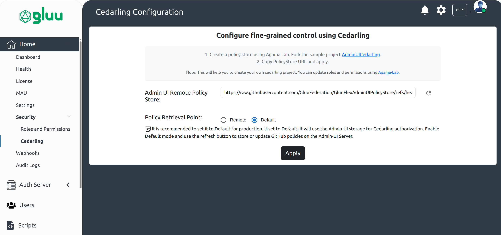
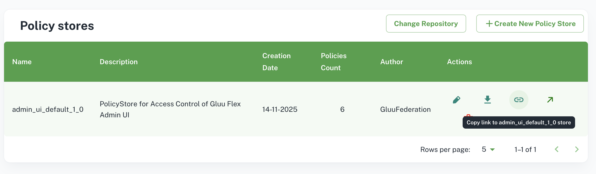

---
tags:
- administration
- admin-ui
- configuration
---

# Gluu Flex Admin UI Configuration

This document outlines the configuration process for Gluu Flex Admin UI, with a focus on essential components stored in the Auth Server's persistence layer. These components include Cedarling Configuration, OIDC client details for accessing the Auth Server, OIDC client details for accessing the Token Server, OIDC client details for accessing the License APIs, and license metadata.

## Configuration Components

### Cedarling Configuration

Gluu Flex Admin UI uses [Cedarling](https://docs.jans.io/stable/cedarling/) for GUI access control. The role of the user is mapped with specific permissions (scopes) to ensure that the user can only access and modify functionalities relevant to their roles.

The Cedarling Policy Store configuration screen helps to configure the Policy Store used for the Admin UI access control. The Gluu Flex Admin UI uses a default Policy Store after installation for GUI access control. You need to configure a remote Cedarling Policy Store using its URL and Admin UI backend will automatically synchronize roles and role-to-scope mapping as per the schema and policies defined in the Policy Store.



#### Policy Retrieval Point

This feature is useful for setting PRP. It helps to prevent MITM attacks in production. There are 2 modes.

1. `Remote`: In this mode, Admin UI will always use the remote policy store URL to initialize Cedarling, fetch policies, and schema.

2. `Default`: It is recommended to set it to Default for production. If set to Default, it will use the Admin-UI storage for Cedarling authorization. Enable Default mode and use the refresh button to store or update GitHub policies on the Admin-UI Server.

#### Steps to configure Remote Policy Store URL

 1. Fork the project [GluuFlexAdminUIPolicyStore](https://github.com/GluuFederation/GluuFlexAdminUIPolicyStore/tree/agama-lab-policy-designer).
 2. Open the forked repository using [Agama Lab's](https://cloud.gluu.org/agama-lab) Policy Designer.
 3. Make the required modifications in the policies for Admin UI access control and save the changes.
 4. Copy the Policy Store URL.
 
 5. Open Cedarling Policy Store configuration screen on Admin UI and add the copied Policy Store URL in `Admin UI Remote Policy Store` field.
 6. Set `Policy Retrieval Point` field to `Remote` to use the remote Policy Store URL for the GUI access control.

### OIDC Client Details for Auth Server

To establish secure communication with the Auth Server, Gluu Flex Admin UI requires the OIDC client details, including client ID and client secret. These details are used for authentication and authorization purposes.

The information is stored in json format with following attributes.

|Attribute Name|Description|
|--------------|-----------|
|auiWebClient|Object with Web OIDC client details|
|opHost|Auth Server hostname|
|clientId| Client Id of OIDC client used to access Auth server|
|clientSecret| Client Secret of OIDC client used to access Auth server|
|scopes|Scopes required for Admin UI authentication|
|acrValues|ACR required for Admin UI authentication|
|redirectUri|Redirect UI which is Admin UI home page|
|postLogoutUri|Url to be redirected after Admin UI logout|
|frontchannelLogoutUri|Front channel Logout Uri|
|additionalParameters|The custom parameters allow you to pass additional information to the authorization server during Admin UI authentication. Format: [{"key": "custom-param-key", "value": "custom-param-value"}, ...]|

### OIDC Client Details for Backend API Server

Similarly, Gluu Flex Admin UI needs OIDC client details to interact with the Janssen Server via. `Jans Config API` protected APIs. The Backend API client enables the UI to request and manage access tokens required to access `Jans Config API` protected resources.

The information is stored in json format with following attributes.

|Attribute Name|Description|
|--------------|-----------|
|auiBackendApiClient|Object with Backend API client details|
|opHost|Token Server hostname|
|clientId| Client Id of OIDC client used to access Token server|
|clientSecret| Client Secret of OIDC client used to access Token server|
|tokenEndpoint|Token endpoint of token server|

### Configuration Properties for User-Interface

|Attribute Name|Description|
|--------------|-----------|
|uiConfig|Object with UI configuration attributes|
|sessionTimeoutInMins|The admin UI will auto-logout after a period of inactivity defined in this field.|  

uiConfig 

|Attribute Name|Description|
|--------------|-----------|
|sessionTimeoutInMins|Admin UI Frontend session out time|
|allowSmtpKeystoreEdit|Allow to edit SMTP keystore fields. The default value is `true`.|
|cedarlingLogType|Set embeded Cedarling log-type in Admin UI. The allowed values are `off` and `std_out`.|
|auiPolicyStoreUrl|The remote Policy Store URL|
|auiDefaultPolicyStorePath|The path of the default Policy Store json file on Config Api pod.|
|cedarlingPolicyStoreRetrievalPoint|The retrieval point of the Policy Store. The allowed values are `default` and `remote`.|

### OIDC Client Details for License Server

Access to the License APIs is managed through OIDC client details. These details allows the Gluu Flex Admin UI Backend to generated access token to allow the retrieval of license-related information using license APIs.

The information is stored in json format with following attributes.

|Attribute Name|Description|
|--------------|-----------|
|opHost|Auth Server hostname used to generate token to access License APIs|
|clientId| Client Id of OIDC client used to generate token to access License APIs|
|clientSecret| Client Secret of OIDC client used to generate token to access License APIs|

### License Metadata

License metadata includes relevant information about the Gluu Flex Admin UI's licensing, such as License Key, Hardware id, License server url, License Auth server url, SSA used to register license auth server client.

The information is stored in json format with following attributes.

|Attribute Name| Description|
|--------------|------------|
|licenseConfig| Object with License configuration details |
|ssa| SSA used to register OIDC client to access license APIs |
|scanLicenseApiHostname| SCAN License server hostname |
|licenseHardwareKey| Hardware key (org_id) to access license APIs |
|intervalForSyncLicenseDetailsInDays| The Admin UI backend syncs license details into the configuration (persistence) after the set interval (default: 30 days). |

**Sample configuration stored in persistence**

```text
{
  "oidcConfig": {
    "auiWebClient": {
      "redirectUri": "https://your.host.com/admin",
      "postLogoutUri": "https://your.gost.com/admin",
      "frontchannelLogoutUri": "https://your.host.com/admin/logout",
      "scopes": [
        "openid",
        "profile",
        "user_name",
        "email"
      ],
      "acrValues": [
        "basic"
      ],
      "opHost": "https://your.host.com",
      "clientId": "2001.aaf0b8eb-a82e-4798-b1a0-e007803a6568",
      "clientSecret": "GGO4t1uixrTpl4Rizt3zag==".
      "additionalParameters": []
    },
    "auiBackendApiClient": {
      "tokenEndpoint": "https://your.host.com/jans-auth/restv1/token",
      "scopes": [
        "openid",
        "profile",
        "user_name",
        "email"
      ],
      "opHost": "https://your.host.com",
      "clientId": "2001.aaf0b8eb-a82e-4798-b1a0-e007803a6568",
      "clientSecret": "GGO4t1uixrTpl4Rizt3zag=="
    }
  },
  "uiConfig": {
    "sessionTimeoutInMins": 30,
    "allowSmtpKeystoreEdit": true,
    "cedarlingLogType":"off",
    "auiPolicyStoreUrl": "",
    "auiDefaultPolicyStorePath": "./custom/config/adminUI/policy-store.json",
    "cedarlingPolicyStoreRetrievalPoint": "default"
  },
  "licenseConfig": {
    "ssa": "...ssa in jwt format...",
    "scanLicenseApiHostname": "https://cloud-dev.gluu.cloud",
    "licenseKey": "XXXX-XXXX-XXXX-XXXX",
    "licenseHardwareKey": "github:ghUsername",
    "oidcClient": {
      "opHost": "https://account-dev.gluu.cloud",
      "clientId": "36a43e2b-a77b-4e9c-a966-a9d98af1665c",
      "clientSecret": "211188d8-a2d8-4562-ab53-80907c1bb5ba"
    }
  }
}
```