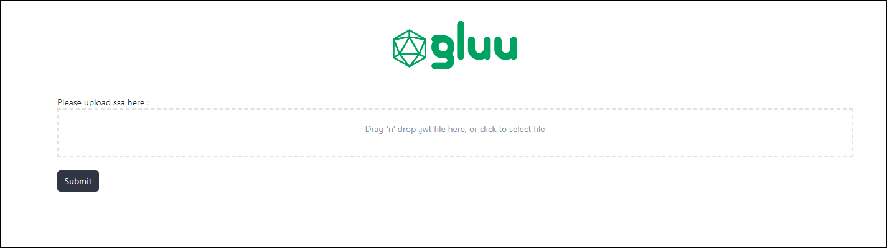
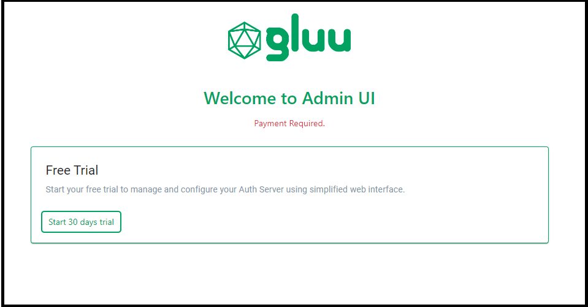

# Frequently Asked Questions (FAQ)


### Why is the Gluu Flex Admin UI displaying the following error messages after the Flex VM installation?


#### The requested page not found

```text
Error Code: 404
The requested page was not found on this server.
```

If a user encounters the above error when visiting the Admin UI URL, it indicates that the Admin UI is not properly installed. Please verify whether the Admin UI build is located at `/var/www/html/admin`. If the build is not present at this location, Janssen displays this error.

####  Admin UI backend is down

```text
Error Code: 503
Gluu Flex Admin UI is not getting any response from the backend (Jans Config Api).
```

Gluu Flex Admin UI facilitates interaction with the Jans Auth Server through a REST API layer, [Jans Config API](https://docs.jans.io/vreplace-janssen-version/contribute/implementation-design/jans-config-api/). This error prompts administrators to perform a series of troubleshooting steps.

1. Verify the status of the Jans Config API service by using the command `systemctl status jans-config-api.service`. In the majority of cases, this error is displayed when the Jans Config API is not running. 
2. It is essential to verify the server's network connectivity, including firewall rules, ports, and routing, to ensure that there are no network-related impediments preventing communication with the Jans Config API. Jans Config API runs at port `8074` for Janssen vm installation.
3. Check the Jans Config API logs at `/opt/jans/jetty/jans-config-api/logs/configapi.log` for any potential errors.
4. Review the Admin UI logs at `/opt/jans/jetty/jans-config-api/logs/adminui.log` to check for any potential errors.
5. Confirm the existence of the `/opt/jans/jetty/jans-config-api/custom/libs/gluu-flex-admin-ui-plugin.jar` file. This file serves as the backend jar for the Admin UI and is used as a Jans Config API extension.
6. It is also recommended to check the browser's console log and network tab for any failing requests, as this can provide additional information to diagnose and troubleshoot issues.

#### Internal server error in generating Jans Config Api token

```text
Error Code: 500
Error in generating token to access Jans Config Api endpoints.
```

This error is displayed when there is an internal server error in generating an access token for the Jans Config API. The Jans Config API endpoints are protected and require a token with the appropriate scopes for access.

1. Inspect the Gluu Flex Admin UI log at `/opt/jans/jetty/jans-config-api/logs/adminui.log` for any errors related to token requests.
2. Examine the Janssen Auth server log at `/opt/jans/jetty/jans-auth/logs/jans-auth.log` while it is in debug/trace mode to identify any errors that may occur during token generation. 

### Why is the Gluu Flex Admin UI is displaying the following page to upload SSA?



During installation, it is necessary to provide a Software Statement Assertion (SSA), which the Admin UI utilizes to register an OIDC client for accessing license APIs. To obtain a new SSA or renew an existing one, please follow the steps outlined in the provided [guide](../../install/agama/prerequisites.md#software-statement-assertions) from the Agama Lab web interface. If the SSA used during the installation has expired or become invalidated, you will need to upload a fresh SSA to regain access to the Admin UI.

### Why is the Gluu Flex Admin UI is displaying the following message on screen to generate trial license?



```text
Payment Required.
```

This message indicates that in order to enjoy long-term access to the Gluu Flex Admin UI, you will need to subscribe for a Admin UI license on the [Agama Lab](https://cloud.gluu.org/agama-lab) website.

```text
License validity period has expired.
```

This message is displayed when a user attempts to generate a trial license (from the Admin UI) after the previously generated trial license has expired. Please note that the Admin UI 30-day trial license can only be generated once per Agama Lab user.
