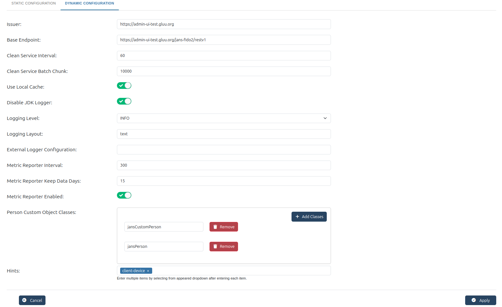

---
tags:
  - administration
  - admin-ui
  - fido2
  - fido
---

# FIDO

## Configuring FIDO2

[FIDO 2.0](https://fidoalliance.org/) (FIDO2) is an open authentication standard that enables people to leverage common devices to authenticate to online services in both mobile and desktop environments.

FIDO2 comprises the W3C’s Web Authentication specification (WebAuthn) and FIDO’s corresponding Client-to-Authenticator Protocol (CTAP). WebAuthn defines a standard web API that can be built into browsers and related web platform infrastructure to enable online services to use FIDO Authentication. CTAP enables external devices such as mobile handsets or FIDO Security Keys to work with WebAuthn and serve as authenticators to desktop applications and web services.

Gluu Flex Admin UI allows configuring parameters of Janssen's FIDO2 server. Check following [documnetation](https://docs.jans.io/stable/janssen-server/fido/config/) for details of FIDO2 configuration parameters.

## Static Configuration

The Static Configuration section holds the main server parameters and certificate paths necessary for the FIDO2 configuration.

**Authenticator Certificates Folder**

  * The path to the folder where authenticator certificates are stored. These certificates are used to validate the authenticity of FIDO2 authenticators.
  * This field helps to point to the location of authenticator certificates, which are critical in verifying the authenticity of a device during registration or authentication in a FIDO2 process.

**MDS TOC Certificates Folder**

* This field specifies the path to the folder containing the MDS (Metadata Service) TOC (Table of Contents) certificates.
* It helps in specifying the location of the certificates used to validate metadata for FIDO2 devices.

**MDS TOC Files Folder**

* This field defines the folder path that contains the MDS TOC files.
* The TOC files provide metadata related to FIDO2 authenticators and are necessary for validation during the authentication process.
  

**Check U2F Attestations**

* A toggle to enable or disable U2F (Universal 2nd Factor) attestation checking.
* This option determines whether the system should validate U2F devices' attestations during registration. U2F was an earlier version of FIDO, and some devices may still use it.

**Unfinished Request Expiration**

* Defines the time in seconds for which an unfinished authentication request is considered valid.
* This setting ensures that incomplete or pending authentication requests are discarded after a specified period, preventing the system from being overloaded with stale requests.

**Authentication History Expiration**

  * This parameter defines how long (in minutes) the system should retain authentication history logs. After this period, authentication logs will be deleted automatically.

  * This helps manage storage space by ensuring that only relevant authentication history data is retained, with older data being automatically cleaned up.

**Server Metadata Folder**

  * The path to the server metadata folder, where FIDO2 metadata is stored.
  * This folder contains critical information about the server’s capabilities, such as supported features, certificates, and public keys, needed for the authentication process.

**User Auto Enrollment**

* A toggle that enables or disables automatic enrollment of users in the FIDO2 authentication process.
* When enabled, new users are automatically enrolled into the FIDO2 authentication system during their first sign-in. This helps to streamline the user experience and speed up registration.

**Requested Credential Types**

  * Defines the types of credentials that are requested for authentication, such as public key credentials or biometric factors.

  * It restricts or specifies the type of credentials that the system should request during the authentication process. This allows for more granular control over the types of authenticators that can be used.

**Requested Parties ID**

  * This field is used to define the party or service requesting authentication. Multiple parties can be added by clicking the + Add Party button.
  
  * This setting is used to limit authentication to certain parties or domains. It ensures that only specific parties can authenticate the user, adding an additional layer of security.

Once all parameters are set, click the Apply button at the bottom of the page to save the configuration changes.

## Dynamic Configuration

The Dynamic Configuration section allows for adjustments to operational settings, such as logging, metrics, and service endpoints.

**Issuer**

  * This is the identifier (usually a URL) of the FIDO2 service. It identifies the entity that is responsible for issuing the authentication tokens.
  
  * It identifies the authentication provider to ensure that the server’s identity is verified during communication with other systems or services.

**Base Endpoint**

  * The base endpoint URL for the FIDO2 RESTful API.
  * It determines the entry point for all communication with the FIDO2 system, ensuring that API requests are correctly routed to the server.

**Clean Service Interval**

  * This setting specifies the time interval (in seconds) at which the service will clean up expired or unnecessary data.
  * This setting ensures that data management tasks, such as removing expired sessions, occur at a regular interval to prevent data buildup and keep the system efficient.

**Clean Service Batch Chunk**

  * Defines the batch size for cleanup processes. The service will clean up data in chunks of this size.
  * It allows the cleanup process to be optimized by controlling the number of records that are processed at once, preventing system overload during large cleanup tasks.

**Use Local Cache**

  * A toggle to enable or disable the use of local caching for temporary data storage.
  * This setting helps reduce the load on external systems by storing frequently accessed data locally, improving performance by allowing faster access to that data.

**Disable JDK Logger**

  * This option controls whether Java Development Kit (JDK) logging is disabled.
  * Disabling the JDK logger helps reduce unnecessary log data, which can be especially useful in production environments where minimal logging is preferred for performance.

**Logging Level**

  * Specifies the level of logging information to capture. Options include DEBUG, INFO, WARN, FATAL, OFF, TRACE and ERROR.

  * This setting controls the verbosity of log messages, allowing the system to capture only necessary information based on the severity level.

**Logging Layout**

  * Defines the format in which log entries are recorded. Common formats include plain text or JSON.

  * It allows for easy reading and processing of logs depending on the desired format, making it easier for administrators to monitor system activity.
  
**External Logger Configuration**

  * Provides the ability to configure an external logging system for centralized logging.
  * It helps integrate the system with external logging solutions for better log management, analysis, and monitoring, which is particularly useful in large-scale environments.

**Metric Reporter Interval**

  * Specifies the interval (in seconds) at which the FIDO2 server should report metrics.
  * This helps track the system's performance over time and ensures regular reporting of metrics to assist with monitoring and troubleshooting.

**Metric Reporter Keep Data Days**

  * Defines the number of days for which metric data should be kept before it is discarded.
  * It helps manage data retention for performance monitoring, ensuring that only the necessary amount of data is stored and preventing storage overload.

**Metric Reporter Enabled**

  * This option enables or disables metric reporting for the FIDO2 service.
  * Enabling this option ensures that system metrics are reported and monitored, allowing for better tracking and diagnostics of system health.

**Person Custom Object Classes**

  * Defines custom object classes that extend the person model.
  * This allows the system to store additional user data beyond the default attributes provided by the base person model, enabling greater flexibility in managing user information.

**Hints**

  * A field that provides suggestions or predefined values to assist in configuration.
  * It guides the user in providing the correct configuration options or values by offering helpful hints or pre-configured suggestions, such as common object classes or device types.
  
Once all parameters are set, click the Apply button at the bottom of the page to save the configuration changes.

The FIDO2 configuration page in the Gluu Flex Admin UI provides an intuitive interface for managing various server and authentication settings, enabling organizations to implement secure and flexible passwordless authentication solutions.

