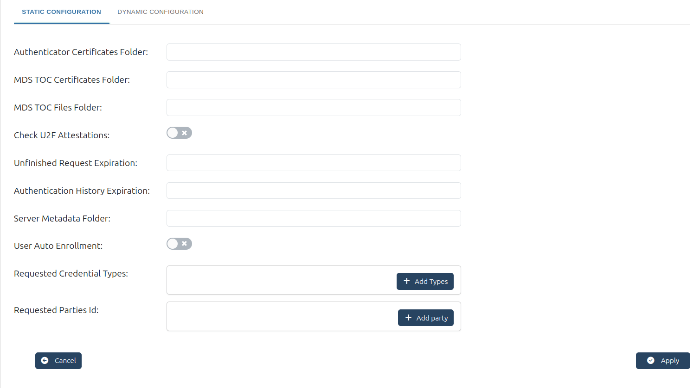

---
tags:
  - administration
  - admin-ui
  - fido2
  - fido
---

# FIDO

## Configuring FIDO2

[FIDO 2.0](https://fidoalliance.org/) (FIDO2) is an open authentication standard that enables people to leverage common devices to authenticate to online services in both mobile and desktop environments.

FIDO2 comprises the W3C’s Web Authentication specification (WebAuthn) and FIDO’s corresponding Client-to-Authenticator Protocol (CTAP). WebAuthn defines a standard web API that can be built into browsers and related web platform infrastructure to enable online services to use FIDO Authentication. CTAP enables external devices such as mobile handsets or FIDO Security Keys to work with WebAuthn and serve as authenticators to desktop applications and web services.

Gluu Flex Admin UI allows configuring parameters of Janssen's FIDO2 server. Check following [documnetation](https://docs.jans.io/stable/janssen-server/fido/config/) for details of FIDO2 configuration parameters.

## Static Configuration

The Static Configuration section holds the main server parameters and certificate paths necessary for the FIDO2 configuration.

**Authenticator Certificates Folder**

  * This field specifies the path to the folder where FIDO2 authenticator certificates are stored. These certificates are used to validate the authenticity of the authentication devices (such as security keys) during the authentication process.
  * Example Path: /etc/jans/conf/fido2/authenticator_cert
  * This folder is critical for ensuring that only trusted authenticator devices are used to authenticate users.

**MDS TOC Certificates Folder**

  * This field specifies the location where Metadata Service Token Operation Control (MDS TOC) certificates are stored. These certificates are necessary to securely interact with the MDS TOC.
  * Example Path: /etc/jans/conf/fido2/mds/cert
  * These certificates ensure that the metadata being used during authentication is valid and secure, preventing any tampering or unauthorized access.

**MDS TOC Files Folder**
  
  * This folder contains the MDS TOC files, which are used to manage metadata related to authentication processes in FIDO2. The TOC files ensure proper token management and compliance with security protocols.
  * Example Path: /etc/jans/conf/fido2/mds/toc
  * The TOC files store key operational data that helps in maintaining the security and validity of authentication tokens.

**Check U2F Attestations**

  * U2F (Universal 2nd Factor) attestations help verify whether a device has been properly registered and is trustworthy. This setting controls whether the system checks U2F attestations during the authentication process.
  * Enabling this check ensures that only properly authenticated and registered devices can be used for authentication, adding an additional layer of security.

**Unfinished Request Expiration**

  * This field defines how long (in minutes) the system should wait for an authentication request to be completed before it expires. If the request isn't finished within the defined time, it will be discarded.
  * This helps prevent old or incomplete requests from lingering in the system and potentially being exploited by attackers.

**Authentication History Expiration**

  * This parameter defines how long (in minutes) the system should retain authentication history logs. After this period, authentication logs will be deleted automatically.
  * This helps to clear old data that is no longer needed, optimizing storage and ensuring that sensitive information isn't retained longer than necessary.

**Server Metadata Folder**

  * This field specifies the folder where the server's metadata is stored. The metadata contains configuration data and other important information for the FIDO2 server's operations.
  * The metadata is essential for proper operation of the FIDO2 server and ensures that the server is up-to-date with its configuration.

**User Auto Enrollment**

  * When enabled, this setting automatically enrolls new users into the FIDO2 authentication system when they create an account. This helps streamline the enrollment process.
  * Options:
    * true: Automatically enrolls users.
    * false: Requires manual user enrollment.
  * This is useful for ensuring that all users can take advantage of FIDO2 authentication without requiring administrators to manually register them.

**Requested Credential Types**

  * This field allows administrators to specify which types of credentials the FIDO2 server will request during authentication.
  * By specifying the types of credentials, the organization can enforce more stringent authentication standards and ensure that the correct level of security is used.

**Requested Parties ID**

  * This field is used to define the party or service requesting authentication. Multiple parties can be added by clicking the + Add Party button.
  * This is useful for scenarios where the FIDO2 authentication system needs to interact with multiple organizations or services, each with its own requirements.

Once all parameters are set, click the Apply button at the bottom of the page to save the configuration changes.

## Dynamic Configuration

The Dynamic Configuration section allows for adjustments to operational settings, such as logging, metrics, and service endpoints.

**Issuer**

  * This is the identifier (usually a URL) of the FIDO2 service. It identifies the entity that is responsible for issuing the authentication tokens.
  * The issuer is essential for identifying the source of the authentication request and ensuring the integrity of the token being used.

**Base Endpoint**

  * This is the base URL endpoint for interacting with the FIDO2 service, including operations like authentication and token management.
  * This endpoint is where clients will make API calls for authentication and related services.

**Clean Service Interval**

  * This setting specifies the time interval (in seconds) at which the service will clean up expired or unnecessary data.
  * This helps ensure that outdated data does not accumulate and negatively affect the system's performance.

**Clean Service Batch Chunk**

  * Defines the batch size for cleanup processes. The service will clean up data in chunks of this size.
  * By cleaning data in batches, the system can efficiently manage large volumes of data without overloading the server.

**Use Local Cache**

  * This setting determines whether the server should use a local cache to store frequently accessed data.
  * Enabling caching improves system performance by reducing the need to retrieve data from the server on each request.

**Disable JDK Logger**

  * This option controls whether Java Development Kit (JDK) logging is disabled.
  * Disabling JDK logging can reduce unnecessary log entries and streamline the logging system.

**Logging Level**

  * Defines the verbosity of logs produced by the FIDO2 service. This helps control the amount of information logged.
  * Selecting an appropriate logging level helps administrators monitor the system more effectively. Lower verbosity (e.g., ERROR) reduces log clutter, while higher verbosity (e.g., TRACE) provides more detailed logs for troubleshooting.

**Logging Layout**

  * Specifies the format of log entries (e.g., text or JSON format).
  * The layout defines how log entries are structured, making it easier for system administrators to read and parse logs.

**External Logger Configuration**

  * This field allows administrators to specify configuration details for an external logging system.
  * Using an external logger helps centralize logs from the FIDO2 service into a unified monitoring system. This makes it easier to analyze, visualize, and correlate logs across multiple services for auditing, debugging, or compliance purposes.

**Metric Reporter Interval**

  * Specifies the interval (in seconds) at which the FIDO2 server should report metrics (such as usage, errors, or performance).
  * This allows administrators to monitor the health and performance of the server in real time.

**Metric Reporter Keep Data Days**

  * Defines the number of days for which metric data should be kept before it is discarded.
  * This ensures that only relevant metric data is retained, preventing excessive storage use.

**Metric Reporter Enabled**

  * This option enables or disables metric reporting for the FIDO2 service.
  * Metric reporting is important for performance analysis and troubleshooting, so enabling it helps keep track of system health.

**Person Custom Object Classes**

  * This setting allows administrators to add custom object classes for the person schema in the directory. Custom object classes can store additional data specific to your organization's needs.
  * Custom object classes provide flexibility for organizations to store user data that is specific to their authentication setup.

**Hints**

  * This field allows administrators to define one or more hint values (keywords or identifiers) that can be used by the FIDO2 service to optimize or guide authentication flows. Hints can help the system recognize and process specific devices, credentials, or configurations.
  * By using hints, administrators can provide contextual information to the FIDO2 server. This improves flexibility in handling different authentication scenarios, such as directing certain requests to specific devices or tailoring the authentication experience for particular clients.
  
Once all parameters are set, click the Apply button at the bottom of the page to save the configuration changes.

The FIDO2 configuration page in the Gluu Flex Admin UI provides an intuitive interface for managing various server and authentication settings, enabling organizations to implement secure and flexible passwordless authentication solutions.

