---
tags:
  - administration
  - admin-ui
  - dashboard
  - health
  - license
  - mau
  - setting
  - security
  - admin-ui-roles
  - roles
  - mappings
  - permissions
  - capabilities
  - webhooks
  - assets
  - Jans-assets
  - audit-log
  - logs
---

# Home

## Dashboard

After successful authentication, the administrator is taken to the dashboard. The dashboard brings an organized presentation of crucial details at one place adding to the convenience of users in tracking and analysis of auth server and other details.

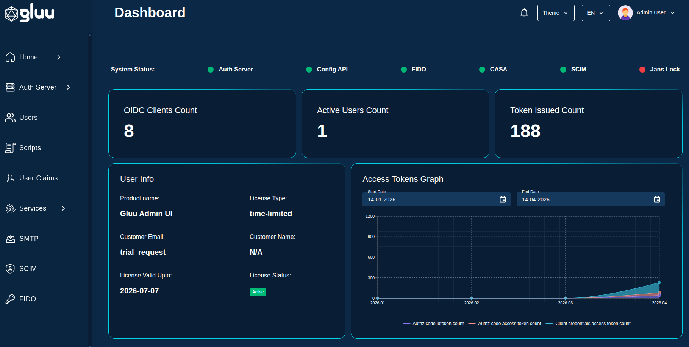

### Dashboard Descriptions Fields

- **OIDC Clients Count:** The count of OIDC clients created on auth server.
- **Active Users Count:** The count of `active` users on auth server.
- **Token Issued Count:** This figure is the sum of the access-tokens with grant-type `client credentials` and `authorization code` and id-token.
- **Server statuses:** The health status of the `Auth Server` `CASA` `SCIM` `Config API` `FIDO` `Keycloak` `Jans Lock` . For e.g. `Running` or `Down`.
- **Database status:** The health status of the persistence (e.g. PostgreSQL, MySQL etc).

### Access Token Graph

The dashboard has a bar graph showing month-wise access-token with grant-type `client credentials`, `authorization code` and `id_token` generated from auth server.

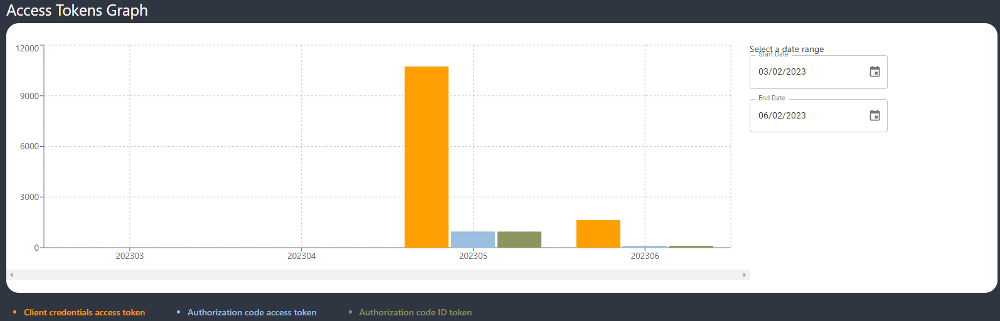

### Localization and Theme selection

Admin UI supports localization. The default language is English. The other supported languages are French and Portuguese. A new preferred language can be selected from the top right corner of the dashboard which will convert the labels and tooltip to the selected language.

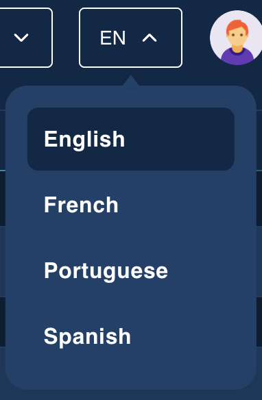

The administrator can also select from four website themes in Admin UI.

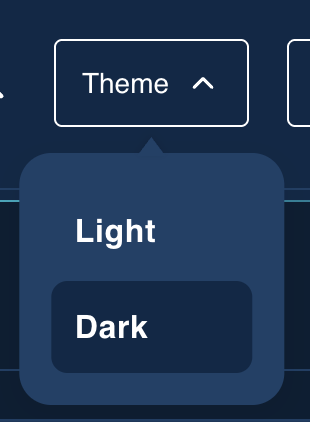

## Health

The health section show the statuses of the `OAuth Server` and `Database`.

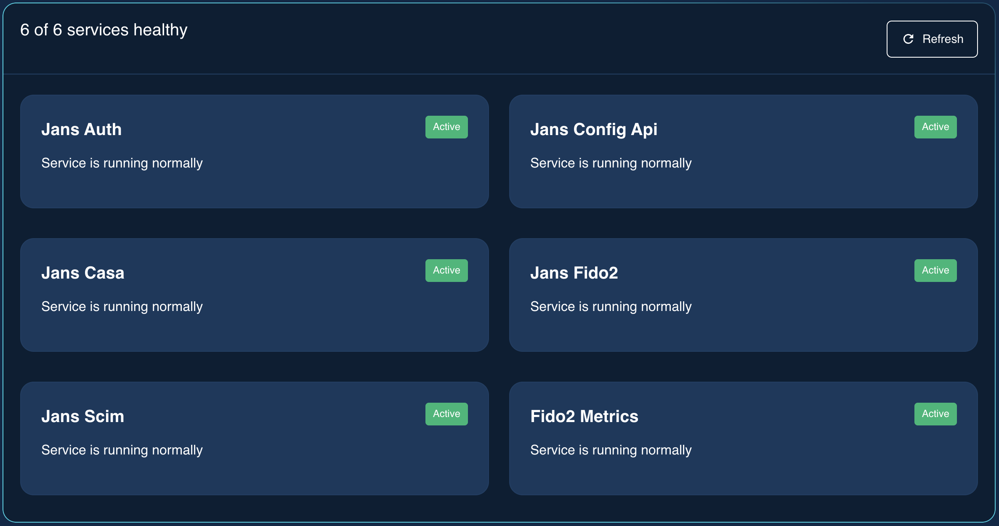

## License Details

Admin UI uses [LicenseSpring](https://licensespring.com/) platform for customer license management.

- **Product Name:** The name of the product created on the LicenseSpring platform. The license issued for Admin UI activation is created under this product. Check LicenseSpring [docs](https://docs.licensespring.com/docs/getting-started#configureyourproductwithinthelicensespringplatform) for more details.
- **License Type:** The type of license issued. For e.g. Perpetual, Time Limited, Subscription and Consumption.
- **Customer Email:** To issue a license, we need to enter customer details like first name, last name, company, email and phone number in the LicenseSpring platform. This field displays the email of the customer of the license.
- **Company Name:** The company name of the registered product.
- **License Status:** The status of the license (e.g. active or inactive).

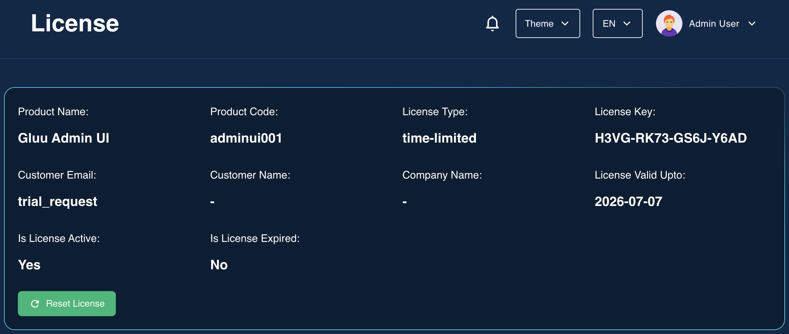

## MAU Graph

This is a line graph showing month-wise active users under a selected date range.

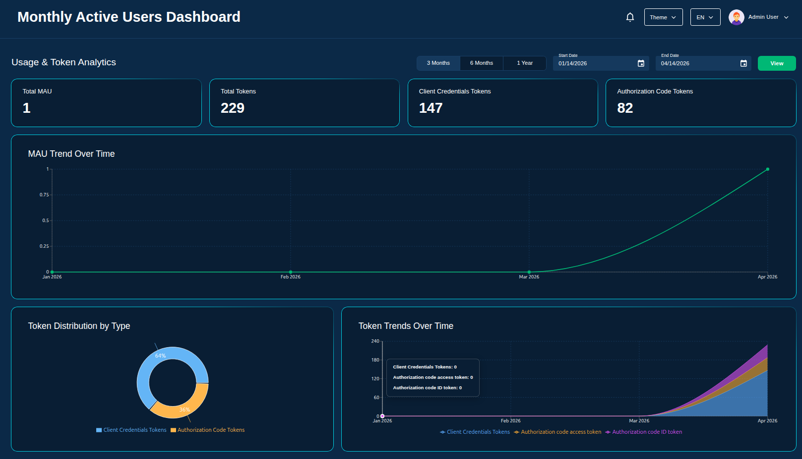

## Settings

The Gluu Flex Admin UI provides a user-friendly interface for managing various UI settings of this web application. This page has the following fields.

- **List paging size:** This field allows to define the default paging size for all search pages within the Admin UI.
- **Config API URL:** The read-only URL of the Jans Config API is used by the Admin UI for interaction.
- **Admin UI Session Timeout (In Minutes):** This field determines the maximum idle time allowed before a user is automatically logged out of the Admin UI.
- **Cedarling Log enabled?:** This switch enables or disables Cedarling logs in the browser console.
- **Admin UI Logging Level:** This field is used to set frontend log level on browser console.
- **Admin UI authentication method (ACR):** This dropdown enables user to select the default authentication method to be used in the Admin UI.
- **Custom Parameters (for authentication):** The custom parameters allow you to pass additional information to the authorization server during Admin UI authentication.

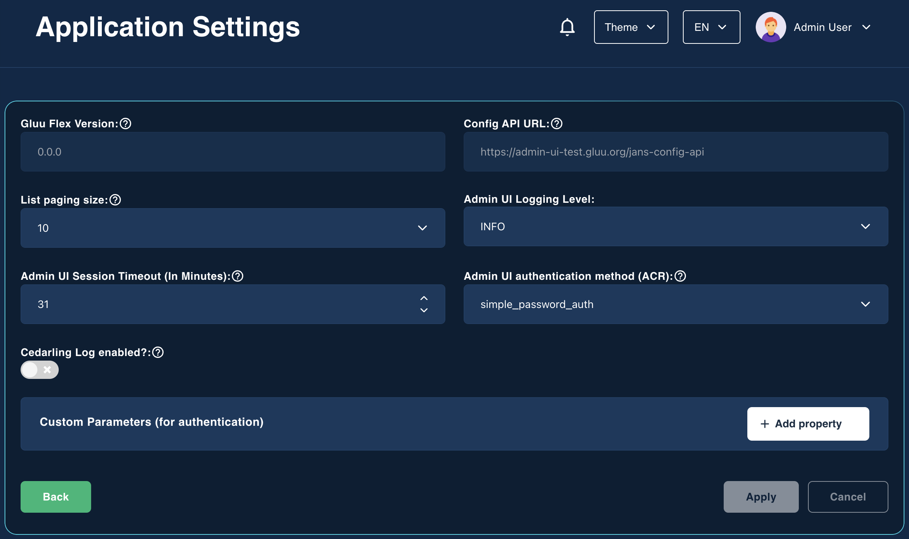

## Security

Features such as uploading a new policy store to manage access control and checking role-to-scope mappings in the Admin UI are covered under the Security menu.

### GUI Access Control

This topic is covered in detail [here](./access-control.md). New Admin UI roles can be added by introducing the corresponding policies in the policy store. These roles can then be assigned to users through the [User Management](./user-management-menu.md) feature of the Admin UI. After installation, the Admin UI uses a default policy store generated by the installer for access control. This policy store includes the `admin` role, and the default user (admin) is assigned that role.

### Capabilities

In Cedarling, a capability represents an action (such as view, edit, or delete) that a principal is authorized to perform on a resource. In the context of Admin UI, the resource is an Admin UI feature. We can introduce Cedarling policies in the policy store to manage capabilities of Admin UI role. The policy store can be uploaded through the [Cedarling Configuration](./configuration.md#cedarling-configuration) page to control access to Admin UI features. After the Policy Store file is uploaded, the backend parses the Policy Store to determine the roles and the role-to-scope mappings. The Role-Permission Mappings can be viewed under the Security menu. 

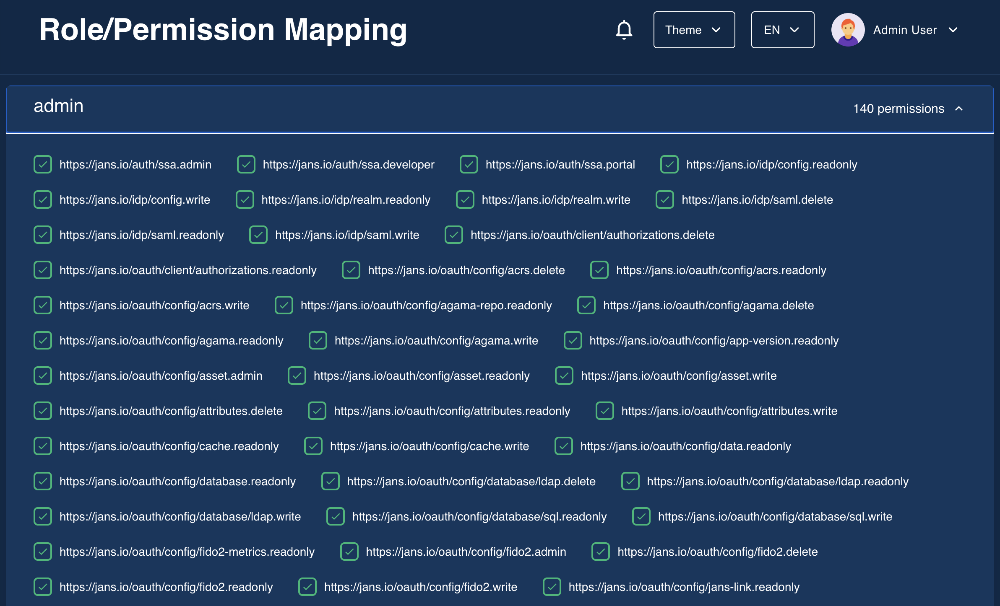

## Webhooks

Gluu Flex Admin UI uses webhooks to automate custom business logic during create, update, and delete operations (e.g., when a new user is created). Administrators can map webhooks to specific features and events, enabling dynamic and extensible workflows.

Follow this [tutorial](./webhooks.md) for setup instructions.

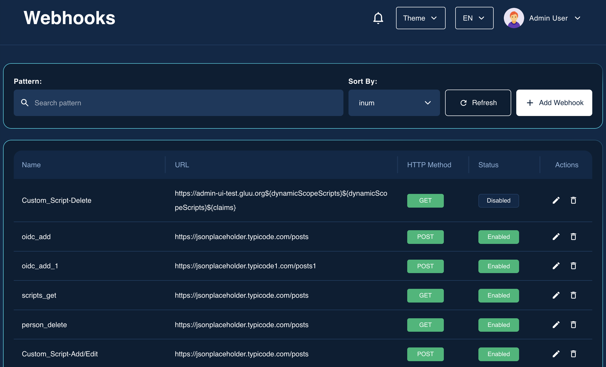

## Assets

The Custom Asset Upload feature enables users to upload various types of assets directly to the Janssen Auth Server and its associated components through the graphical user interface (Admin UI) — without the need to manually access or modify the backend file system. It reduces dependency on system-level access or DevOps intervention and the file uploads are handled within the scope of user permissions defined in the Admin UI.

### Key Use Cases:

- **Web UI Customization:** Users can upload assets such as .js, .css, or .png files to modify the look and feel of authentication-related web pages (e.g., login or error pages) to meet branding or accessibility requirements.

- **Library or Plugin Addition:** Developers can upload .jar files or other supporting resources to introduce new functionality into the running server such as custom authentication mechanisms, filters, or extensions.

- **Configuration Enhancements:** The feature supports uploading configuration-related files like .xml, .properties, or .json which may define behaviors, rules, or component settings for the server or its modules.

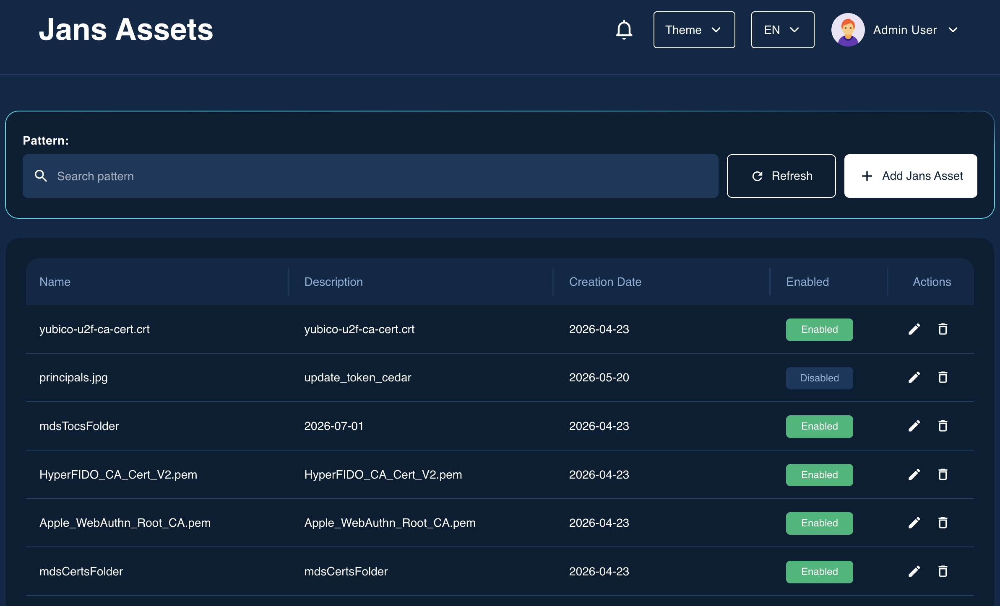

## Audit Logs

Audit logs are records of write requests initiated from the Admin UI to the Jans Config API. In simpler terms, whenever an administrator makes a change — such as updating a client, modifying a script, or changing a configuration property — that action is recorded.

The Audit Log Search page allows administrators to search and analyze recorded administrative activities. It provides date range and pattern-matching filters to help you quickly locate specific log entries which includes details like the timestamp, user, action, and affected resources, making it useful for security monitoring, compliance, and troubleshooting.

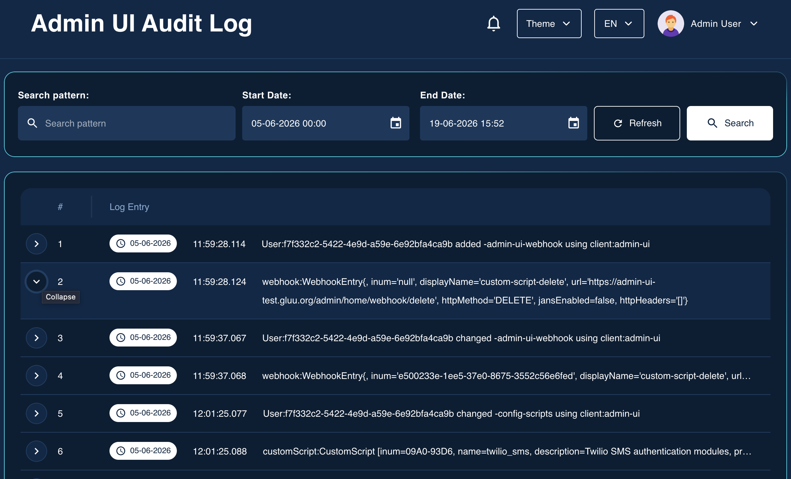
