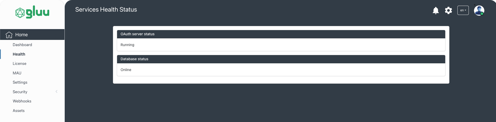

---
tags:
  - administration
  - admin-ui
  - dashboard
  - health
  - license
  - mau
  - setting
  - security
  - admin-ui-roles
  - roles
  - mappings
  - permissions
  - capabilities
  - webhooks
  - assets
  - Jans-assets
  - audit-log
  - logs
---

# Home

## Dashboard

After successful authentication, the administrator is taken to the dashboard. The dashboard brings an organized presentation of crucial details at one place adding to the convenience of users in tracking and analysis of auth server and other details.

### Dashboard Descriptions Fields

- **OIDC Clients Count:** The count of OIDC clients created on auth server.
- **Active Users Count:** The count of `active` users on auth server.
- **Token Issued Count:** This figure is the sum of the access-tokens with grant-type `client credentials` and `authorization code` and id-token.
- **Server statuses:** The health status of the `Auth Server` `CASA` `SCIM` `Config API` `FIDO` `Keycloak` `Jans Lock` . For e.g. `Running` or `Down`.
- **Database status:** The health status of the persistence (e.g. PostgreSQL, MySQL etc).

### Access Token Graph

The dashboard has a bar graph showing month-wise access-token with grant-type `client credentials`, `authorization code` and `id_token` generated from auth server.

### Localization and Theme selection

Admin UI supports localization. The default language is English. The other supported languages are French and Portuguese. A new preferred language can be selected from the top right corner of the dashboard which will convert the labels and tooltip to the selected language.

The administrator can also select from four website themes in Admin UI.

## Health

The health section show the statuses of the `OAuth Server` and `Database`.

## License Details

Admin UI uses [LicenseSpring](https://licensespring.com/) platform for customer license management.

- **Product Name:** The name of the product created on the LicenseSpring platform. The license issued for Admin UI activation is created under this product. Check LicenseSpring [docs](https://docs.licensespring.com/docs/getting-started#configureyourproductwithinthelicensespringplatform) for more details.
- **License Type:** The type of license issued. For e.g. Perpetual, Time Limited, Subscription and Consumption.
- **Customer Email:** To issue a license, we need to enter customer details like first name, last name, company, email and phone number in the LicenseSpring platform. This field displays the email of the customer of the license.
- **Company Name:** The company name of the registered product.
- **License Status:** The status of the license (e.g. active or inactive).

## MAU Graph

This is a line graph showing month-wise active users under a selected date range.

## Settings

The Gluu Flex Admin UI provides a user-friendly interface for managing various UI settings of this web application. This page has the following fields.

- **List paging size:** This field allows to define the default paging size for all search pages within the Admin UI.
- **Config API URL:** The read-only URL of the Jans Config API is used by the Admin UI for interaction.
- **Admin UI Session Timeout (In Minutes):** This field determines the maximum idle time allowed before a user is automatically logged out of the Admin UI.
- **Admin UI authentication method (ACR):** This dropdown enables user to select the default authentication method to be used in the Admin UI.
- **Custom Parameters (for authentication):** The custom parameters allow you to pass additional information to the authorization server during Admin UI authentication.

## Security

The features like managing Admin UI Roles and Capabilities and Mappings are placed under the Security menu. These features will be discussed one by one below:

### GUI Access Control

The administrator can control view/edit/delete access of users of Gluu Flex Admin UI by adding or removing the
appropriate Permissions mapped to the user's Admin UI Role. For e.g. if the **read** Permission of OIDC
clients (`https://jans.io/oauth/config/clients.readonly`) is not mapped to the logged-in user's Role, the contents of
the page showing OIDC client records will not be visible to the user. In the same way, if the write and delete
Permissions of OIDC clients are not mapped then the user will not be able to edit or delete any OIDC client record.

### Admin UI Roles

The logged-in administrator can create, edit or delete Admin UI Roles using this Page. The Admin UI Role
can be assigned to the user using the [User Management](./user-management-menu.md) feature of this GUI. After installation,
the following Admin UI Roles can be seen on Admin UI: api-viewer, api-editor, api-manager and api-admin. The default
user i.e. `admin` is assigned with api-admin role. A user with one or more Admin UI Role(s) assigned will be able to
log into Gluu Flex Admin UI.

### Capabilities

Gluu Flex Admin UI uses [Config API](https://github.com/JanssenProject/jans/tree/main/jans-config-api) to manage and
configure the Jans Auth server.The user interface allows to add, edit and delete the Permissions or Capabilities used to access the APIs (i.e. rest APIs used by Admin UI).

### Role-Permission Mapping

The administrator can map the Admin UI Role with one or more Capabilities using the Role-Permission Mapping page. The Role mapped with Capabilities can be then assigned to the user to allow access to the corresponding operations of the GUI.

The below table lists the Capabilities used in Admin UI:

| Capability                                                                                  | Description                           |
| ------------------------------------------------------------------------------------------- | ------------------------------------- |
| `https://jans.io/oauth/config/attributes.readonly`                                          | View Person attributes                |
| `https://jans.io/oauth/config/attributes.write`                                             | Add/Edit Person attributes            |
| `https://jans.io/oauth/config/attributes.delete`                                            | Delete Person attributes              |
| `https://jans.io/oauth/config/scopes.readonly`                                              | View the Scopes                       |
| `https://jans.io/oauth/config/scopes.write`                                                 | Add/Edit Scopes                       |
| `https://jans.io/oauth/config/scopes.delete`                                                | Delete Scopes                         |
| `https://jans.io/oauth/config/scripts.readonly`                                             | View the Scripts                      |
| `https://jans.io/oauth/config/scripts.write`                                                | Add/Edit Scripts                      |
| `https://jans.io/oauth/config/scripts.delete`                                               | Delete Scripts                        |
| `https://jans.io/oauth/config/openid/clients.readonly`                                      | View the Clients                      |
| `https://jans.io/oauth/config/openid/clients.write`                                         | Add/Edit Clients                      |
| `https://jans.io/oauth/config/openid/clients.delete`                                        | Delete Clients                        |
| `https://jans.io/oauth/config/smtp.readonly`                                                | View SMTP configuration               |
| `https://jans.io/oauth/config/smtp.write`                                                   | Edit SMTP configuration               |
| `https://jans.io/oauth/config/smtp.delete`                                                  | Remove SMTP configuration             |
| `https://jans.io/oauth/config/logging.readonly`                                             | View Auth server log configuration    |
| `https://jans.io/oauth/config/logging.write`                                                | Edit Auth server log configuration    |
| `https://jans.io/oauth/config/database/ldap.readonly`                                       | View LDAP persistence configuration   |
| `https://jans.io/oauth/config/database/ldap.write`                                          | Edit LDAP persistence configuration   |
| `https://jans.io/oauth/config/database/ldap.delete`                                         | Delete LDAP persistence configuration |
| `https://jans.io/oauth/config/jwks.readonly`                                                | View JWKS                             |
| `https://jans.io/oauth/jans-auth-server/config/adminui/user/role.readonly`                  | View Admin UI Roles                   |
| `https://jans.io/oauth/jans-auth-server/config/adminui/user/role.write`                     | Edit Admin UI Roles                   |
| `https://jans.io/oauth/jans-auth-server/config/adminui/user/role.delete`                    | Delete Admin UI Roles                 |
| `https://jans.io/oauth/jans-auth-server/config/adminui/user/permission.readonly`            | View Admin UI Permissions             |
| `https://jans.io/oauth/jans-auth-server/config/adminui/user/permission.write`               | Edit Admin UI Permissions             |
| `https://jans.io/oauth/jans-auth-server/config/adminui/user/permission.delete`              | Delete Admin UI Permissions           |
| `https://jans.io/oauth/jans-auth-server/config/adminui/user/rolePermissionMapping.readonly` | View Role-Permission Mapping          |
| `https://jans.io/oauth/jans-auth-server/config/adminui/user/rolePermissionMapping.write`    | Edit Role-Permission Mapping          |
| `https://jans.io/oauth/jans-auth-server/config/adminui/user/rolePermissionMapping.delete`   | Delete Role-Permission Mapping        |

## Webhooks

Gluu Flex Admin UI uses webhooks to automate custom business logic during create, update, and delete operations (e.g., when a new user is created). Administrators can map webhooks to specific features and events, enabling dynamic and extensible workflows.

Follow this [tutorial](./webhooks.md) for setup instructions.

## Assets

The Custom Asset Upload feature enables users to upload various types of assets directly to the Janssen Auth Server and its associated components through the graphical user interface (Admin UI) — without the need to manually access or modify the backend file system. It reduces dependency on system-level access or DevOps intervention and the file uploads are handled within the scope of user permissions defined in the Admin UI.

### Key Use Cases:

- **Web UI Customization:** Users can upload assets such as .js, .css, or .png files to modify the look and feel of authentication-related web pages (e.g., login or error pages) to meet branding or accessibility requirements.

- **Library or Plugin Addition:** Developers can upload .jar files or other supporting resources to introduce new functionality into the running server such as custom authentication mechanisms, filters, or extensions.

- **Configuration Enhancements:** The feature supports uploading configuration-related files like .xml, .properties, or .json which may define behaviors, rules, or component settings for the server or its modules.

## Audit Logs

The Audit Logs component displays a record of all activities and events that have taken place in the Janssen system. It helps administrators track actions, identify who performed them, and when they occurred. Each log entry includes details like the timestamp, user, action, and affected resources, making it useful for security monitoring, compliance, and troubleshooting.

