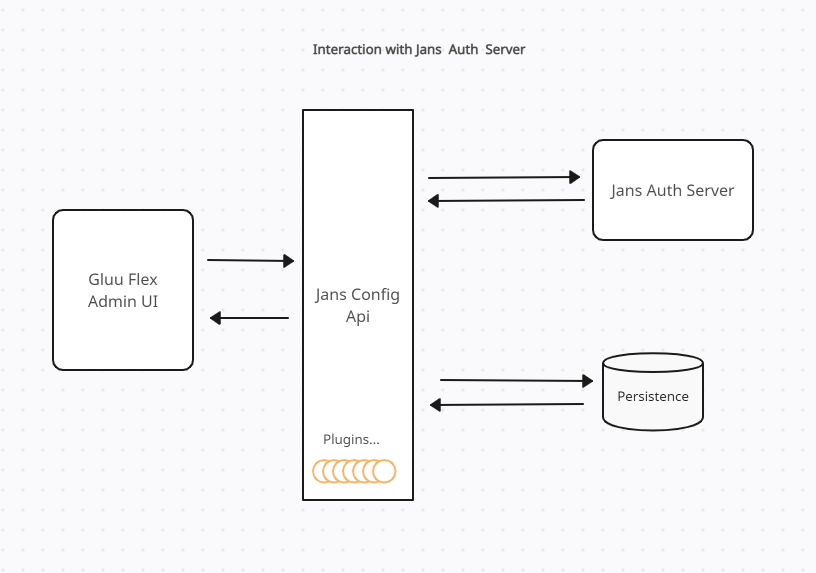
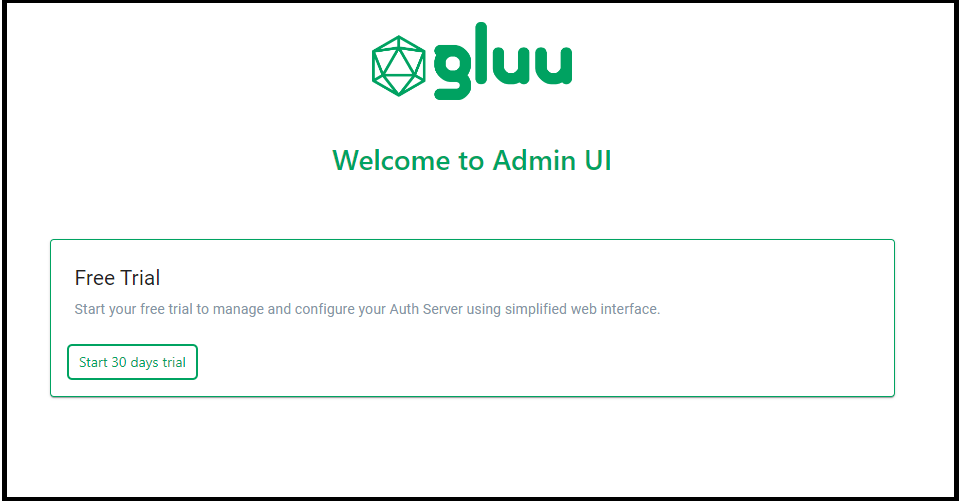
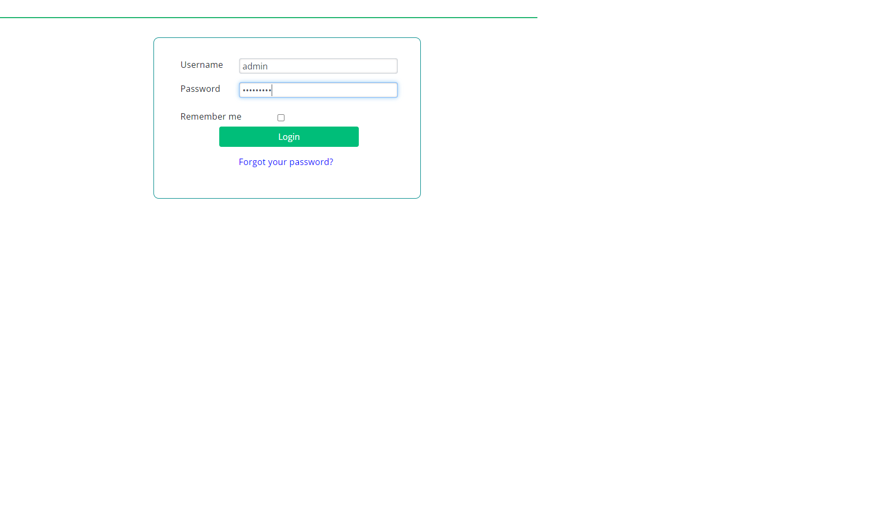

---
tags:
- administration
- admin-ui
- installation
- license
---

# Gluu Flex Admin UI

Gluu Flex Admin UI is a web interface to simplify the management and configuration of your Janssen Authentication Server. One of the key services offered by Gluu Flex is the ability to view and edit configuration properties, interception scripts, clients, users, metrics, and more, all in one place. This user-friendly interface facilitates interaction with the Jans Auth Server through a REST API layer known as the Jans Config API.

The above diagram explains interaction between various depending components.  

### Admin UI Frontend

This user facing GUI has been developed using [React.js](https://react.dev/) and [Redux](https://redux.js.org/) is used for state management. The Admin UI utilizes an OpenAPI JavaScript client for Jans Config API, facilitating API calls to Jans Config API endpoints.

The GUI utilizes popular libraries such as [Material-UI](https://mui.com/material-ui/), Axios, [Formik](https://formik.org/), etc. [Webpack](https://webpack.js.org/) is responsible for compiling and bundling the application, optimizing its performance, and generating the necessary production files. The Admin UI bundle is hosted on an **Apache HTTP server**, which is included as a component with the Janssen server installation. This setup ensures that the GUI is readily accessible and efficiently served to users.

### Admin UI Backend

The GUI utilizes a dedicated Java backend to handle specific tasks, such as reading the Admin UI configuration from persistence, managing Admin UI roles and permission mapping in configuration, performing audit logging, and making calls to license APIs on SCAN. The Jans Config API follows a flexible plugin architecture, allowing the addition of new APIs through extensions known as plugins, without the need to modify the core application. The Admin UI Backend has been incorporated into the Jans Config API as a plugin to address Admin UI-specific tasks.   

## Installation

Gluu Flex can be installed using [VM installer](../../install/vm-install/vm-requirements.md) or using [Rancher](../recipes/getting-started-rancher.md) on Cloud Native.

During installation, we need to provide a Software Statement Assertion (SSA) which is used by Admin UI to register an OIDC client to access license APIs. Check the following [guide](../../install/flex/prerequisites.md#software-statement-assertions) for the steps to issue SSA from the [Agama Lab](https://cloud.gluu.org/agama-lab) web interface.

## Gluu Flex License

After installation, the Admin UI can be accessed at `https://hostname/admin` (the hostname is provided during setup). Access to this web interface is granted only after subscribing to the Admin UI license from Agama Lab.

There is a provision to generate a 30-day free trial license of Gluu Flex which will help users to enter and understand this web interface.

After license activation, the user can log into Gluu Flex Admin UI using the default username (`admin`) and the `password` (the admin password provided during installation).

## Flex services dependencies

Gluu Flex Admin UI depends on following Flex services:

- Janssen Config API service (jans-config-api.service) 
- The Apache HTTP Server (apache2.service) 

