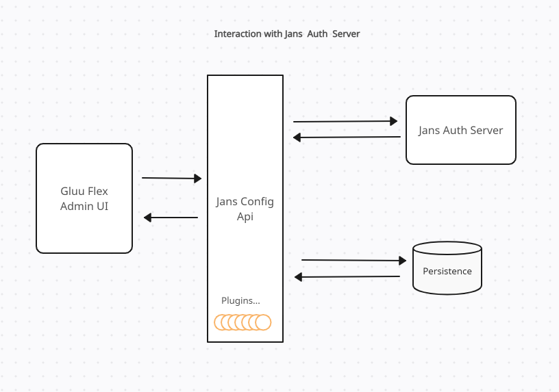
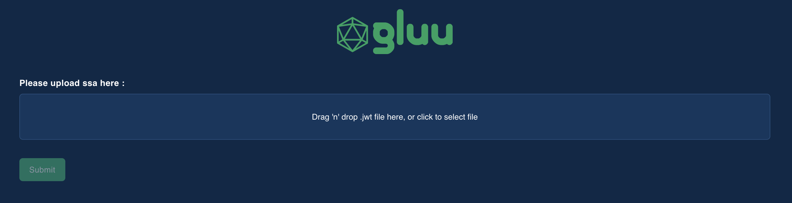
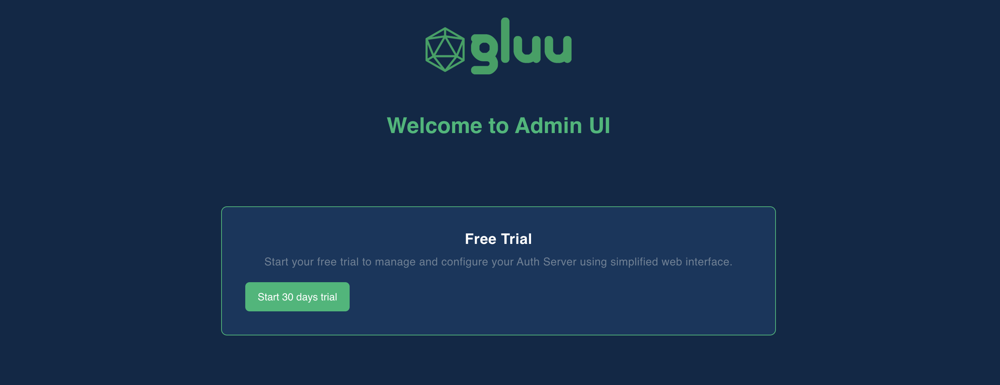
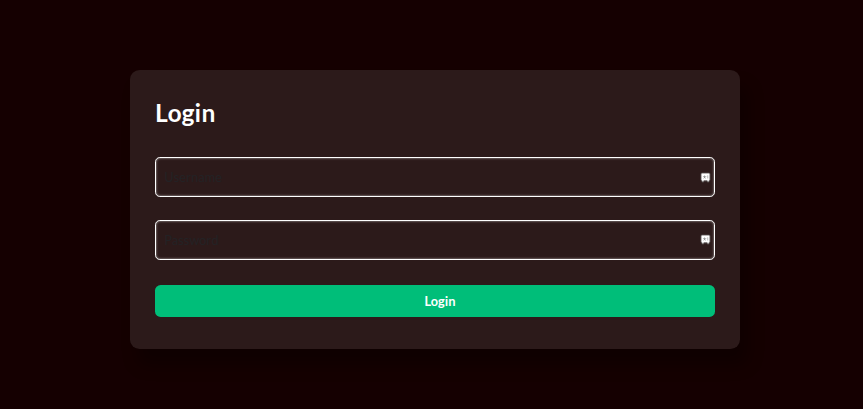

---
tags:
- administration
- admin-ui
- installation
- license
---

# Gluu Flex Admin UI

Gluu Flex Admin UI is a web interface to simplify the management and configuration of your Janssen Authentication Server. One of the key services offered by Gluu Flex is the ability to view and edit configuration properties, interception scripts, clients, users, metrics, and more, all in one place. This user-friendly interface facilitates interaction with the Jans Auth Server through a REST API layer known as the Jans Config API.

The above diagram explains the interaction between various dependent components.

### Admin UI Frontend

This user facing Frontend has been developed using the following:

#### UI Framework & Styling

- **React 18** — core UI framework
- **MUI (Material UI) v9** — component library (@mui/material, @mui/icons-material, @mui/x-date-pickers)
- **Bootstrap 5** — utility CSS
- **Emotion (@emotion/react, @emotion/styled)** — CSS-in-JS, used by MUI
- **tss-react** — MUI-compatible typed style system
-  **@material-table/core** — data tables

#### State Management & Data Fetching

- **Redux Toolkit + react-redux** — global state management
- **redux-persist** — persists Redux state across reloads
- **TanStack Query (React Query) v5** — server state / API data fetching
- **Axios** — HTTP client

#### Routing

- **React Router DOM v7**

#### Forms & Validation

- **Formik** — form state management
- **Yup** — schema-based form validation

#### Authentication/ Authorization

- **@openid/appauth** — OpenID Connect / OAuth 2.0 client-side auth
- **@janssenproject/cedarling_wasm** — Cedarling WASM module for policy-based authorization (Cedar policy engine)

#### Internationalisation

- **i18next + react-i18next** — i18n support

#### Utilities

- **Lodash** — general utility functions
- **Dayjs** — date/time handling
- **Recharts** — charts (used for MAU dashboard)
- **react-toastify** — toast notifications
- **animejs** — animations
- **clsx** — conditional class names

#### Build & Tooling

- **Vite v8** — build tool
- **TypeScript 6**
- **Orval** — generates typed API client from OpenAPI spec
- **Jest + React Testing Library** — unit/component testing
- **ESLint + Prettier** — linting and formatting

### Admin UI Backend

The GUI utilizes a dedicated Java backend to handle specific tasks, such as reading the Admin UI configuration from persistence, managing Admin UI roles and permission mapping in configuration, performing audit logging, and making calls to license APIs on Agama Lab. The Jans Config API follows a flexible plugin architecture, allowing the addition of new APIs through extensions known as plugins, without the need to modify the core application. The Admin UI Backend has been incorporated into the Jans Config API as a plugin to address Admin UI-specific tasks.

## Installation

Gluu Flex can be installed using [VM installer](../../install/vm-install/vm-requirements.md) or using [Helm Deployments](../install/helm-install/README.md) on Cloud Native.

## Gluu Flex License

After installation, the Admin UI can be accessed at `https://hostname/admin` (the hostname is provided during setup). Access to this web interface is granted only after issuing a Software Statement Assertion (SSA) and subscribing to the Admin UI license from [Agama Lab](https://cloud.gluu.org/agama-lab). The SSA issued from the Agama Lab is used by Admin UI to register an OIDC client to access license APIs. Follow this [guide](../../install/flex/prerequisites.md) for detailed steps.

There is a provision to generate a 30-day free trial license of Gluu Flex which will help users to enter and understand this web interface.

After license activation, the user can log into Gluu Flex Admin UI using the default username (`admin`) and the `password` (the admin password provided during installation).

## Flex services dependencies

Gluu Flex Admin UI depends on following Flex services:

- Janssen Config API service (jans-config-api.service) 
- The Apache HTTP Server (apache2.service) 

