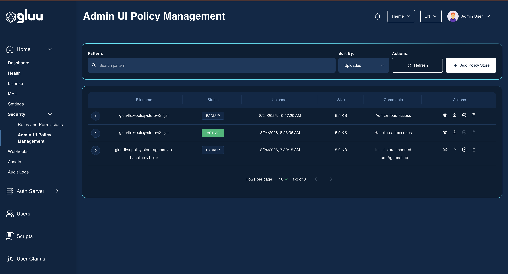
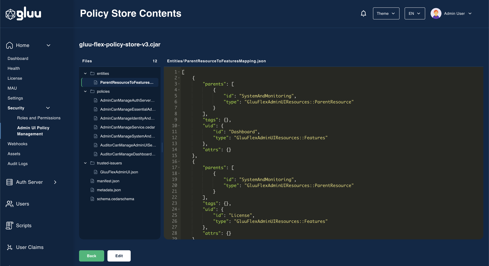

---
tags:
  - administration
  - admin-ui
  - cedarling
  - policy store
  - access control
---

# Admin UI Policy Management

`Security` > `Admin UI Policy Management` lists every Cedarling Policy Store held by the Admin UI backend and controls which one governs GUI access control.

One store is active at a time. The active store supplies the schema, policies and role-to-scope mappings that decide what each administrator can see and change. Every other store is retained as a backup, so a previous configuration can be restored by activating it again.

## Policy store list

|Column|Description|
|---|---|
|Filename|Name of the uploaded `.cjar` archive|
|Status|`ACTIVE` for the store in force, `BACKUP` for the rest|
|Uploaded|Date and time the store was added|
|Size|Size of the stored archive|
|Comments|Description supplied when the store was uploaded|

Search by pattern, sort by uploaded date, name or status, and page through the list using the toolbar above the table.

## Adding a policy store

`Add Policy Store` button opens the upload screen, which accepts a `.cjar` archive produced by Agama Lab's Policy Designer. See [Steps to create and upload Policy Store archive file](./configuration.md#steps-to-create-and-upload-policy-store-archive-file).

A newly uploaded store is stored as a backup. It has no effect on access control until it is activated.

## Activating a policy store

On click of `Set active` action button, it promotes a backup to the active store. The action is unavailable on the store that is already active.

Activation runs in two steps:

1. A confirmation dialog states that activating restarts the system, triggers the webhooks registered against the `policy_store_write` feature, and signs you out of the Admin UI.
2. A commit dialog collects a comment describing the change. The comment is between 10 and 512 characters and is written to the audit log.

On success the Admin UI:

- Marks the selected store active and the previously active store a backup
- Regenerates the role-to-scope mappings from the newly active store. A failed regeneration is logged and does not block the activation
- Triggers any enabled webhooks mapped to `policy_store_write`
- Signs you out after three seconds

Sign in again to pick up the permissions defined by the new store.

## Deleting a policy store

`Delete` permanently removes a backup store. The action is unavailable on the active store, so access control cannot be left without a policy source.

Deleting collects a comment on the same terms as activation, records it in the audit log, and triggers any enabled webhooks mapped to the `policy_store_delete` feature.

## Downloading a policy store

`Download` saves the stored archive to your machine under the filename it was uploaded with.

## Viewing archive contents

`Open` shows the `Policy Store Contents` screen: a file tree of the archive on the left, and the contents of the selected file on the right. Policies, entities, the schema, the manifest and the trusted-issuer definitions are all rendered as text. Binary files are listed but not rendered.

The tree lists folders first, each with a count of the files it holds, then the archive's top-level files under a `Store root` heading. The count in the `Files` header covers the whole archive.

Drag the divider between the two panes to widen either side, or focus it and use the left and right arrow keys.

## Editing archive contents

`Edit`, in the footer of the `Policy Store Contents` screen, opens the archive for editing. It is available on backup stores only. The active store stays read-only, with a notice explaining that it must be downloaded, edited as a copy and uploaded as a new store.

While editing you can:

- Change the contents of any text file in the archive
- Add a file or a folder with the two controls in the `Files` header, giving a path such as `policies/AdminCanManageService.cedar` or `policies`
- Rename or delete any file or folder with the controls that appear on its row when you hover over it or focus it

Deleting a folder also removes every file inside it. Renaming a folder moves its contents with it, keeping any edits you have already made to them. An empty folder is written into the downloaded archive as a real directory entry, so it survives the round trip.

Changes are held in the browser. The Admin UI does not write them back to the stored archive, so `Download` is the only way to keep them:

- The viewer header shows `(Not downloaded yet)` for as long as the archive has pending changes
- `Download` packs the archive, including added and removed files, into a new `.cjar` and clears the pending changes. The file is named after the store with a date and time stamp, so repeated downloads stay distinguishable
- `Cancel` discards all pending changes and keeps you on the page
- `Back` with pending changes asks for confirmation before leaving

`Download` and `Cancel` stay disabled until something in the archive changes.

To put edited policies into service, upload the downloaded archive as a new policy store and activate it.

## Permissions

The screen requires read access to the Admin UI `Security` resource. `Set active`, `Delete`, `Add Policy Store` and `Edit` additionally require write access. Administrators without write access see the list, the download action and the read-only contents viewer.

On screens narrower than 768 pixels the row actions collapse to viewing and downloading.
