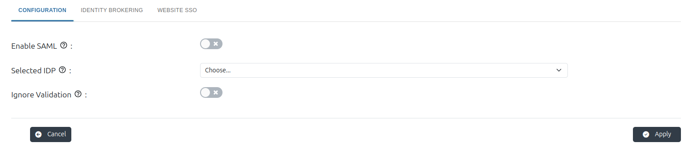
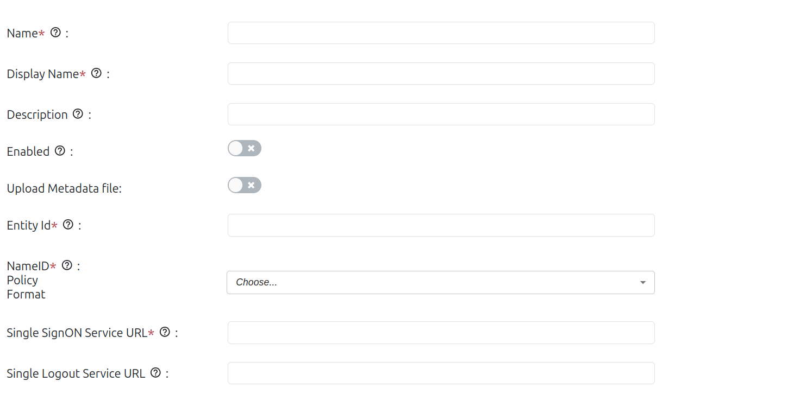
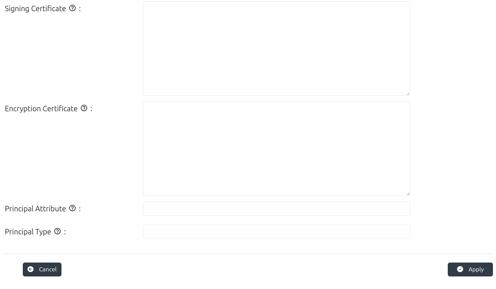
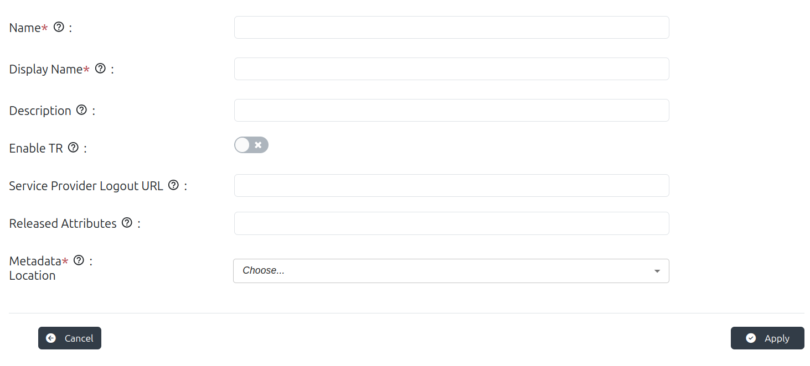
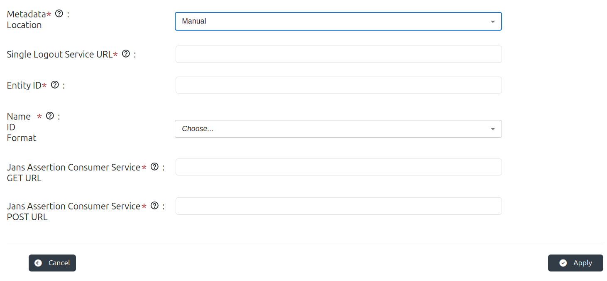

---
tags:
  - administration
  - admin-ui
  - test
  - SAML
  - SSO
  - inbound
  - keycloak
---

# SAML

## Description

Security Assertion Markup Language (SAML) is a widely adopted protocol that enables Single Sign-On (SSO) capabilities between an Identity Provider (IDP) and a Service Provider (SP). Gluu Flex supports SAML-based SSO by integrating with external SPs through the Keycloak (KC) module. Through the Admin UI, administrators can add and manage SAML Service Providers by importing their metadata and configuring which user attributes to release. The Admin UI provides a user-friendly interface to simplify the setup and testing of SAML SSO connections with external service providers like IAMShowcase.

For more information, click here to refer to the [official docs](https://docs.jans.io/stable/janssen-server/keycloak/keycloak-saml-sso).

## Configuration 

1. Enable SAML
    * Enables or disables SAML-based authentication in the system. When turned on, the application will allow SAML SSO flows.
    * When enabled, the server will accept or initiate SAML-based Single Sign-On (SSO). If disabled, SAML features are inactive; prevents SAML login or SSO flows.

2. Selected IDP

    * Dropdown or input to choose which Identity Provider (IdP) configuration (from among those created) to use.
    * This tells the system which external IdP it should trust / use for inbound SAML (i.e. when Jans acts as a SP trusting that IdP) or for outbound flows.

3. Ignore Validation
    * A toggle to skip certain validation checks (e.g. certificate validation, metadata validity).
    * Useful for testing or when metadata is temporarily invalid; not recommended for production because it weakens security.

## Create Identity Provider (IDP) Form

1. Name

    * Unique internal identifier for this IdP configuration. Used programmatically and must be unique.
    * Allows the system to reference this IdP for SAML communication. Not shown to end users.

2. Display Name

    * Friendly, human-readable name for the IdP. Can be shown on login screens or admin dashboards.
    * Helps users/admins distinguish between multiple IdPs when available.
  
3. Description

    * Optional free-text to describe the IdP, its purpose, or any additional notes.
    * Provides clarity to administrators managing many IdPs. Helps in documentation and audits.

4. Enabled

    * Controls whether this IdP is currently active and usable for SAML flows.
    * Ensures inactive or test IdPs do not interfere with live traffic. Must be ON for actual use.

5. Upload Metadata file

    * This toggle enables uploading an .xml or .json metadata file from the Identity Provider (IDP) instead of manually entering configuration fields.
    * Speeds up setup by importing required info like SSO URLs and certificates from metadata.
    * To allow automatic population of the IDP configuration by importing metadata, hiding manual fields.

6. Entity ID

    * The Entity ID is a globally unique identifier (URI or URL) for the Identity Provider (IDP). It is used by the Service Provider (SP) to identify the IDP in SAML communications.
    * It ensures that the correct IDP is used for authentication during SSO processes. The value must exactly match the IDP’s configured entity ID from its metadata.

6. NameID Policy Format

    * This field specifies the format of the `NameID` element in the SAML assertion, which identifies the user being authenticated. It determines how the subject (user) identity is structured and communicated to the Service Provider.
    * It allows the administrator to control the type of identifier used for the user, ensuring compatibility with the expectations of the Service Provider (SP). 

6. Single SignOn Service URL
    * URL endpoint on the IdP where authentication requests (AuthnRequest) are sent.
    * Jans will send SAML AuthnRequests to this URL to initiate login.

7. Single Logout Service URL
    * URL endpoint on the IdP for Single‑Logout (SLO), if supported.
    * For logout flows: to tell IdP when SP wants to log the user out globally.

6. Signing Certificate
    * Public key certificate of the IdP used to verify signatures on SAML responses/assertions.
    * To ensure responses are really from the IdP and not tampered with — signature verification.

7. Encryption Certificate
    * Public key certificate used (if used) to decrypt encrypted parts of SAML assertion.
    * If assertions are encrypted, SP (Jans) needs a certificate to decrypt; this field provides that.

8. Principal Attribute
    * The attribute in the SAML assertion that will be used as the principal / username (or user identifier).
    * To map SAML attributes to local user accounts; i.e. which SAML attribute identifies the user.

9. Principal Type

    * The type of principal (for example, “User”, “Group”, etc.) or possibly the format (email / username).
    * Defines how the principal attribute is interpreted; how user identity is resolved locally.

## Create Service Provider (SP) Form

1. Name

    * Internal unique identifier for the Service Provider.
    * Used in configuration, logs, and when linking SP with IdP settings.

2. Display Name

    * Human‑friendly label for the SP.
    * Helps identify which SP is which in UIs, selecting SP in workflows.

3. Description

    * Optional explanatory text about the SP (function, owner, environment).
    * Helps with documentation and future maintenance, especially in multi‑SP setups.

4. Enable TR

    * Toggle to enable a feature called “TR” (Trust Relationship).
    * Activate or deactivate the SP; you can disable SP if you don’t want to accept assertions from it temporarily.

5. Service Provider Logout URL
    * The URL endpoint where the SP expects logout notifications or post‑logout redirect.
    * Facilitates Single Logout functionality so user sessions are cleaned up properly across systems.
   
6. Released Attributes
    * List of user attributes that will be included in SAML assertions for this SP.
    * Controls which user attributes are shared; for privacy and minimizing exposure only necessary attributes should be released.

7. Metadata Location

    * Whether SP metadata is provided via file upload, URL, etc.
    * Determines how metadata is fetched or provided; metadata contains critical SP info (certs, endpoints).

8. Upload Metadata File
    * Upload field for SP metadata XML or JSON.
    * When you select "Manual" in the Metadata Location field, additional fields appear for manual input of SAML configuration.

        

      1. Single Logout Service URL
          * The endpoint where logout requests or responses are sent during SAML Single Logout.
          * Enables session termination on the SP side after IdP-initiated logout, ensuring consistent session cleanup.
      2. Entity ID
          * Unique identifier for the SP, typically a URL or URN.
          * Used by the IdP to recognize the SP and include this ID in assertions and metadata.
      3. Name ID Format
          * Specifies the format of the NameID used in assertions (e.g. email, persistent).
          * Helps the IdP determine how to structure the user identifier in SAML assertions sent to this SP.
      4. Jans Assertion Consumer Service GET URL
          * ACS endpoint using the HTTP GET binding. The SP receives assertions at this URL.
          * Allows SAML assertions to be delivered using GET method; some SPs may require or support this binding.
      5. Jans Assertion Consumer Service POST URL
          * ACS endpoint using the HTTP POST binding. This is where the IdP sends SAML responses.
          * Ensures the IdP sends authentication assertions via HTTP POST binding, commonly used for SAML SSO.
      