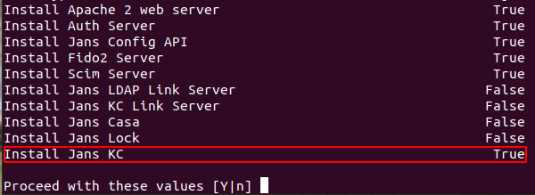
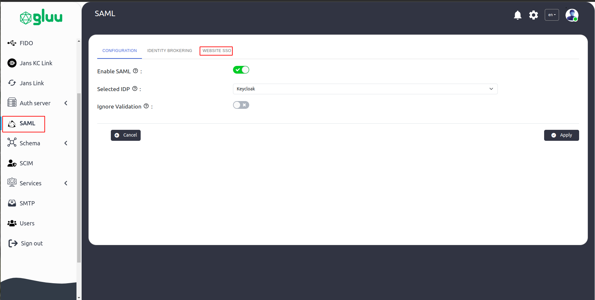

---
tags:
  - administration
  - admin-ui
  - test
  - SAML
  - SSO
  - inbound
  - keycloak
---

# SAML SSO Configuration

Security Assertion Markup Language (SAML) is a widely adopted protocol that enables Single Sign-On (SSO) capabilities between an Identity Provider (IDP) and a Service Provider (SP). Gluu Flex supports SAML-based SSO by integrating with external SPs through the Keycloak (KC) module.

This guide
how to test SAML SSO in Gluu Flex using the [sptest](https://sptest.iamshowcase.com) test service provider.

## Installing SAML IDP in the Flex Server

During Flex Server installation, ensure that the **Jans Keycloak** module is selected. This enables the Keycloak-based SAML Identity Provider (IDP) necessary for supporting SAML flows.



## Configuring the IDP in Flex

- Download the test service provider (SP) metadata:

  ```bash
  wget https://sptest.iamshowcase.com/testsp_metadata.xml
  ```

- Open the Flex Admin UI and navigate to **SAML > Configuration**.
- Select **Keycloak** as the IDP.

  

- Then navigate to **Website SSO > Add Service Provider**.

  

- Release the required attributes (e.g., **username**, **inum**).

  

- Finally click apply.

# Inbound SAML

Janssen supports authentication against external SAML Identity Providers (IDPs), commonly referred to as _Inbound SAML_ or _Inbound Identity_. This section provides instructions for configuring inbound SAML on the Janssen Server.

## Enabling Inbound SAML

To use inbound SAML, ensure the Janssen Server has the SAML plugin installed and enabled. This can be done using the Jans TUI:

- Navigate to: `Jans SAML > Contribution`
- Enable the **SAML Plugin**

## Inbound SAML Authentication Flow

The inbound identity flow allows users to authenticate using an external SAML provider. Here's an overview of the process:


1. User clicks login.
2. Janssen redirects the user to the external SAML IDP.
3. The IDP authenticates the user.
4. User is redirected back to Janssen with a SAML assertion.
5. Janssen processes the assertion, maps attributes, and logs the user in.

## Configure SAML IDP

Use the **Janssen TUI** (Text-based UI) or **Jans CLI** to register a new SAML Identity Provider.

Steps:

1. Navigate to `Jans SAML > Identity Providers`
2. Select `Add Identity Provider`
3. Provide the following:
   - **Name**: A unique identifier (letters, digits, underscore only)
   - **Display Name**: Human-readable name
4. **Upload Metadata**:
   - For `Metadata Source Type`, choose `file`, browse and upload the metadata XML
   - Alternatively, select `manual` to enter metadata elements manually
5. Save the configuration.

The SAML IDP will now appear in Keycloak under the `jans` realm and is also stored in the Janssen database.

To edit later:

- Navigate to the provider
- Press `Enter`
- Modify and save the details

## Configure Inbound SAML Flow Using Agama

To handle SAML authentication flows dynamically, you can use [Agama Lab](https://github.com/GluuFederation/agama-lab):

1. Fork the `agama-inbound-saml` project from Agama Lab Projects
2. In the Agama Orchestrator:
   - Create a new flow
   - Add an **RFAC** (Redirect and Fetch a Callback) node for the SAML IDP
3. Deploy the `.gama` package on your Janssen Server

## Testing the Authentication Flow Using Tarp

To test the flow:

1. Install the **Tarp** browser extension ([installation details](https://github.com/GluuFederation/tarp))
2. Open Tarp
3. Enter the Keycloak OpenID configuration URL, e.g.:
   http://<your-server>/realms/keycloak-external-broker/.well-known/openid-configuration
4. Click `Register`
5. Fill in **Additional Params** to hint Keycloak which IDP to use:

```json
{
  "kc_idp_hint": "gluu-saml-idp-1"
}
```
