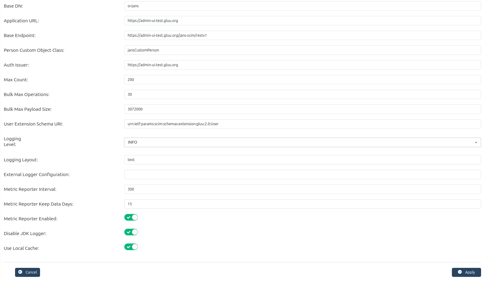

---
tags:
  - administration
  - admin-ui
  - scim
---

# SCIM Admin Guide

System for Cross-domain Identity Management, in short SCIM, is a protocol that 
simplifies the exchange of user identity information across different domains. 
The Flex server provides an implementation for the 
[SCIM protocol](https://datatracker.ietf.org/doc/html/rfc7644).

Gluu Flex Admin UI allows administrators to view and manage the 
[configuration](https://docs.jans.io/stable/janssen-server/scim/config/) of the Gluu Flex SCIM server.

## SCIM Configuration 

The SCIM configuration page in the Admin UI allows administrators to manage and 
customize SCIM services. These settings control endpoints, logging, caching, 
performance limits, and schema extensions. Proper configuration ensures secure, 
efficient, and scalable user and group management through the SCIM API.

### More details about important properties

**Base Endpoint**

  * Base Endpoint defines the path segment where SCIM API requests are received,
   such as `/jans-scim/restv1`. This groups all SCIM management 
   operations under one URL for standardized API access.

**Max Count**

  * Max Count controls the maximum number of SCIM resources 
  (e.g. users) returned per search request. 
  The default value is `200`.

**Bulk Max Operations**

  * Bulk Max Operations establishes the limit on how many create, update, or 
  delete actions are accepted in a single SCIM bulk request. The default value 
  is `30`.

**Bulk Max Payload Size**
  
  * This is the maximum byte size allowed for bulk SCIM requests. Any batch 
  exceeding this size will be rejected. The default value is 3072000 bytes 
  (around 3 MB).

**User Extension Schema URI**

  * This field identifies the SCIM schema URI used for custom user attributes. 
  The default value provided is `urn:ietf:params:scim:schemas:extension:gluu:2.0:User`.

**Logging Level**

  * Logging Level sets the verbosity of SCIM logs, with possible values such 
  as TRACE, DEBUG, INFO, WARN, ERROR, FATAL, or OFF. The default level is `INFO`.

**skipDefinedPasswordValidation**

  * This property determines if password validation is skipped when creating or updating users.
  Validation makes use of the regular expression defined over the `password` database attribute as 
  well as the minimum and maximum length defined.

Once all parameters are set, click the Apply button at the bottom of the page 
to save the configuration changes.

