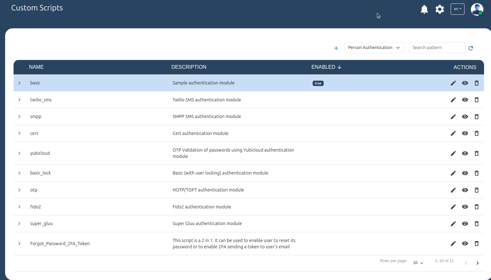
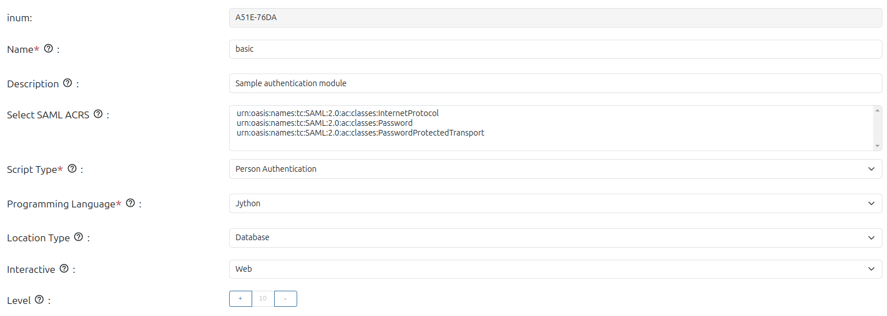
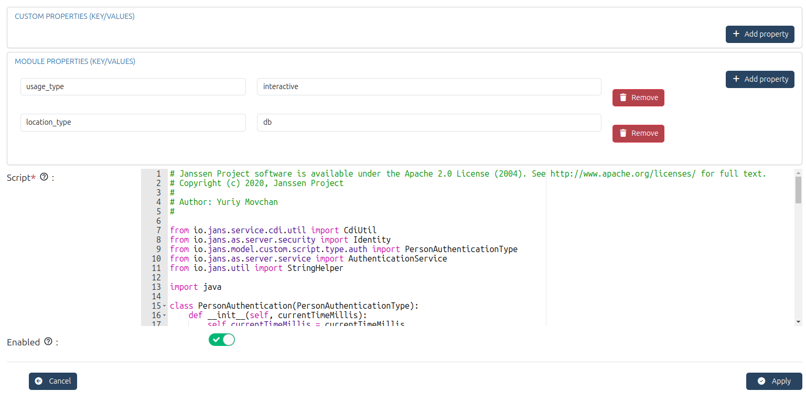

---
tags:
  - administration
  - admin-ui
  - admin
  - role
  - permission
  - custom scripts
  - mau
---

# Custom Scripts

The Custom Scripts page provides a list of scripts. Easily add, update, and delete scripts to control and modify various authentication methods.

[Custom Scripts](https://docs.jans.io/stable/janssen-server/developer/scripts/) are used to implement custom business logic for authentication, authorization, client registration, cache refresh, scopes, token revocation, etc.

The Janssen Authentication Server leverages custom scripts, which, when implemented, can facilitate complex business workflows without changing the server code. Gluu Flex Admin UI provides the interface to add/edit/delete custom scripts.

## Script properties

Each script presents a few default properties where values can be set 
according to the requirement. Details can be found [here](https://docs.jans.io/stable/janssen-server/developer/scripts/#configurable-properties-of-a-custom-script).

In addition to the default properties, custom properties can be supplied to 
the script using the `Custom properties` section. 