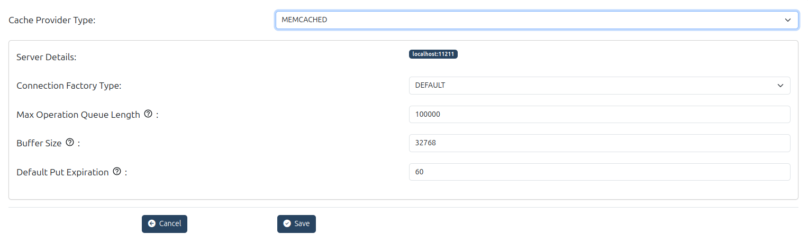
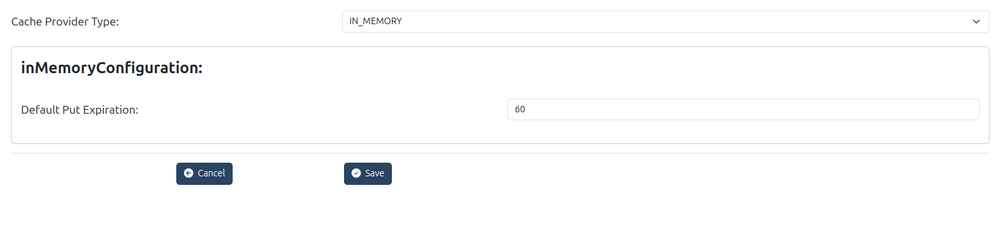
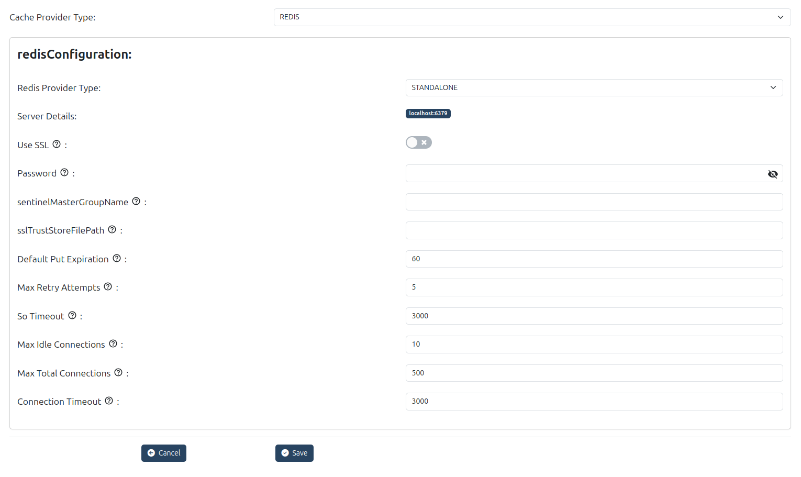
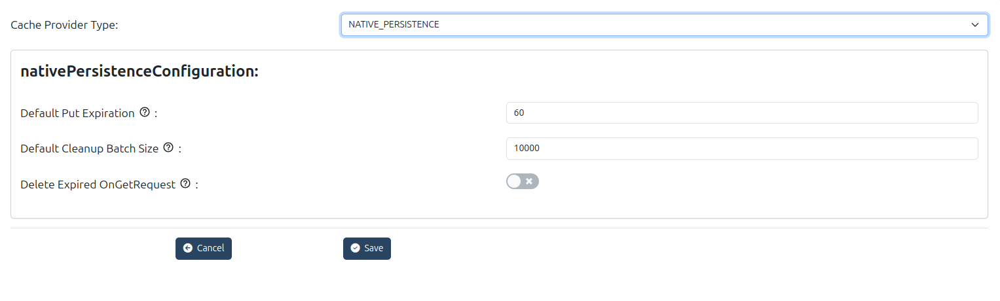

---
tags:
- administration
- admin-ui
- services
- cache-configuration
---
# Services

This menu allows user to configure Cache Provider which can be used by the auth server.

## Cache Provider Configuration

The following cache providers are supported in Janssen's auth server:

- **In Memory** : recommended for small deployments only
- **Memcached** : recommended for single cache server deployment
- **Redis** : recommended for cluster deployments
- **Native Persistence** : recommended to avoid installing additional components. All cache entries are saved in persistence layers.

## Cache Provider Properties

The following tables include the name and description of each Cache Provider's properties.

### Cache Configuration

|Name|Description|
|----|-----------|
|Cache Provider Type| - The cache provider type. Possible values include `IN_MEMORY`, `MEMCACHED`, `REDIS`, `NATIVE_PERSISTENCE`.   - To select which cache backend the server should use. Use different types depending on scale, performance, high‑availability & infrastructure constraints. |

### Memcached Configuration

|Name|Description|
|----|-----------|
|Server Details|- Server details separated by spaces (for example localhost:11211)   - To specify where the Memcached cache backend is running. Use your memcached host(s). |
|Max Operation Queue Length|- Maximum number of operations that can be queued to Memcached before they are processed.   - To limit backlog / throttling under high load. If operations queue too long, performance suffers or fail‑over behavior may be needed.|
|Buffer Size|- Buffer size in bytes used in memcached communications.   - To affect performance/tuning of network or serialization overhead. Larger buffer helps with large data but uses more memory.|
|Default Put Expiration|- Expiration timeout (in seconds) for entries placed in memcached.   - To manage how long cached items live. Adjust per data freshness vs cache hit trade‑off.|
|Connection Factory Type|- Connection factory type (e.g. `DEFAULT`) which determines how client connections are created.   - To customise or optimise how connection pooling / creation works. Use default unless you have special requirements or want custom behavior.|

### In-Memory Configuration

|Name|Description|
|----|-----------|
|Default Put Expiration|- Default expiration timeout value in seconds for entries inserted into cache.   - To control how long objects remain in cache before expiring when using in‑memory cache. Short expiry helps limit stale data / memory usage, longer expiry improves cache hits|

### Redis Configuration

|Name|Description|
|----|-----------|
|Redis Provider Type|- Type of Redis deployment: e.g. `STANDALONE`, `CLUSTERED`, `SHARDED`, `SENTINEL`.   - To match your Redis setup. If using a Redis cluster, sentinel, etc., set accordingly to enable correct behavior/availability.|
|Server Details| - Redis server address(es), comma‑separated (e.g.`localhost:6379`)   - To point Janssen to correct Redis instances|
|Use SSL| - Enable SSL communication between Gluu Server and Redis cache   - For secure communications, especially important in production or when Redis is remotely hosted. |
Password|- Redis server password   - To authenticate to Redis when required.|
|Sentinel Master Group Name| - When using sentinel mode, name of the master group.   - Required for sentinel setups so the client knows which master to use.|
|SSL Trust Store File Path|- Path to trust store file when SSL is used.  - To provide certificate chain/trust anchors to trust the Redis server’s certificate.|Native Persistence :
|Default Put Expiration|- Default expiration time for objects put into cache (seconds).   - Same as in other backends: how long items remain in Redis before expiring.|
|Max Retry Attempts| - Maximum attempts to retry operations in case of failure.   - For resilience: to retry Redis operations in face of transient network/Redis errors.
|   
|So Timeout| - With this option set to a non-zero timeout, a read() call on the InputStream associated with this Socket will block for only this amount of time. If the timeout expires, a java.net.SocketTimeoutException is raised, though the Socket is still valid. The option must be enabled prior to entering the blocking operation to have effect. The timeout must be > 0. A timeout of zero is interpreted as an infinite timeout.|
|Max Idle Connections| - The cap on the number of \"idle\" instances in the pool. If maxIdle is set too low on heavily loaded systems it is possible you will see objects being destroyed and almost immediately new objects being created. This is a result of the active threads momentarily returning objects faster than they are requesting them, causing the number of idle objects to rise above maxIdle. The best value for maxIdle for heavily loaded system will vary but the default is a good starting point.|
|Max Total Connections| - Total number of connections allowed in the pool.   - To limit overall connection usage; helps avoid resource exhaustion.|
|Connection Timeout| - Timeout for establishing connections to Redis.   - To fail early when server is unreachable.|

### Native Persistence Configuration

|Name|Description|
|----|-----------|  
|Default Put Expiration| - Default expiration time for objects put into cache in seconds.   - Same as other backends: defines how long items last before expiring; useful when you want to persist cache via database or another persistence layer rather than in volatile memory.| 
|Default Cleanup Batch Size| - Default cleanup batch page size (number of entries to handle in one clean-up iteration) when removing expired entries.   - To control performance impact of cleanup jobs: small batch size reduces load per cleanup, large batches finish faster but consume more resources.|
|Delete Expired OnGetRequest|- Boolean flag: whether to delete expired entries when a GET request is made.   - If true, expired entries are cleaned up proactively when accessed. This helps reduce stale data but may add overhead on GET operations.|