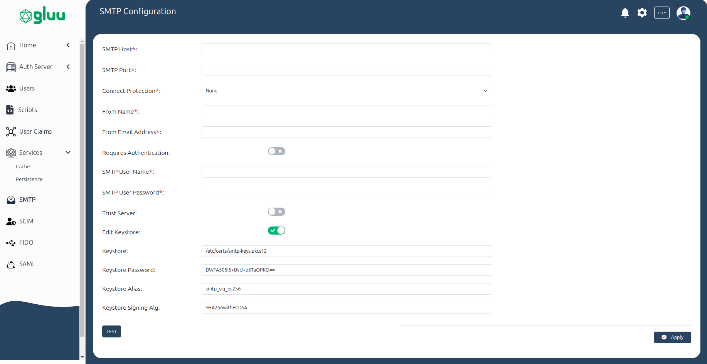

---
tags:
- administration
- admin-ui
- smtp
---
# SMTP Configuration

The SMTP configuration page allows administrators to set up and manage the settings for sending emails through the configured SMTP server. Below is a detailed explanation of each field in the SMTP configuration form:

## SMTP Settings

**SMTP Host**

  * This is the hostname or IP address of the SMTP server (e.g. smtp.mailserver.com).

**SMTP Port**

  * The port number used to connect to the SMTP server.
  * Common values:
    * 25: Default SMTP port (unencrypted).
    * 465: SMTP over SSL.
    * 587: SMTP with TLS encryption.

**Connect Protection**

  * This option defines the type of protection for the connection. It can be set to:
    * None: No encryption is used.
    * SslTls: Refined to include both SSL and TLS since they're often mentioned together as the encryption standard.
    * StartTls: Corrected capitalization and clarified that it's used to upgrade an unencrypted connection to an encrypted one.

## Sender Information

**From Name**

  * The name that will appear in the `From` field of sent emails.

**From Email Address**

  * The email address that will appear in the `From` field of sent emails.

## Authentication and Security

**Requires Authentication**

  * A toggle button to enable or disable authentication for the SMTP server. If enabled, the SMTP server will require a valid username and password for sending emails.

**SMTP User Name**

  * The username used to authenticate with the SMTP server. This is typically your email address or a specific SMTP username provided by your email service.

**SMTP User Password**

  * The password associated with the SMTP user for authentication. This password is necessary if the `Requires Authentication` toggle button is Enabled.

**Trust Server**

  * A toggle button to enable or disable the option to trust the SMTP server. If enabled, the server's identity will be verified during the connection to ensure it's safe to communicate with.

## Keystore and Encryption

**Keystore**

  * The file path to the keystore containing SSL certificates necessary for encrypted communication. For example, /etc/certs/smtp-keys.pkcs12. The keystore is essential for securely sending emails over SSL/TLS.

**Keystore Password**

  * The password used to access the keystore. This is required if the keystore is password-protected.

**Keystore Alias**

  * The alias associated with the certificate stored in the keystore. The alias is used to identify the specific certificate for signing or encryption purposes.

**Keystore Signing Algorithm**

  * The cryptographic algorithm used for signing the emails. An example of this might be `SHA256withECDSA`, which refers to a strong algorithm for securely signing messages.
