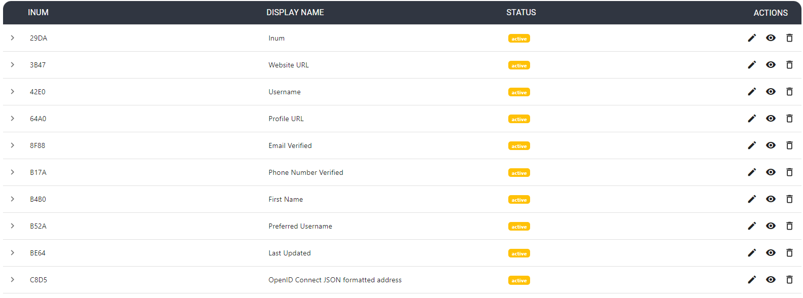

---
tags:
  - user-claims
  - administration
  - admin-ui
  - schema
  - person
  - attributes
---

# User Claims

[User Claims](https://docs.jans.io/stable/janssen-server/auth-server/openid-features/user-claims/) are individual pieces of user data, like uid, email, First Name etc that are required by applications in order to identify a user. Admin UI allows administrator to manage the user claims.

The following fields are supported in the Person (attribute) creation form:

- **Name:** This field defines the name of the Person attribute. The name must be unique in the Janssen Server
  persistence tree.
- **Display Name:** The display name can be anything that is human-readable.
- **Description:** The description of the attribute.
- **Status:** Used to mark the attribute as Active so that it can be used in your federation service or choose Inactive
  to create the attribute that can be activated at a later date.
- **Data Type:** Select what type of attribute is being added in this field.
- **Edit Type:** This field controls who can edit this attribute. If user is selected, this will enable each user to
  edit this attribute in their Janssen server user profile.
- **View Type:** This field controls which type of user is allowed to view the corresponding attribute on the web user
  interface.
- **oxAuth claim name:** If this attribute will be used as a 'claim' in your OpenID Connect service, add the name of
  the claim here. Generally, the `name of the attribute` == `name of the claim`.
- **Multivalued?:** If the attribute contains more than one value, set this field to True.
- **Hide On Discovery?:** Boolean value indicating if the attribute should be shown on the discovery page.
- **Include In SCIM Extension?:** Boolean value indicating if the attribute is a SCIM custom attribute.
- **Enable custom validation for this attribute?:** If you plan to set minimum and maximum lengths or a regex pattern,
  as described below, you will need to enable custom validation for this attribute. Otherwise, you can leave this disabled.
- **Regular expression:** You can set a regex pattern to enforce the proper formatting of an attribute. For example,
  you could set a regex expression for an email attribute like this: ^[A-Z0-9._%+-]+@[A-Z0-9.-]+\\.[A-Z]{2,6}$. This would
  make sure that a value is added for the attribute only if it follows standard email formatting.
- **Minimum length:** This is the minimum length of a value associated with this attribute.
- **Maximum length:** This is the maximum length of a value associated with this attribute.
- **Saml1 URI:** This field can contain a SAML v1 supported nameformat for the new attribute. If this field is left
  blank the Janssen Server will automatically populate a value.
- **Saml2 URI:** This field can contain a SAML v2 supported nameformat for the new attribute. If this field is left
  blank the Janssen Server will automatically populate a value.
