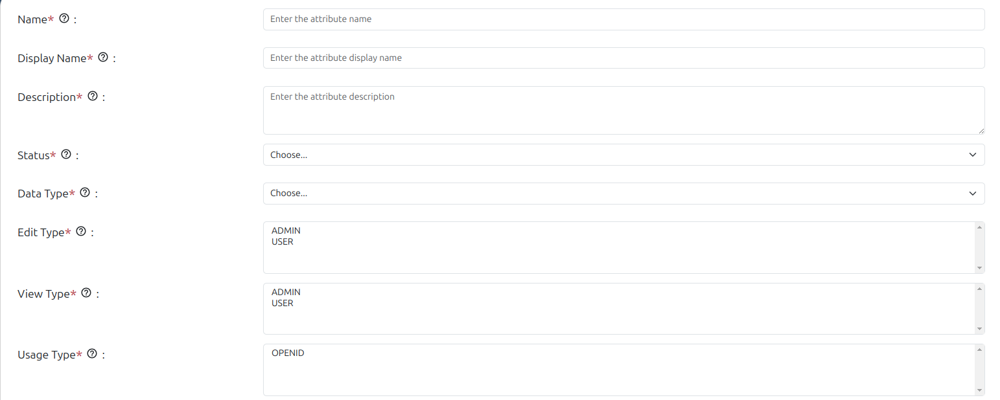
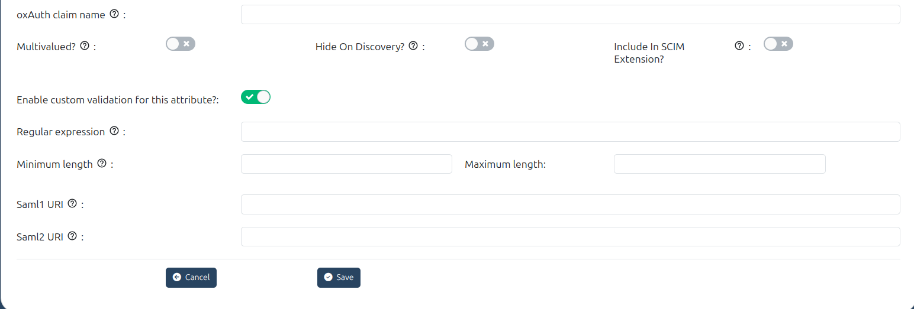

---
tags:
  - user-claims
  - administration
  - admin-ui
  - schema
  - person
  - attributes
---

# User Claims

[User Claims](https://docs.jans.io/stable/janssen-server/auth-server/openid-features/user-claims/) are individual pieces of user data, like uid, email, firstName, etc., that are required by applications in order to identify a user. The Admin UI allows administrators to manage these user claims effectively.

The following fields are supported in the Person (attribute) creation form:
 
 
1. Name
    * This field defines the internal name of the attribute. 

2. Display Name
    * A human-readable label for the attribute.

3. Description
    * A short textual description explaining what the attribute is or how it is used.
    
4. Status
    * Allows you to enable or disable attributes without deleting them

5. Data Type
    * Defines the type of data the attribute holds. Common types include `string`, `boolean`, `numeric`, etc.

6. Edit Type
    * Specifies who has permission to edit this attribute — either `ADMIN` or `USER`.
    
7. View Type
    * Specifies who can view this attribute in the UI — `ADMIN` or `USER`, or both.
    
8. Usage Type
    * Defines the use case for the attribute
    
9. oxAuth Claim Name
    * The name of the claim as it will appear in an OpenID Connect (OIDC) ID token or UserInfo response.
    
10. Multivalued?
    * Boolean toggle to allow the attribute to store multiple values (e.g., a list of email addresses).

11. Hide On Discovery?
    * Boolean setting that controls whether the attribute is shown on the `.well-known/openid-configuration` discovery endpoint.

12. Include In SCIM Extension?
    * Boolean flag indicating whether the attribute should be part of the SCIM schema extension.
    * Used to extend the SCIM (System for Cross-domain Identity Management) schema with custom attributes.

13. Enable Custom Validation for This Attribute?
    * Toggle to activate custom validation rules like minimum/maximum length and regex.
    * Helps enforce stricter formatting or content rules for this attribute. Must be enabled to use regex, min, or max length fields.

    **Regular expression:** 
        
      * You can set a regex pattern to enforce the proper formatting of an attribute. For example, you could set a regex expression for an email attribute like this: `^[A-Z0-9._%+-]+@[A-Z0-9.-]+\\.[A-Z]{2,6}$`. 
      * This would make sure that a value is added for the attribute only if it follows standard email formatting.
    
    **Minimum length:** 
      
      * This is the minimum length of a value associated with this attribute.
    
    **Maximum length:** 
      
      * This is the maximum length of a value associated with this attribute.

14. Saml1 URI
    * Defines a URI for this attribute that is compatible with SAML 1.1 standards.

15. Saml2 URI
    * Defines a URI for this attribute that is compatible with SAML 2.0 standards.

