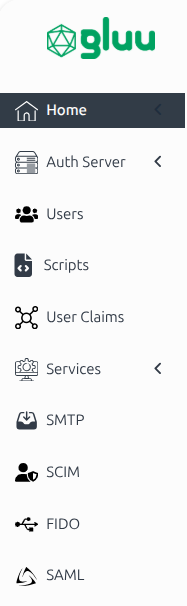
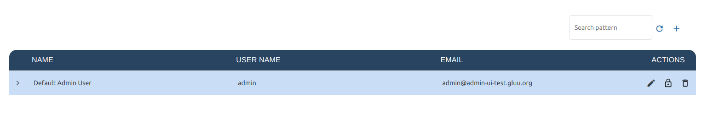
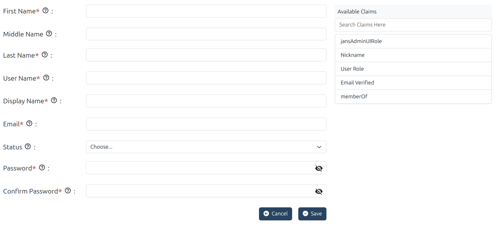
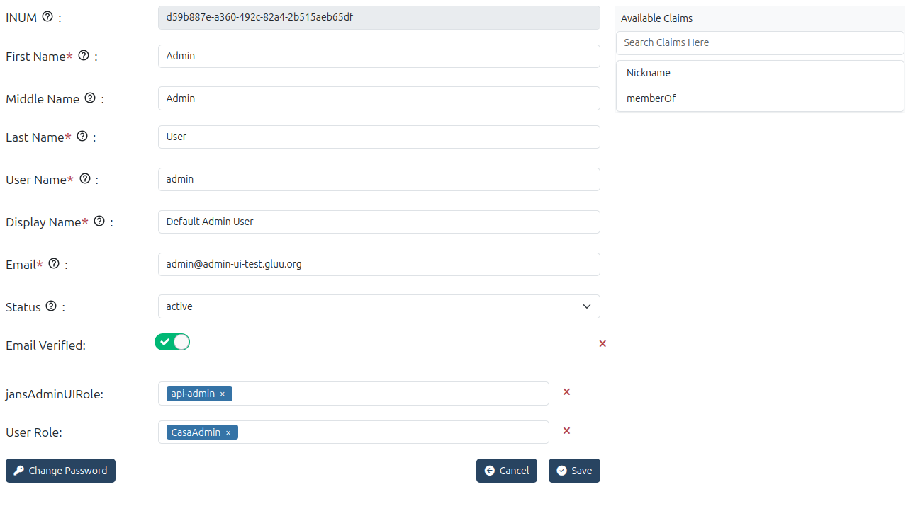
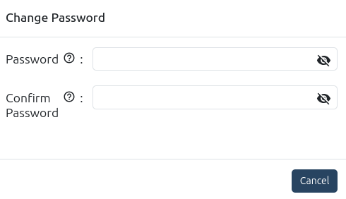

---
tags:
  - administration
  - admin-ui
  - users
  - user-management
---

# Users

The User Management module allows administrators to create, edit, delete, and
search user records in Janssen persistence. This module can be accessed via
the `Users` link on the left navigation menu as shown in the image below.

## User List

* `User` section lists all the available users in the Flex Server.

    

## Add User

* To add a new user, use the edit action :material-pencil: on the user listing
grid
* The user creation form includes a number of user claims by default but the 
administrator can add more user claims to the form using `Available Claims` 
panel on the right side. Different [Admin UI Roles](./home.md#admin-ui-roles) can be assigned to the user in the `jansAdminUIRole` attribute (to be selected from the `Available Claims` panel).

     

## Edit User

 * Modify existing user details, manage assigned claims, and update attributes.
 
    

### Change password

 * The password can be changed from the Edit User screen.

     

