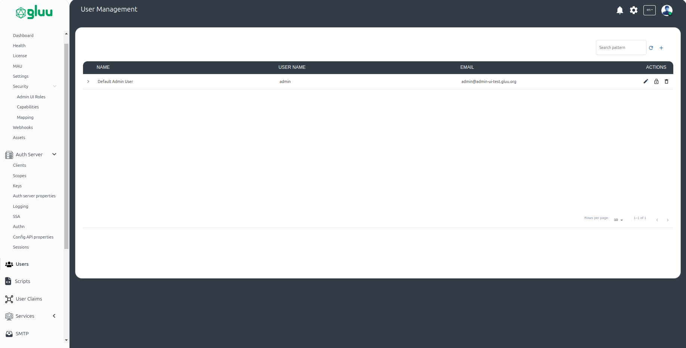
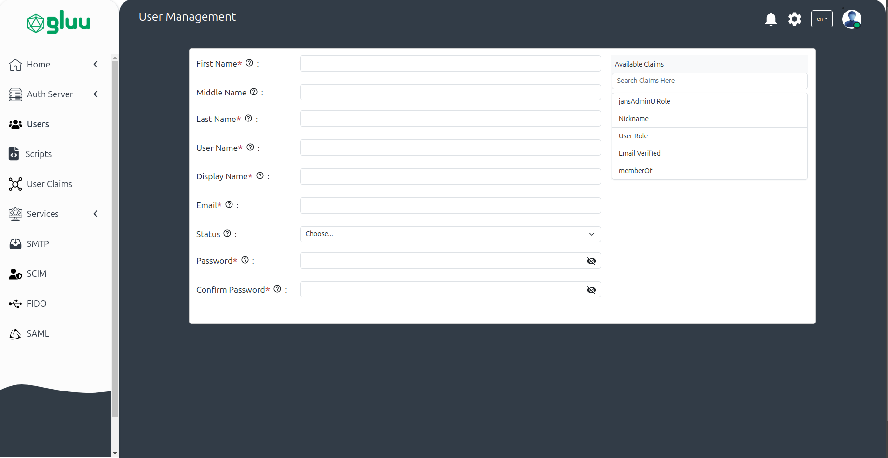
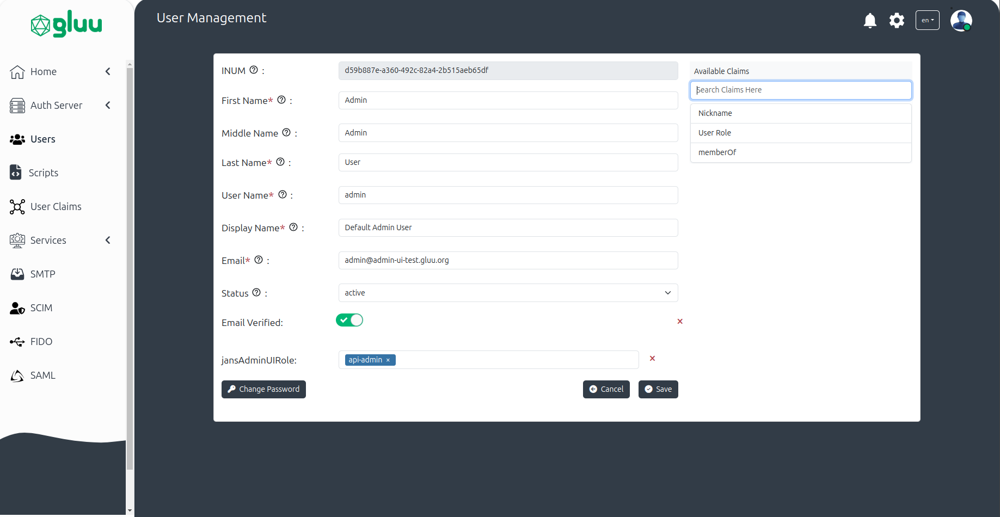
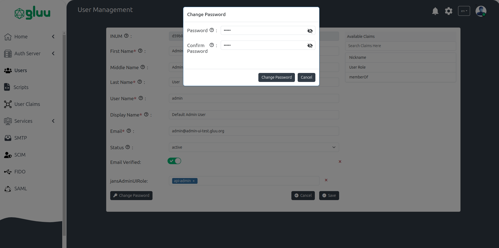

---
tags:
  - administration
  - admin-ui
  - users
  - user-management
---

# Users

The User Management module in the Admin UI allows administrators to manage user accounts stored in Janssen persistence.

## User

* This interface allows administrators to create, edit, delete, and search user records in Janssen persistence. 
    

## Add User

* The user creation form includes the following fields by default: First Name, Middle Name, Last Name, Username, Display Name, Email, and Status.. 
* The administrator can select and add more user attributes to the form from the right `Available Claims` panel. Different [Admin UI Roles](./home.md#admin-ui-roles) can be assigned to the user in the `jansAdminUIRole` attribute (to be selected from the `Available Claims` panel).

     

## Edit User

 * Modify existing user details, manage assigned claims, and update attributes.
    

### Change password    

 * The password can be changed from the Edit User screen. There is a button titled `Change Password` which, when clicked, opens a popup window where the password can be updated.
 * This popup will contain two fields:
    * New Password
    * Confirm Password
 * Both fields are mandatory for the password change process.

     
    

