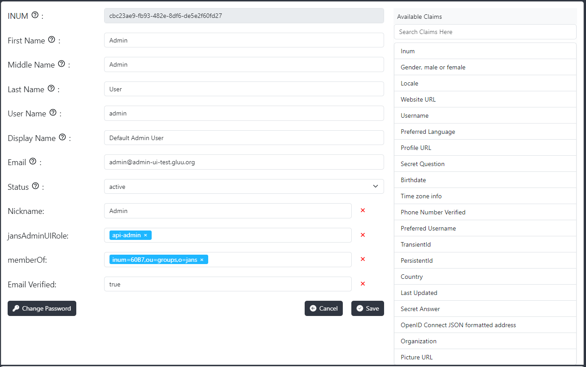

---
tags:
- administration
- admin-ui
- users
---
# Users

This interface allows the administrator to create, edit, delete and search user records in Janssen persistence. The user creation/modification form has First Name, Middle Name, Last Name, Username, Display Name, Email, Status and Password fields populated by default on it. The administrator can select and add more user attributes to the form from the right `Available Claims` panel. Different [Admin UI Roles](./admin-menu.md) can be assigned to the user in the `jansAdminUIRole` attribute (to be selected from the `Available Claims` panel).

