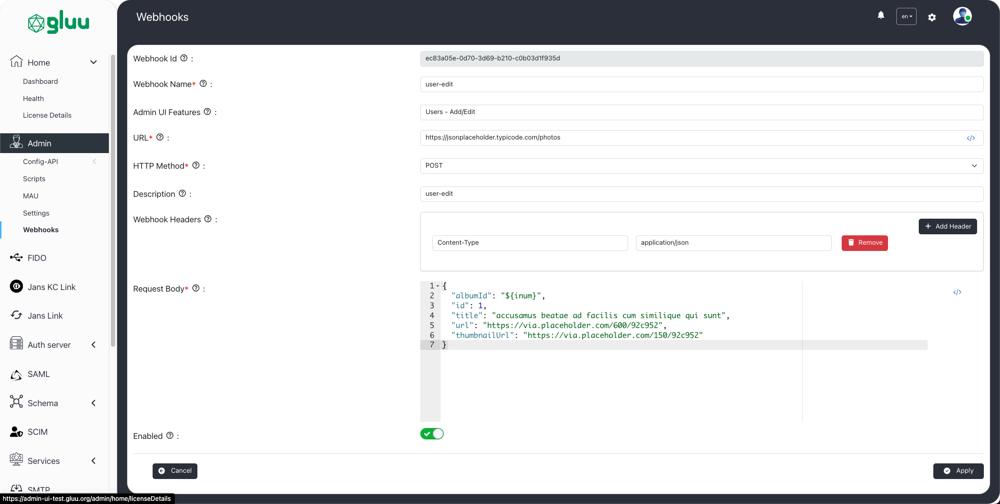

---
tags:
- administration
- admin-ui
- webhooks
---

# Webhooks

Gluu Flex Admin UI serves as a powerful web interface designed to streamline the management and configuration of the Janssen Authentication Server. To further extend its capabilities, Gluu Flex Admin UI integrates the use of webhooks, enabling the execution of custom business logic during the creation, update, and deletion of information on the Janssen Authentication Server. The seamless integration of webhooks into this interface enhances its functionality, offering a dynamic and extensible solution.

Webhooks are a mechanism for automating workflows by allowing external systems to be notified of specific events. In the context of Gluu Flex Admin UI, webhooks can be mapped to crucial operations such as creating, updating, or deleting information on the Janssen Authentication Server. This opens up possibilities for executing custom business logic say of creation/update/delete of a new/existing user, scope, oidc client, custom script etc. To leverage the power of webhooks in Gluu Flex Admin UI, administrators can map one or more webhooks to specific operations within the interface. This mapping establishes a connection between the Admin UI and external systems, ensuring that designated webhooks are triggered when relevant actions take place.

## Webhook management on the UI 

The webhook create/update form consists for following fields.

|Field|Description|Required|
|--|--|--|
|Webhook Id|The unique identifier of webhook|Generated by Admin UI|
|Webhook Name|The name give to webhook|Yes|
|URL|The webhook url|Yes|
|HTTP Method|The type HTTP request (e.g. GET, POST, PUT, PATCH, DELETE )|Yes|
|Description|Webhook description|No|
|Webhook Headers|The HTTP request headers|No|
|Request Body|The HTTP request body|Mandatory for POST, PUT, PATCH requests|
|Enabled|Toggle switch to enable/disable webhook|Yes|
|Admin UI Features|The Admin UI features which can be mapped to the webhook|No|

Once a webhook is created it can be searched, edited or deleted.   

## Triggering webhooks

The webhooks can be mapped with one or more Admin UI feature(s) using the [webhook create/update form](./webhooks.md#webhook-management-on-the-ui). The following Admin UI features can be mapped to the webhooks.

|Feature Name|Action|Permission|
|--|--|--|
|Custom Script|Add/Edit|https://jans.io/oauth/config/scripts.write|
|Custom Script|Delete|https://jans.io/oauth/config/scripts.delete|
|FIDO Configuration|Edit|https://jans.io/oauth/jans-auth-server/config/properties.write|
|Jans Link|Edit|https://jans.io/oauth/config/jans-link.write|
|OIDC Clients|Add/Edit|https://jans.io/oauth/config/openid/clients.write|
|OIDC Clients|Delete|https://jans.io/oauth/config/openid/clients.delete|
|Scopes|Add/Edit|https://jans.io/oauth/config/scopes.write|
|Scopes|Delete|https://jans.io/oauth/config/scopes.delete|
|Schema:Person|Add/Edit|https://jans.io/oauth/config/attributes.write|
|Schema:Person|Delete|https://jans.io/oauth/config/attributes.delete|
|SCIM Configuration|Edit|https://jans.io/scim/config.write|
|SMTP Configuration|Edit|https://jans.io/oauth/config/smtp.write|
|Users|Add/Edit|https://jans.io/oauth/config/user.write|
|Users|Delete|https://jans.io/oauth/config/user.delete|

When the feature action is performed (such as submitting the "create new user" form), the Admin UI displays the consent model with a list of webhooks that will be triggered upon submitting the form. If the user clicks on the Accept button, all the mapped and enabled webhooks will be triggered during user creation.      

