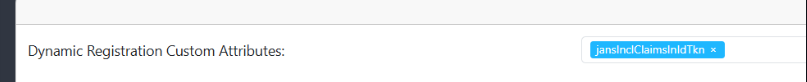
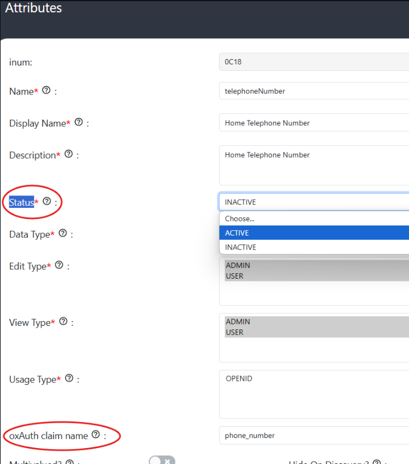
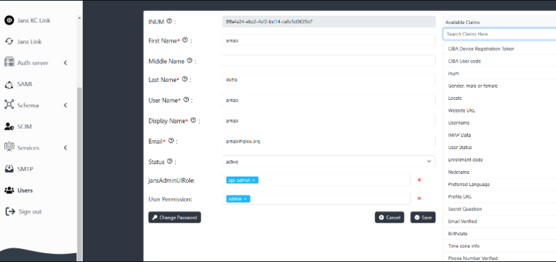
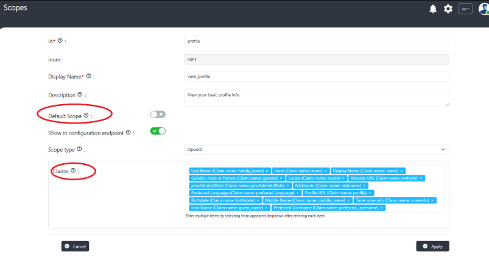
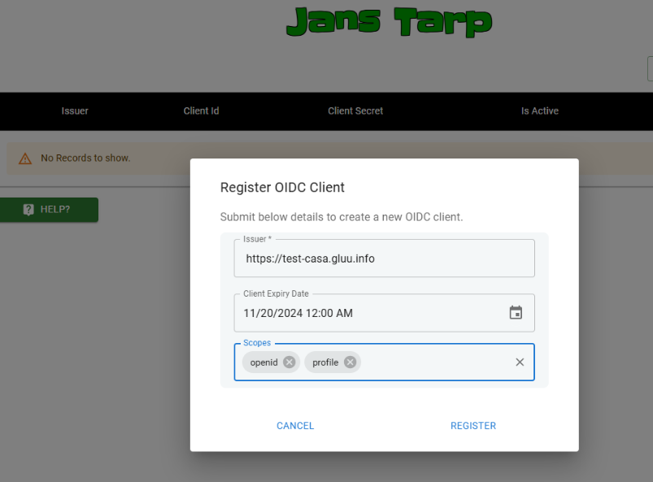

---
tags:
  - administration
  - test
  - token
  - claims
---

## Steps to include user claims in id_token

1. Login to the Admin UI of the auth server (https://{auth-server-hostname}/admin).
2. Using the left menu, go to `Auth Server ---> Auth server properties`.
3. Add `jansInclClaimsInIdTkn` to the `Dynamic Registration Custom Attributes` filed.

## Including the claims to the token

To include the claims to token

* Go to `Schema ---> person`
* Change the `Status` of the attribute to `Active`.
* Note `oxAuth claim name`. This is the claim-name used inside token.
     
* Now go to `Users` menu and open the user and add the claim and its value. 
     

* To include the claims in the token we will include them in the profile scope.
      1. Enable `profile` as the `Default Scope`
      2. Include the claims in the claim field.
          
* On registering OIDC client using tarp add the `profile` scope and `openid`.
* Use the client to generate the token.

