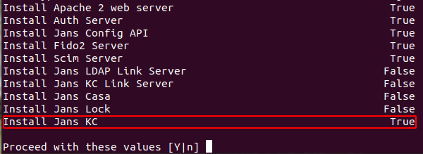
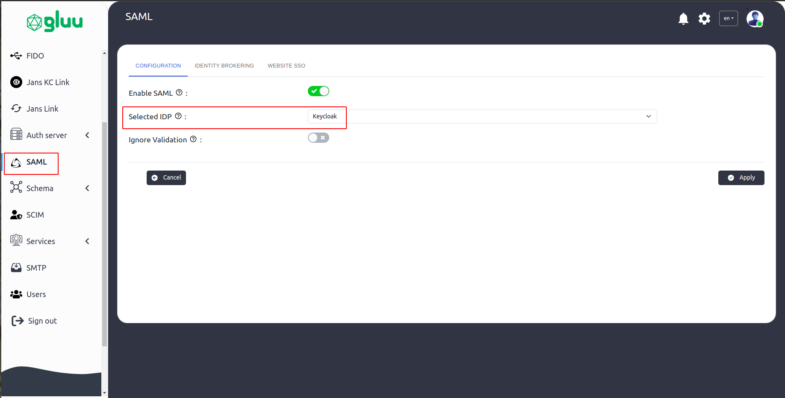
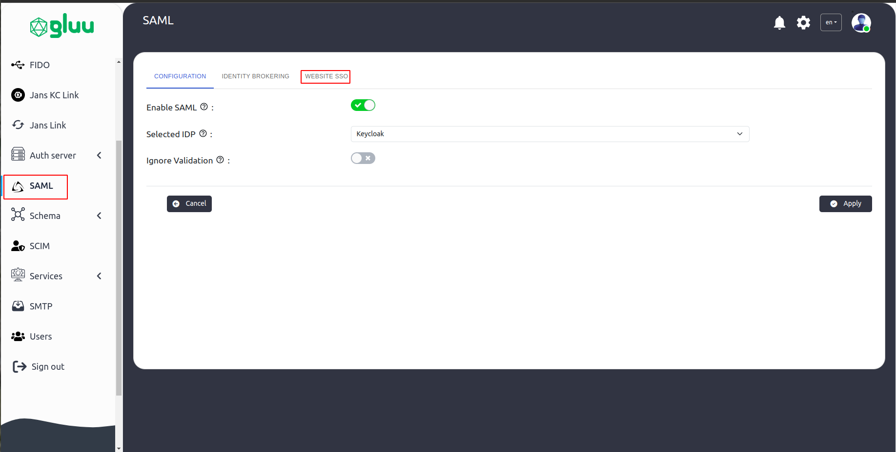
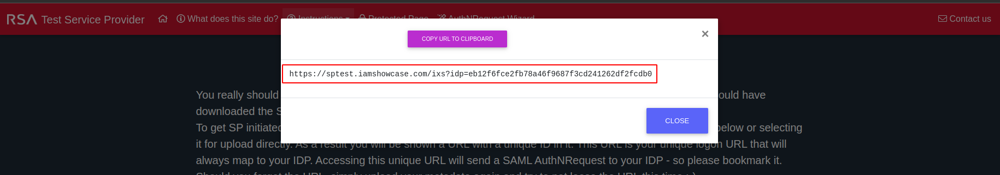

---
tags:
  - administration
  - test
  - SAML
  - SSO
---


# Test SAML SSO with Flex

This guide shows how to test Flex for SAML SSO. We will be using
[sptest](https://sptest.iamshowcase.com/) test service provider
to complete our test.

## Installing SAML IDP in the Flex Server

During installation the [Flex Server](../../../../), make sure you have
selected the [Jans KC](https://docs.jans.io/head/janssen-server/keycloak/)
module to be installed.



## Configure IDP in Flex Server

Follow the steps below to create a
TR and apply them in [Flex Server](../../../../):

* Download the SP metadata using the following command:
```bash title="Command"
wget https://sptest.iamshowcase.com/testsp_metadata.xml
```
* Open the Flex Admin UI and navigate to `SAML > Configuration`.
* Select `Keycloak` as the IDP.


* Then navigate to `Website SSO` > `Add Service Provider`


* Release the required attributes (e.g., `username`, `inum`).


* Finally, click Apply.

## Configure SP in Iamshowcase


After configuring the IDP in Flex Server, it's time to connect the service
provider (SP) with the IDP:

* Download the IDP metadata from the following URL:
```
https://<your-janssen-server>/kc/realms/jans/protocol/saml/descriptor
```
* Go to: `https://sptest.iamshowcase.com/instructions#spinit` 
and upload the IDP metadata.
* After the metadata is uploaded, it will provide you with an 
SP link to test the SAML SSO flow.



## Test SSO

* Copy that link and open it in a browser. You can open it in 
incognito mode to avoid session issue.

* This will redirect you to the Janssen login page. Once you log in with 
your user credentials, you will be redirected back to the SP’s protected page, 
which will display the user session details.

Refer to the Janssen Server [SAML SSO](https://docs.jans.io/head/janssen-server/keycloak/keycloak-saml-sso/) documentation for further details.

## FAQ

Check KC scheduler log for any TR issue
```
/opt/kc-scheduler/logs/scheduler.log
```
Also check file directory inside
```
/opt/idp/configs/keycloak/sp/metadata
```


