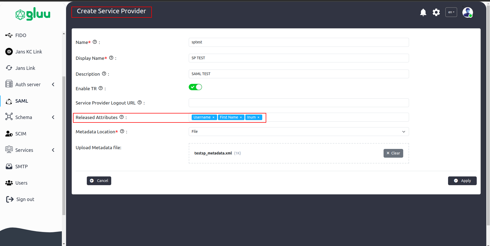

---
tags:
  - administration
  - SAML
  - SSO
---

## Installing SAML IDP in Flex Server

During installation the [Flex Server](../../../../), make sure you have 
selected [Jans KC](https://docs.jans.io/head/janssen-server/keycloak/) 
to be installed.


## Configure IDP in Flex Server


In this tutorial, we will use [Iamshowcase](https://sptest.iamshowcase.com/) 
as the service provider. Follow the steps below to create a 
TR and apply them in [Flex Server](../../../../):

* Download the SP metadata using the following command:
```bash title="Command"
wget https://sptest.iamshowcase.com/testsp_metadata.xml
```
* Open the Flex Admin UI and navigate to `SAML > Configuration`.
* Select IDP to `Keycloak`.


* Then navigate to `Website SSO` > `Add Service Provider`


* Release the required attributes (e.g., `username`, `inum`).


* Finally, click Apply.

## Configure SP in Iamshowcase


After configuring the IDP in Flex Server, it's time to connect the service 
provider (SP) with the IDP:

* Download the IDP metadata from the following URL:
```
https://<your-janssen-server>/kc/realms/jans/protocol/saml/descriptor
```
* Go to: `https://sptest.iamshowcase.com/instructions#spinit` 
and upload the IDP metadata.
* After the metadata is uploaded, it will provide you with an 
SP link to test the SAML SSO flow.


## Test SSO

* Copy that link and open it in a browser. You can open it in 
incognito mode to avoid session issue.

* This will redirect you to the Janssen login page. Once you log in with 
your user credentials, you will be redirected back to the SP’s protected page, 
which will display the user session details.

For Reference 
```
https://docs.jans.io/head/janssen-server/keycloak/keycloak-saml-sso/
```


## FAQ

Check KC scheduler log for any TR issue 
```
/opt/kc-scheduler/logs/scheduler.log
```
Also check file directory inside 
```
/opt/idp/configs/keycloak/sp/metadata
```

