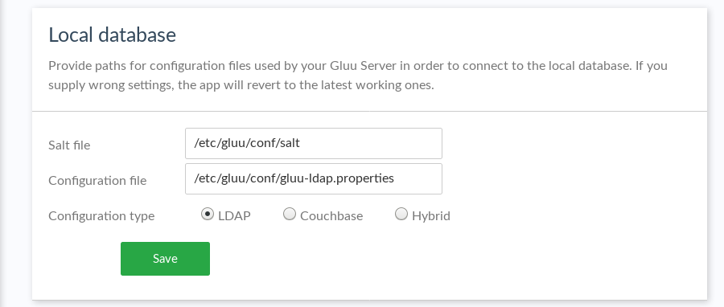
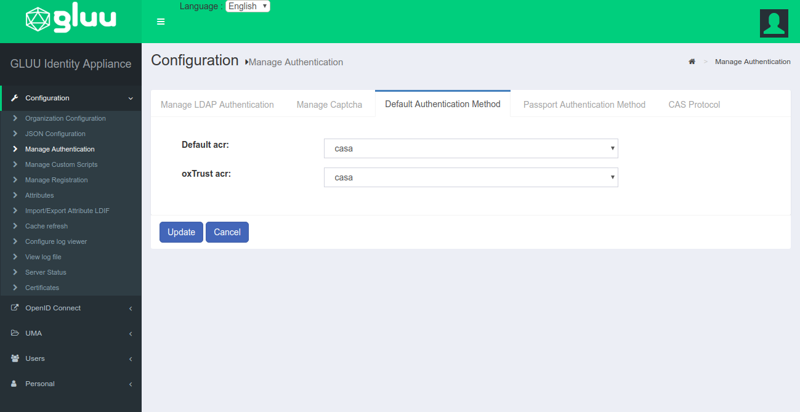
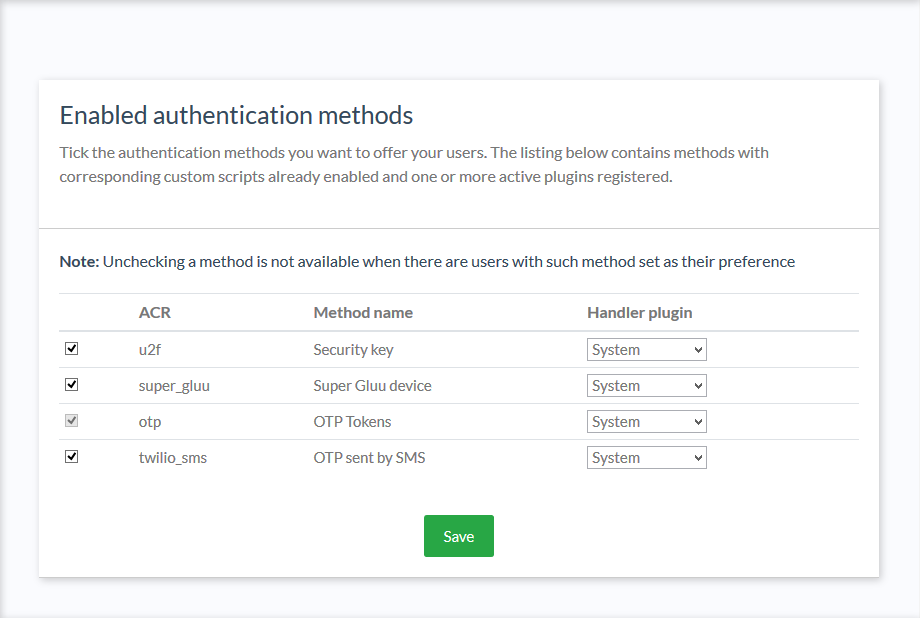
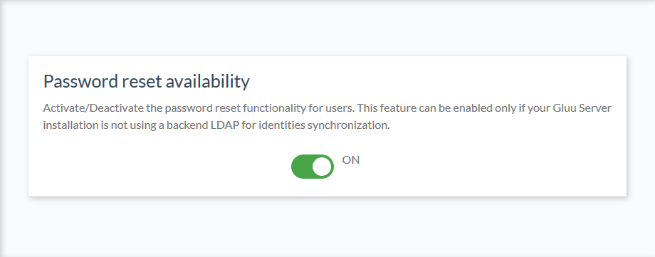
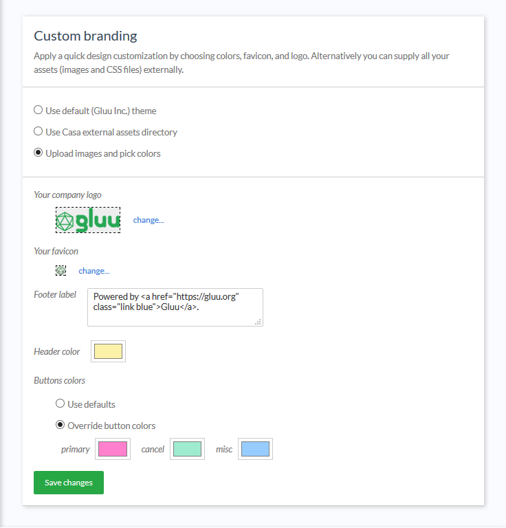
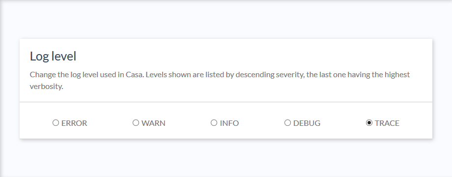
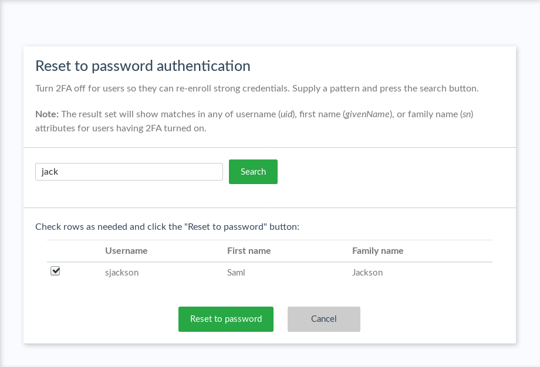
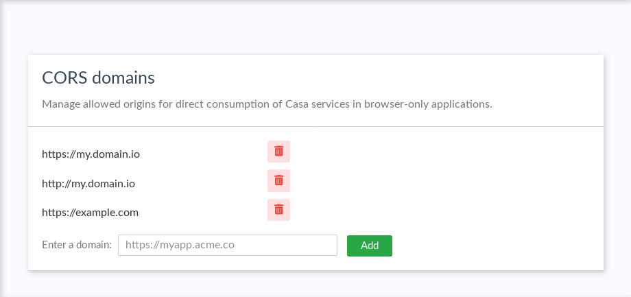
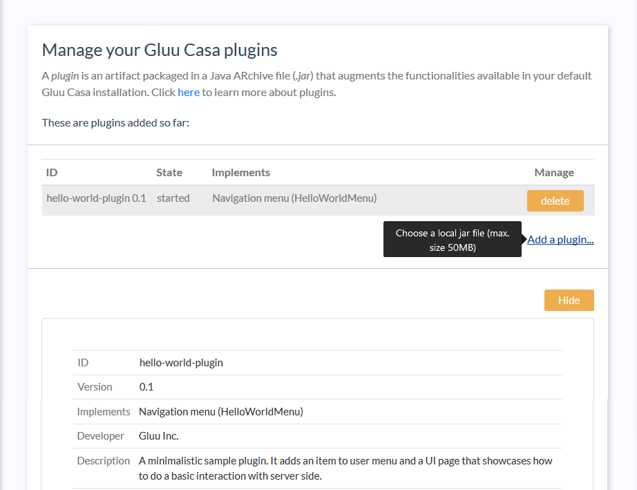

---
tags:
- Casa
- administration
- admin console
---

# Admin Console

The sections below document the admin console that is available to Gluu Casa administrators after installation. 
Many of the settings are configured during initial setup. Once Casa and Gluu Flex are properly configured, follow 
the [enable methods section below](#enabled-methods) to "turn on" Casa. 

All configuration changes applied via the admin console take effect immediately with no restart or other actions 
required.

## Local database 

This section contains settings used by Casa to establish a connection to the underlying database. These settings are 
prepared by the application installer and there is no need to apply any change afterward. 
Update these settings only if the application needs to be tested against a different database Server. 

## Enabled Methods

Updates need to be made in both the Gluu Flex Server and Casa to get Casa operational.

### Enable Authentication Scripts (Gluu Flex)

The Gluu Flex Server uses [interception scripts](https://gluu.org/docs/ce/admin-guide/custom-script/) to implement user 
authentication. For each type of 2FA credential that should be manageable in Casa, the corresponding authentication 
script **must be** enabled in Gluu Flex. 

To enable authentication methods in Gluu Flex, open oxTrust and navigate to  `Configuration` > `Manage custom scripts`. 
Enable the interception script for each type of 2FA credential that should be manageable in 
Casa - i.e. `fido2`, `u2f`, `super_gluu`, `otp`, and/or `twilio_sms`.  

!!! Note
    It is recommended not to use U2F but FIDO2 as authentication method.
    
To confirm script functionality, or if issues arise, check the 
[troubleshooting doc](./faq.md#troubleshooting-interception-scripts) in the FAQ.

### Set Default Authentication Method (Gluu Flex)
With the Casa authentication script enabled in the Gluu Flex Server, OpenID Connect clients can now request Casa 
authentication (i.e. each user's 2FA preferences) using the standard OpenID Connect `acr_value`. 

To make this behavior the default for all Gluu Flex logins, navigate 
to `Configuration` > `Manage Authentication` > `Default Authentication method` and set `Default acr` 
and `oxTrust acr` to `casa`. Click update to save your changes. 

    
### Configure Casa

Once the applicable interception scripts are enabled in Gluu Flex, a Casa admin can enable 2FA mechanisms in 
the `Enable methods` interface. Check the box for each type of authentication method users should be able to 
self-service in Casa. You can assign the handler [plugin](#plugins) for each method. Choose "System" to use the 
default implementation provided by the application.

The System plugin supports several authentication methods:

- OTP SMS
- OTP (handling mobile apps and hard tokens)
- FIDO security keys
- Super Gluu. 

Developers can provide their own [custom handler plugins](https://gluu.org/docs/casa/4.4/developer/authn-methods/) that
add or override the authentication methods.

In their home page, users will see widgets for every available method. These widgets are listed in decreasing order of 
ACR level. That is, the first method shown will be that with the highest level assigned in its corresponding 
interception script, and therefore the most secure.
    
### Testing 

A recommended practice is to enable one script in the Gluu Flex Server (like U2F), then enable the associated method in Casa.
Test and confirm that enrollment and authentication is working as expected, then continue adding other desired 2FA 
methods. In an incognito browser, employ a user other than `admin` to test enrollments each time a new method is added. 
This will prevent the `admin` user from being accidentally locked out.

## 2FA settings

!!! Warning  
    This feature is only available through the [2FA settings plugin](../plugins/2fa-settings.md).  

In the 2FA settings, an admin can:

- Specify the minimum number of credentials a user **must** enroll before 2FA can be turned on
- Determine whether 2FA should be automatically enabled upon credential enrollment
- Whether users can turn 2FA on and off their own
- Whether users can choose a preferred authentication method
- Choose from a few predefined policies for when 2FA should be prompted. 

To reduce the chance of lockouts, we recommend setting a minimum of two (2) strong credentials. 

Predefined 2FA policy options include:

- Enforce strong authentication for every login attempt
- Prompt for 2FA when users' location is unrecognized
- Prompt for 2FA when users' device is unrecognized
- Allow the user to set their own strong authentication policy

The default policy is to enforce 2FA for every login attempt. If the admin opts to allow users to manager their own 
policy, a new widget will appear in the user-facing dashboard as described in 
the [user guide](../user-guide.md#2fa-settings--trusted-devices). 

In addition, the plugin exposes an API to programmatically manipulate these settings.

## Pass reset config

If passwords are being stored in the Gluu Flex Server (and not at an external backend directory server like AD), an admin 
can give users the ability to reset their password from inside Casa. To enable the password reset functionality, 
navigate to `Pass reset config` and click the toggle to `ON`.  

## Branding

Most organizations will want to custom brand Casa. Follow our guide to learn more 
about [custom branding Casa](./custom-branding.md).

## Logging

Application logs are useful sources of information to diagnose anomalies and understand possible causes of errors 
if presented. Casa uses the Log4J2 logging framework for this. The severity level for logs can be modified at runtime 
and requires no restart. For more information about logging, check the [FAQ entry](./faq.md#where-are-the-logs). 

## Reset to password authentication

If a user is locked out for any reason (e.g. lost device, etc.), an admin can navigate 
to `Reset to password authentication` in the admin console to turn 2FA off for them. Type the username (or part of) in 
the text field and then press search. Once the user has been located, click the checkbox and click the 
`Reset to password` button. The row will become disabled, and a success message will be displayed.

## CORS domains

Casa exposes some REST [services](../developer/rest-services.md) and plugin developers can also add their own. If 
consumption of services is required from the users' browser, known 
[cross origin](https://developer.mozilla.org/en-US/docs/Web/HTTP/CORS) problems will arise. To "grant" an external 
domain access to a Casa service, you can add it to the list of allowed CORS domains.

## Plugins

Plugins are vehicles to augment the functionalities available by default in Gluu Casa. To learn more about plugins, 
visit the [developer guide](../developer/index.md#plugins).

In this section of the console, the current list of active plugins is shown. Once an element in the list is selected, 
a summary of the relevant plugin's metadata is visualized.

Click on the "Add a plugin..." button to select a file in your local hard drive that you wish to onboard as a new 
plugin into your Gluu Casa installation. Account that plugin files must have a specific format and structure as 
explained [here](../developer/intro-plugin.md#anatomy-of-a-plugin).

## Config API

Most of the above aspects can be configured programmatically using the [configuration API](../developer/config-api.md).
