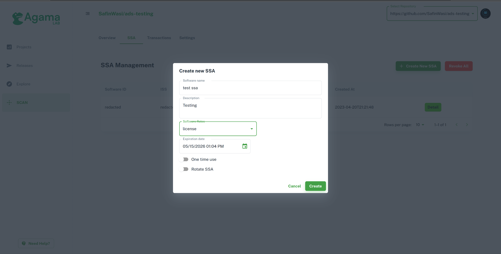

---
tags:
- administration
- installation
---
# Prerequisites

## Agama Lab

[Agama Lab](https://gluu.org/agama-lab/) is a platform to manage your Gluu license. This is where you may subscribe to Gluu Flex or obtain credentials for your enterprise license.

- To begin, please visit [Agama Lab](https://cloud.gluu.org/agama-lab)
- You may register via email or login via GitHub
    - If you want to author or test [Agama](https://docs.jans.io/head/agama/introduction/) or [Cedarling](https://docs.jans.io/head/cedarling/cedarling-getting-started/) projects, you will need to login via GitHub
- Once you have logged in, please navigate to `Market` > `Flex`

## Software Statement Assertions

In order to install Flex, you will need a Software Statement Assertion (SSA). An SSA is a signed JSON Web Token (JWT) that is required by the Flex install script to validate your license.

### Obtaining an SSA

Gluu issues SSAs through the Agama Lab web interface. You can obtain an SSA for use with Flex by following these steps:

- Login to Agama Lab
- On the left navigation bar, select `Market`
- Navigate to the tab named `Flex`.

- Click on `Create New SSA`
    - On `Software Name`, fill in a unique identifier for this SSA
    - `Description` is optional
    - Under `Software Roles`, tick `license`
    - Under `Expiration Date`, select an appropriate date. Your SSA will not be useable after that date.
    - Under `SSA Lifetime`, choose an appropriate lifetime for the Flex client. One month or longer is recommended.
    - Deselect `One time use` and `Rotate SSA`
    - Click `Create`

    
- Click on `Detail` of the newly issued SSA, then click on `Show JWT`

- You will be shown a long string of characters. Copy this and save it to a file.
- You may now use this file during Flex installation.

## License

Gluu Flex uses the SSA obtained in the above step to either request a 30 day trial license or verify presence of a license tied to your Agama Lab account. One account may request one trial license in its lifetime. To purchase a full license, please navigate to the `Flex` tab of the marketplace where you may purchase licenses for up to 1600 MAU (monthly active users). To purchase an enterprise license for more MAU, please contact [Sales](mailto:sales@gluu.org).

If you have subscribed to Flex via Agama Lab, the SSA obtained in the step before will automatically link your license to your installation. For enterprise licenses, please open a support ticket so that we can issue a license against your account. Once this is done, you may use the SSA obtained to proceed to installation.

## Allow Gluu Endpoints Access in Flex

- Flex requires outbound access to the following Gluu endpoints. Please ensure these domains are whitelisted in the Flex environment.
    - account.gluu.org
    - cloud.gluu.org
