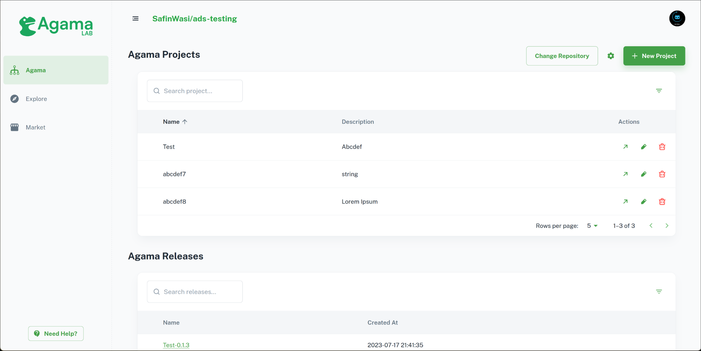
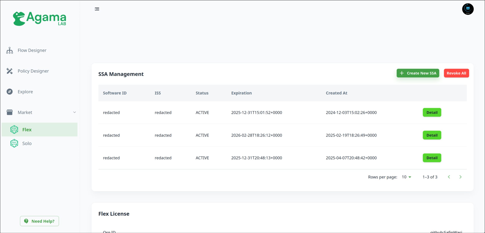
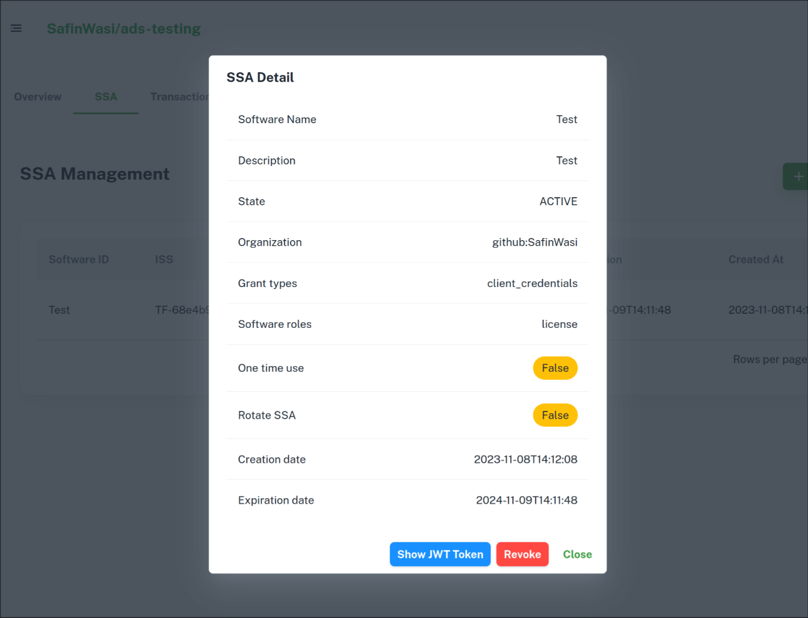

---
tags:
- administration
- installation
---

# Software Statement Assertions

In order to install Flex, you will need a Software Statement Assertion (SSA). An SSA is a signed JSON Web Token (JWT) that is required by the Flex install script to validate your license.

## Obtaining an SSA

Gluu issues SSAs through the Agama Lab web interface. You can obtain an SSA for use with Flex by following these steps:

- Visit [Agama Lab](https://cloud.gluu.org/agama-lab)
- Click on `Login with GitHub` and authorize Agama Lab to access your GitHub profile.
- Select a repository for use with Agama Lab. The repository must have at least 1 commit on the main branch. We recommend creating a fresh repository and pushing a commit for use with Agama Lab.

- On the left navigation bar, select `Market`
- Navigate to the tab named `SSA`.
- Sign up for a free SCAN subscription, which will give you 500 SCAN credits. Flex does not cost any SCAN credits, so you will not be charged for SCAN.

- Click on `Create New SSA`
    - On `Software Name`, fill in a unique identifier for this SSA
    - `Description` is optional
    - Under `Software Roles`, tick `license`
    - Under `Expiration Date`, select an appropriate date. Your SSA will not be useable after that date.
    - Deselect `One time use` and `Rotate SSA`
    - Click `Create`

    
- Click on `Detail` of the newly issued SSA, then click on `Show JWT`

- You will be shown a long string of characters. Copy this and save it to a file.
- You may now use this file during Flex installation.

## License
Gluu Flex uses the SSA obtained in the above step to either request a 30 day trial license or verify presence of a license tied to your Agama Lab account. One account may request one trial license in its lifetime. To purchase a full license, please navigate to the `Flex` tab of the marketplace where you may purchase licenses for up to 1600 MAU (monthly active users). To purchase an enterprise license for more MAU, please contact [Sales](mailto:sales@gluu.org).
