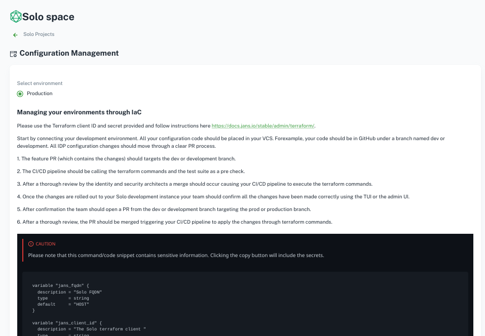
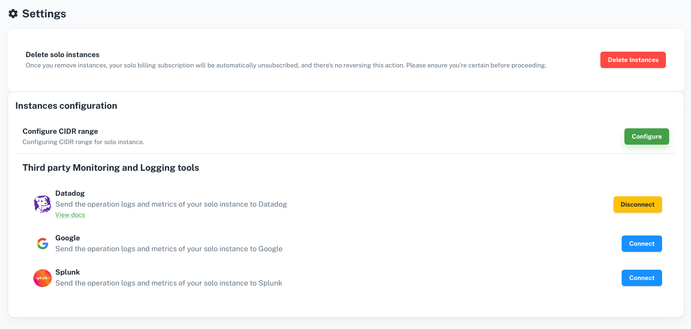
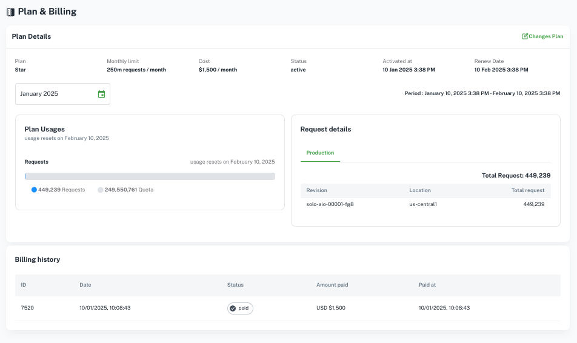

---
tags:
 - solo
 - gluu
 - administration
 - space
---


# Gluu Solo Administration


Gluu Solo administration allows you to configure and control various
aspects of the cloud infrastructure and the IDP.

From the Solo space dashboard click on
 `Configuration` button to open the configurations page. This page lists
 different ways to manage the configuration.



IaC(Infrastructure As Code) using Terraform is the `recommended` method to
configure Gluu Solo cloud infrastructure and administer the IDP.
Gluu Solo provides processes and guidelines about how to manage the
infrastructure. It also provides the actual code that
represents the current infrastructure. Use this code and the prescribed
process to configure the cloud infrastructure to your needs.

## Alternative methods for Ad-hoc administration

```
These tools should not be used as the go to tool for IDP configurations. Please use Terraform for managing your development and production environments.
```

Gluu Solo offers two tools to configure the IDP to your needs.

### Admin UI

Admin UI is a web-based administration portal for Gluu Solo IDP. Refer to
[Admin UI documentation](https://docs.gluu.org/head/admin/admin-ui/left-nav-menu/)
for more details.

### Text-Based UI

You can use [text-based UI](https://docs.jans.io/head/janssen-server/config-guide/config-tools/jans-tui/) to administer the Gluu Solo IDP using terminal/shell access. Install
TUI on your workstation using [these instructions](https://docs.jans.io/head/janssen-server/config-guide/config-tools/jans-tui/#standalone-installation) and then use
the terminal to connect and administer the IDP remotely.

## Configuring CIDR and Integrations

Administrators can manage and update the CIDR and integration settings from
`Settings` Page.



## Gluu Solo Billing

Solo spaces billing page provides details of the current billing plan, usage and
the payment history.


