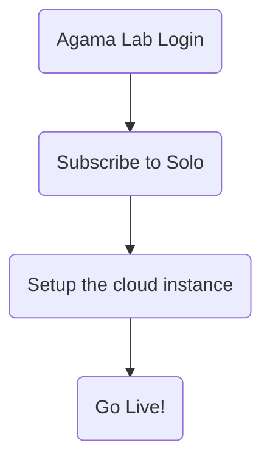

---
tags:
  - solo
  - Gluu
---

# Getting Started with Gluu Solo

Gluu Solo is a cloud-based identity management service designed to provide secure, scalable,
and dedicated authentication solutions for businesses. It eliminates the need for complex
infrastructure management by offering a Software-as-a-Service (SaaS) model tailored to various
business requirements.

Curious about the features? Check out the [Gluu Solo](https://gluu.org/solo/) website for more.

To start using Gluu Solo, sign into Agama Lab. In a few steps, you'll be able to go-live with Gluu Solo:

## Agama Lab Sign in

[Sign-in to the Agama Lab](https://gluu.org/agama-lab/) using an existing account or create a new account.

## Subscription

Gluu Solo offers various subscription plans tailored to different business needs.
Each plan allows you to choose from multiple cloud locations and offers an SLA that
aligns with your identity management requirements.
Check out [subscription process](./solo-subscription.md) to know more.

## Setting up Gluu Solo cloud environment and IDP

Once your subscription is active, cloud instance provisioning starts. Administrator can set up the [domain](../solo/solo-subscription.md#gluu-solo-subscription), configure Gluu Solo, integrate monitoring tools.

## Go Live

After setting up the cloud environment, Gluu Solo is ready to go live.
