---
tags:
  - solo
  - Gluu
  - Subscription
---

# Gluu Solo Subscription

Customers require active Gluu Solo subscription in order to avail Gluu Solo
services. Customers can opt for one of the Gluu Solo subscription plans according
to the business need.

New customers can subscribe to Gluu Solo using the
[Agama Lab](https://gluu.org/agama-lab/).

## Subscription process

1. Sign-in to the [Agama Lab](https://gluu.org/agama-lab/). Navigate to `Solo`.
2. To begin the subscription process, click the `Subscribe` button.

    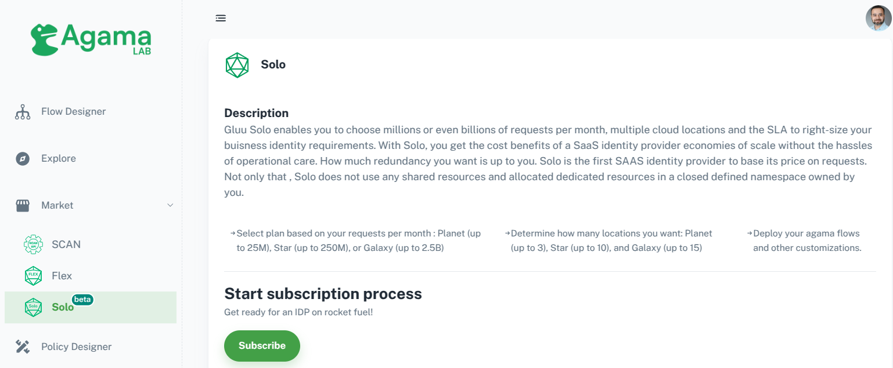

3. Choose a subscription plan

     You will see a list of available plans. Select the plan that best suits 
     your business needs and click `Continue`. 

     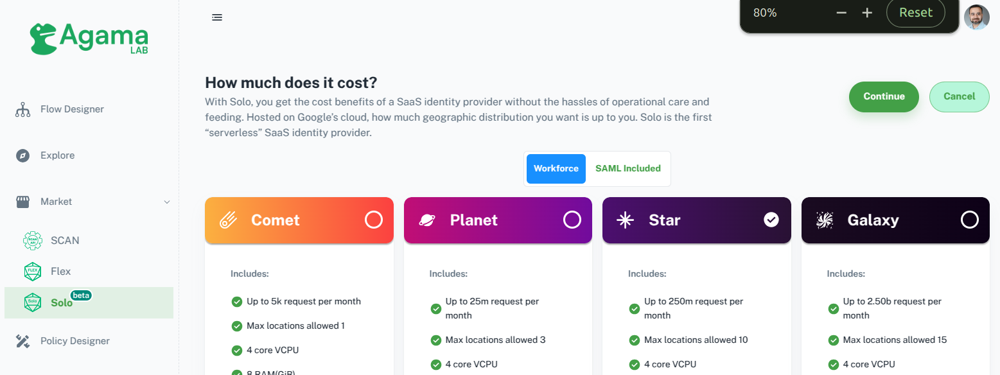

4. Review cost

     * After clicking `Continue`, a pop-up will appear showing the `cost per request per locations` of the selected plan.
     * Click on `Continue` to proceed to the next step

     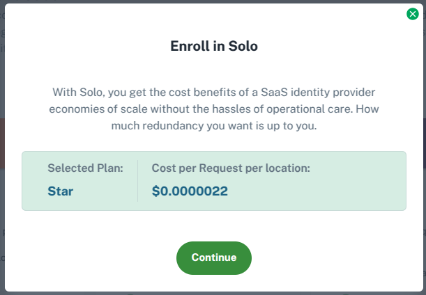

5. Fill the subscription form
     * Fill out the subscription form shown in the image below.
     * FQDN: You can either use the domain assigned by Gluu(default choice), or
     specify a custom domain that you own in the FQDN input. 
     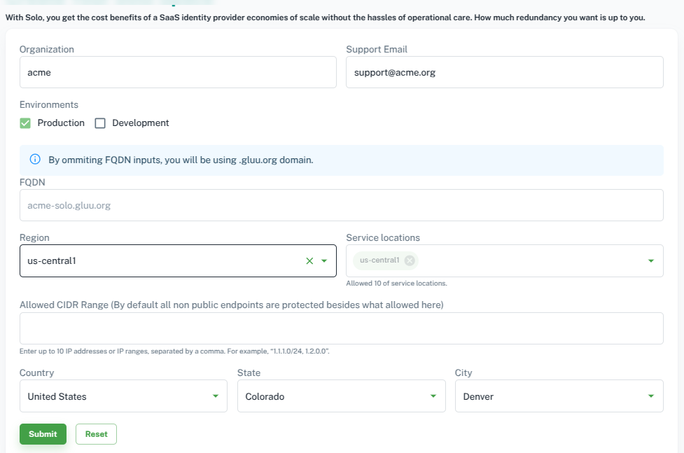
     If you use a custom domain, you'll need to update the DNS records for the 
     same. A note related to custom domains will appear (as shown in the image below).
     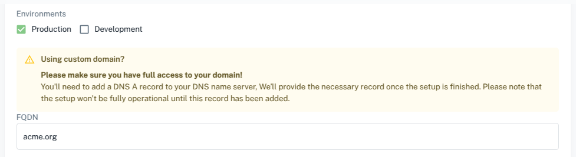

6. Checkout

     * After entering the required information, you will be directed to the checkout page.
     * This page will display details about the selected plan, Gluu components, and a preview of
     your instance configuration.
     * You will also need to choose your billing plan: `Per Month` or `Per Year`.

     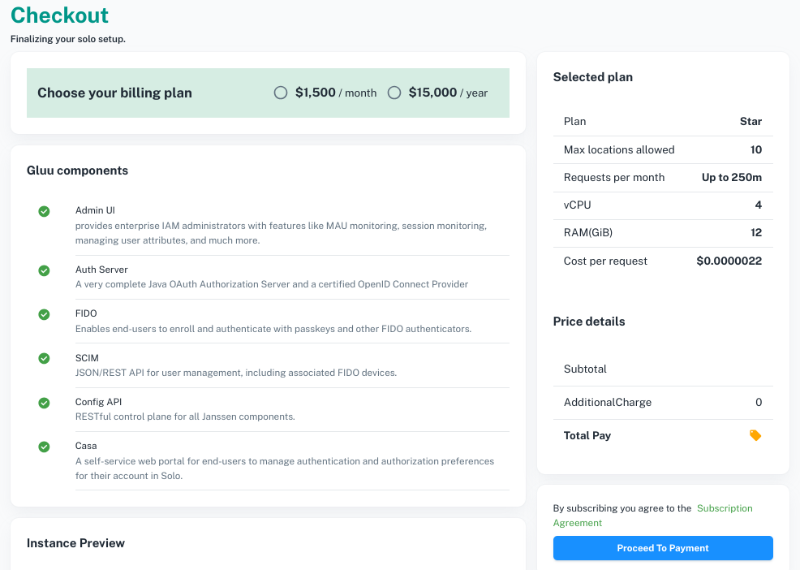

     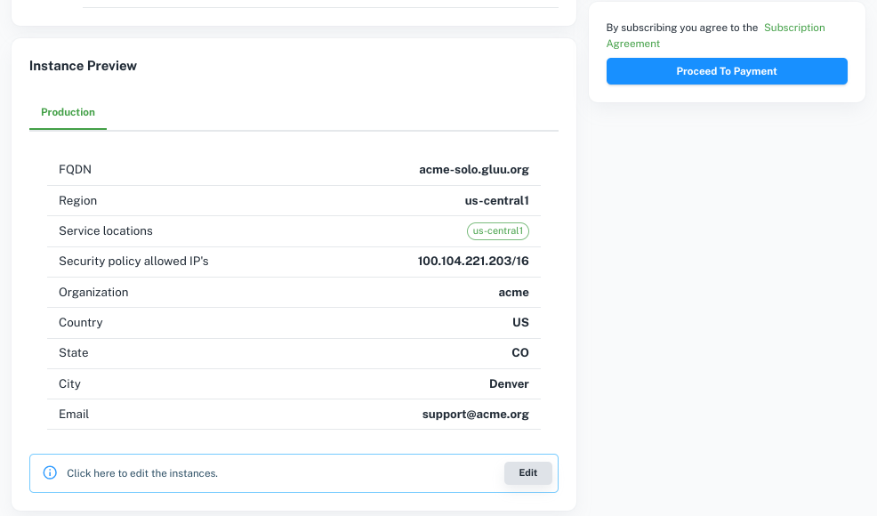

     * After reviewing this information, click on `Proceed To Payment`.

7. Initiate payment

    * A pop-up will display the total amount of your order for confirmation.
    * Click `Proceed to Checkout` to continue.

    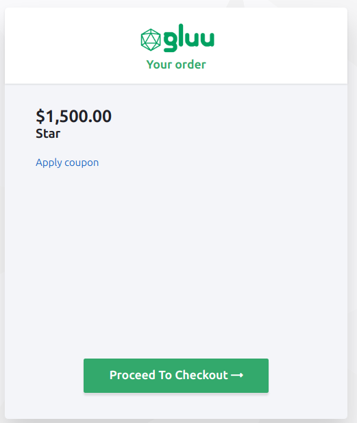

8. Add account details

    * You will be prompted to enter your account details.
    * After entering your details, click `Next` to continue.

    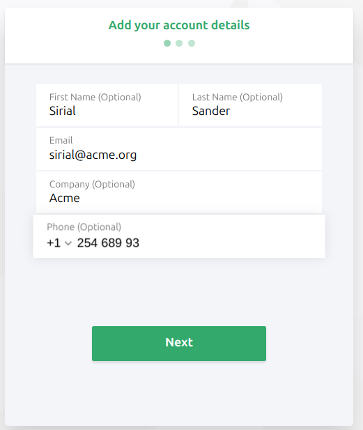

9. Add billing address

    * You will then need to add your billing address.
    * After filling in your address, click `Next` to continue.

    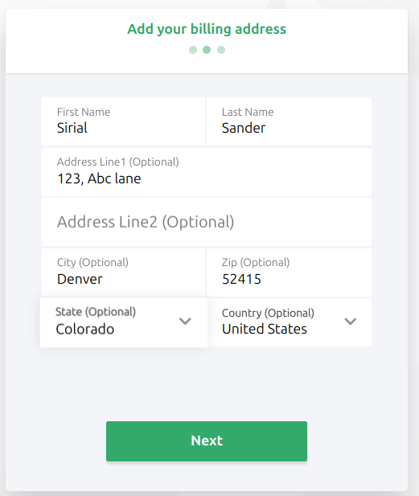

10. Add payment details

    * Next, you will need to add your payment details.
    * Once the details are entered, click `Next` to proceed.

    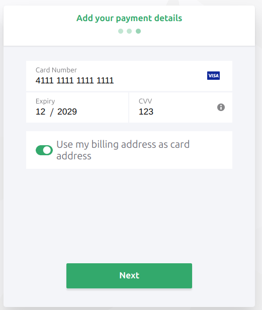

11. Verify and confirm payment

    * A pop-up will appear showing all the details you've entered.
    * Verify the information and, if everything is correct, proceed to Pay to subscribe to the plan.
  
     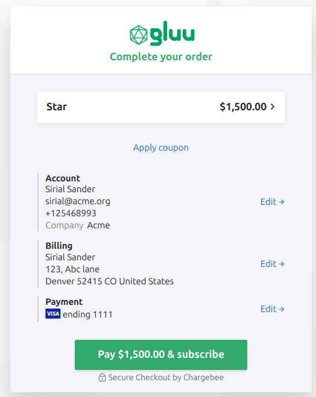

12. Subscription confirmation

    * Upon successful payment, you will be directed to a `Thank You` page. 
    Click on `Go To Solo Space` to access your instance dashboard.

    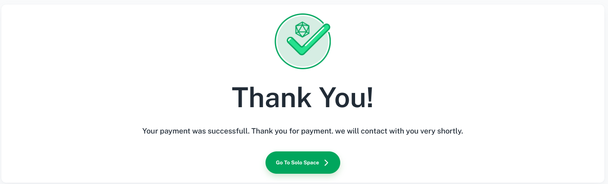

13. Access Solo space

    * Solo space shows your current instance and runtime status.

    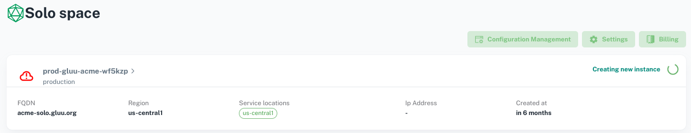
