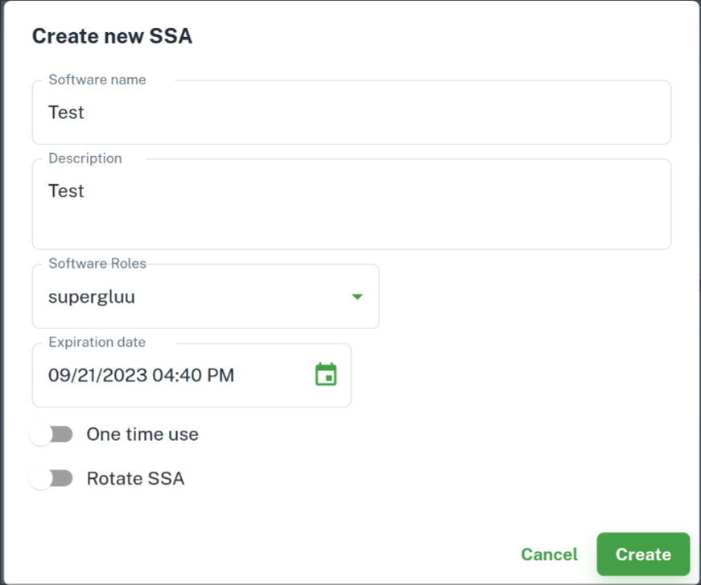

---
tags:
- Super Gluu
- administration
- configuration
---

# Super Gluu Administration Guide

## Obtaining an SSA

In order to set up Super Gluu, the administrator must obtain a Software Statement Assertion from [Agama Lab](https://cloud.gluu.org/agama-lab). Login with GitHub, then sign up for a SCAN subscription. The free tier will give you 500 credits, which can be used for 500 SuperGluu API calls (1 call = 1 credit). Then, go over to the SSA tab and create a new SSA with the `supergluu` software role and an expiry date of your choice. Your SSA will no longer be useable after that date.

After creating the SSA, you can click on `Details` and view the base64 encoded string of characters that represent the SSA. You will need this string during setup.

## Configuration on Gluu Flex 

- Log into Flex UI
- Navigate to `Admin` > `Scripts` > `super_gluu`
- Use the following properties:
    - `AS_SSA`: Your base64 encoded SSA string from Agama Lab
    - `AS_ENDPOINT`: `https://account.gluu.org`
    - The rest of the values can be left as provided
- Enable `super_gluu` script

  

- Navigate to `FIDO` and Enable SuperGluu

  

At this point, the Super Gluu module on Gluu Flex is configured and ready. This means that, using OpenID Connect `acr_values`, applications can now request Super Gluu authentication for users. You can verify this by going to the `super_gluu` script properties and seeing that the `AS_CLIENT_ID` and `AS_CLIENT_SECRET` fields are now populated.

## Configuration on Gluu Server 4.x

To get started, log into the Gluu Server dashboard (a.k.a. oxTrust) and do the following: 

- Navigate to `Configuration` > `Manage Custom Scripts`.
- In the `Person Authentication` tab find the `super_gluu` authentication module.  
- Use the following properties:
    - `AS_SSA`: Your base64 encoded SSA string from Agama Lab
    - `AS_ENDPOINT`: `https://account.gluu.org`
    - The rest of the values can be left as provided
- Scroll down and find the `Enable` check box. 
- Enable the script by clicking the check box.
- Scroll to the bottom of the page and click `Update`. 

Now Super Gluu is an available authentication mechanism for your Gluu Server. This means that, using OpenID Connect `acr_values`, applications can now request Super Gluu authentication for users. You can verify this by going to the `super_gluu` script properties and seeing that the `AS_CLIENT_ID` and `AS_CLIENT_SECRET` fields are now populated.

## Migration from old setups

If you are using a setup from before SCAN was implemented, you will need to migrate to the latest `super_gluu` interception script. 

- Obtain the latest `super_gluu` interception script for [Gluu Server](https://github.com/GluuFederation/oxAuth/blob/master/Server/integrations/super_gluu/SuperGluuExternalAuthenticator.py) or [Jans](https://github.com/JanssenProject/jans/blob/main/docs/script-catalog/person_authentication/super-gluu-external-authenticator/SuperGluuExternalAuthenticator.py)
- Open the script configuration using one of the methods mentioned above, and navigate to `super_gluu`
- Replace the contents of the script with the new one
- Disable the script, and click `Update`. This will update the properties of the script configuration.
- Populate the `AS_SSA` and `AS_ENDPOINT` fields as described above. 
- Enable the script by clicking the `Enable` check box
- Scroll to the bottom of the page and ckick `Update`

The latest version of Super Gluu is now enabled on your server.

!!! Note 
    To make sure Super Gluu has been enabled successfully, you can check your Gluu Server's OpenID Connect configuration by navigating to the following URL: `https://<hostname>/.well-known/openid-configuration`. Find `acr_values_supported` and you should see `super_gluu`. 

## Test 2FA Authentication Flow

To test the Super Gluu configuration from end to end, an administrator can follow the steps below:

- Change the `default authentication method` to `super_gluu` using [this guide](https://docs.jans.io/stable/admin/config-guide/default-authentication-method-config/)
- Keep this browser window active so you can revert the authentication method to the default one.
- Prepare your mobile device by following [Super Gluu mobile app user guide](https://docs.gluu.org/stable/supergluu/user-guide/)
- Perform tests using a test user
