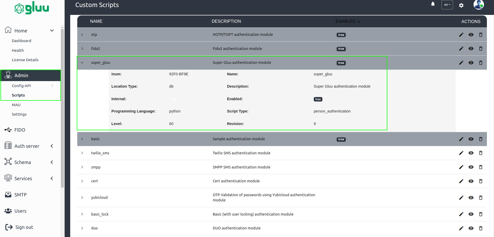
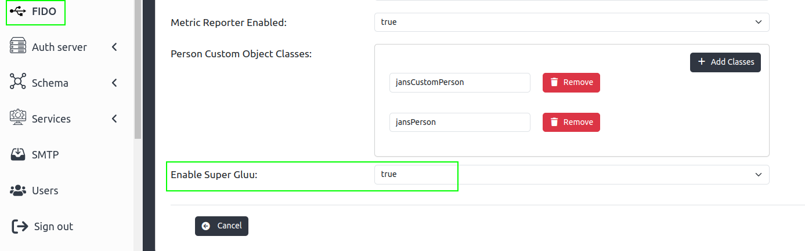

---
tags:
- Super Gluu
- administration
- configuration
---

# Super Gluu Administration Guide

To configure and enable Super Gluu 2FA, Gluu Flex administrator need to perform below operations using Flex UI. 

## Configuration Using Flex UI

 - Log into Flex UI
 - Navigate to `Admin` > `Scripts`
 - Enable `super_gluu` script 
 
   

 - Navigate to `FIDO` and Enable SuperGluu
 
   

At this point, Super Gluu module on Gluu Flex is configured and ready. 

### Test 2FA Authentication Flow

To test Super Gluu configuration from end-to-end, an administrator can follow the steps below: 

 - Change the `default authentication method` to 'super_gluu' using [this guide](https://docs.jans.io/v1.0.14/admin/config-guide/jans-cli/cli-default-authentication-method/)
 - Keep this browser window active so you can revert authentication method to default one.
 - Prepare your mobile device by following [Super Gluu mobile app user guide](https://github.com/GluuFederation/flex/blob/docs-sg-changes/docs/supergluu/user-guide/index.md)
 - Perform tests using a test user 

1. Enroll Super Gluu for a user account, and ads will be removed from the app on that device. 

All users who enroll Super Gluu against this server should now see advertisements removed from the app on their device. 
